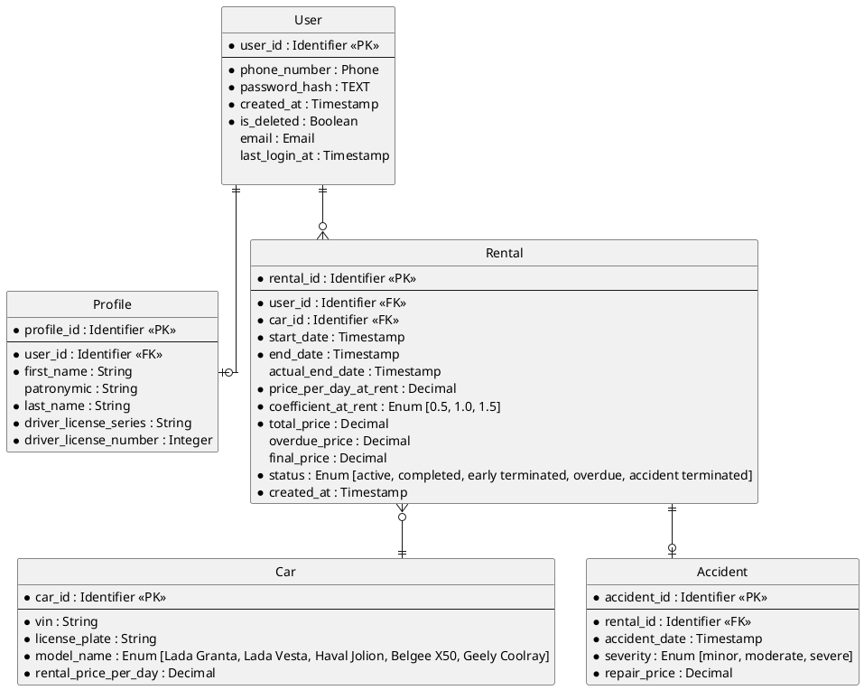

# Задание
## Проектирование БД «Сервис аренды машин посуточно»

**Бизнес-контекст:** Необходимо спроектировать реляционную базу данных для сервиса посуточной аренды автомобилей. Система управляет пользователями, их профилями, парком автомобилей, фактами аренды и случаями ДТП. Требуется построить модель данных на трёх уровнях абстракции: концептуальном, логическом и физическом.

**Цель занятия:** Пройти весь жизненный цикл проектирования базы данных (Conceptual → Logical → Physical) и оформить артефакты для каждого уровня, следуя правилам из теоретической справки.

**Модель данных (Бизнес-сущности):**

| Сущность | Описание |
| :--- | :--- |
| `Пользователь` | Аккаунт пользователя сервиса. |
| `Профиль` | Личные данные пользователя: ФИО, номер водительских прав. |
| `Автомобиль` | Машина, доступная для аренды. Поля: гос. номер, цена за сутки, марка. |
| `Аренда` | Факт сдачи автомобиля пользователю на определённые сутки. |
| `ДТП` | Зафиксированный случай дорожно-транспортного происшествия с автомобилем. |

**Бизнес-правила:**

1. Один пользователь может арендовать только одну машину за одни сутки.
2. Система записывает случаи ДТП для отслеживания уровня повреждения машины.
3. Случаи ДТП используются для расчёта рейтинга пользователя.

**Формат сдачи работы:**

1. Создать файл `solution.md`, который содержит три раздела, соответствующих трём уровням моделирования данных:

   - **Conceptual-level ERD** — концептуальная модель, понятная бизнесу.
   - **Logical-level ERD** — логическая модель, независимая от конкретной СУБД.
   - **Physical-level ERD** — физическая модель для выбранной реляционной СУБД PostgreSQL (Задание опционально)

2. Каждый раздел оформить в соответствии с теоретической справкой из `../lesson.md`.

**Дополнительные условия:**

- Для **концептуальной ERD**:
  - только бизнес-сущности и связи (глаголами);
  - без атрибутов, `PK`/`FK`, типов данных, индексов, привязки к СУБД;
  - связи формулируются как бизнес-отношения (например, «Пользователь арендует Автомобиль»).

- Для **логической ERD**:
  - все значимые сущности и атрибуты;
  - первичные и внешние ключи;
  - кардинальность и обязательность связей;
  - только абстрактные типы данных (`String`, `Decimal`, `Integer`, `Timestamp`, `Enum`, `Identifier` и т.п.);
  - запрещены `VARCHAR(n)`, `JSONB`, `UUID`, `BIGINT`, `TIMESTAMPTZ`, индексы, партиции, DDL;
  - модель нормализована (ориентир — 3NF); many-to-many связи разрешены через промежуточные сущности.

- Для **физической ERD**: 
  - обязательно указать целевую СУБД и конкретные типы данных;
  - реальные имена таблиц;
  - первичные/внешние ключи, ограничения (`UNIQUE`, `CHECK`, `NOT NULL`);
  - индексы, соответствующие ожидаемым запросам (поиск автомобилей по марке/цене, истории аренды пользователя, ДТП по автомобилю);
  - любой сознательный выбор (например, денормализация) должен быть обоснован.

# Решение

## **Conceptual-level ERD**

 **ключевые бизнес сущности:** Пользователь, Профиль, Автомобиль, Аренда,ДТП.

#### **Уточнение требований**
##### Отношение Пользователь - Профиль
1. Пользователь при регистрации заполняет свой профиль.
2. Одному пользователю всегда принадлежит только один профиль.
3. Профиль без пользователя создать нельзя.
4. Данные профиля хранятся при удалении аккаунта в течение 5 лет.
5. Пользователь может видеть ленту автомобилей без заполнения профиля.

##### Отношение Пользователь - Аренда
1. Данные о всех арендах пользователя хранятся в базе данных.
2. Пользователь может храниться в системе не совершая аренд.
3. Данные об арендах удаленного пользователя сохраняются в течение 5 лет.
4. Аренда начинается с момента, когда пользователь садится в автомобиль.

##### Отношение Автомобиль - Аренда
1. Данные о всех арендах автомобиля хранятся в базе данных.
2. Автомобиль может стоять в парке день, неделю, месяц без аренды.
3. Данные об арендах удаленного автомобиля сохраняются в течение 5 лет.

##### Отношения  Аренда - Пользователь, Аренда - Автомобиль
1. Аренда не может быть создана без пользователя или автомобиля.

##### Отношение Аренда - ДТП
1. Все фиксируемые ДТП совершаются во время аренды.
2. Факт ДТП является основанием для досрочного завершения аренды.
3. Данные по ДТП будут запрашиваться, в том числе, отдельно от аренды.

### Conceptual-level ERD

```plantuml
@startchen
left to right direction

entity Пользователь {
}
entity Профиль {
}
entity Автомобиль {
}
entity Аренда {
}
entity ДТП {
}

relationship Заполняет {
}

relationship Осуществляет {
}

relationship Содержит {
}

relationship Фиксирует {
}

Пользователь -1- Заполняет
Заполняет =1= Профиль

Пользователь -1- Осуществляет
Осуществляет =M= Аренда

Аренда =N= Содержит
Содержит -1- Автомобиль

Аренда -1- Фиксирует
Фиксирует =1= ДТП
@endchen
```

## **Logical-level ERD**

1. Получение рейтинга осуществляется через динамический запрос к БД при каждом обращении к профилю пользователя.
2. ДТП делятся по степени тяжести повреждения автомобиля на легкую, среднюю и тяжелую.
3. Рейтинг рассчитывается по данным Аренды и ДТП.
4. Рейтинг необходим для отображения на странице профиля.
5. Рейтинг учитывается при подсчете коэффициента.


**Сущности и атрибуты:**

### **User**
| Атрибут                | Описание                               | Тип        | Обязательность | Допустимые значения                            | Для чего используется                                                           |
|:-----------------------|:---------------------------------------|:-----------|:---------------|:-----------------------------------------------|:--------------------------------------------------------------------------------|
| `user_id`              | Уникальный идентификатор пользователя. | Identifier | Да             | Генерируется автоматически (surrogate key).    | Первичный ключ. На него ссылается профиль (Profile) и аренда (Rental).          |
| `phone_number`         | Номер телефона.                        | Phone      | Да             | Только цифры, +, пробелы, дефисы, скобки.      | Используется для входа (логин) и отправки SMS.                                  |
| `password_hash`        | Хеш пароля.                            | TEXT       | Да             | Должен быть не меньше 60 символов.             | Для аутентификации.                                                             |
| `email`                | Электронная почта для входа.           | Email      | Нет            | Должен быть корректный email формат.           | Для рассылок и восстановления пароля.                                           |
| `created_at`           | Дата создания записи.                  | Timestamp  | Да             | Не может быть больше текущей даты.             | Для аналитики.                                                                  |
| `last_login_at`        | Дата последнего входа.                 | Timestamp  | Нет            | Обновляется при каждом входе на текущее время. | Для определения активности аудитории(MAU - Monthly Active Users).               |
| `is_deleted`           | Флаг мягкого удаления.                 | Boolean    | Да             | По умолчанию false.                            | Позволяет скрыть пользователя, но сохранить профиль, чтобы не потерять историю. |

### **Profile**
| Атрибут                 | Описание                          | Тип        | Обязательность | Допустимые значения                                                                                   | Для чего используется                           |
|:------------------------|:----------------------------------|:-----------|:---------------|:------------------------------------------------------------------------------------------------------|:------------------------------------------------|
| `profile_id`            | Уникальный идентификатор профиля. | Identifier | Да             | Генерируется автоматически (surrogate key).                                                           | Первичный ключ.                                 |
| `user_id`               | Ссылка на пользователя.           | Identifier | Да             | Имеет уникальное значение.                                                                            | Обеспечивает связь один к одному. Внешний ключ. |
| `first_name`            | Имя.                              | String     | Да             | Не может быть пустым или содержать пробелы.                                                           | Для договора аренды.                            |
| `patronymic`            | Отчество.                         | String     | Нет            | Если указан, не может быть пустым или содержать пробелы.                                              | Для договора аренды.                            |
| `last_name`             | Фамилия.                          | String     | Да             | Не может быть пустым или содержать пробелы.                                                           | Для договора аренды.                            |
| `driver_license_series` | Серия водительских прав.          | String     | Да             | Должен состоять из 4 знаков. Представляющие собой цифры или комбинации двух цифр и двух русских букв. | Для страховки ОСАГО и проверки стажа.           |
| `driver_license_number` | Номер водительских прав.          | Integer    | Да             | Должен состоять из 6 цифр.                                                                            | Для страховки ОСАГО и проверки стажа.           |


### **Car**
| Атрибут                | Описание                             | Тип        | Обязательность | Допустимые значения                                                                                                                      | Для чего используется                                                                                                                                                             |
|:-----------------------|:-------------------------------------|:-----------|:---------------|:-----------------------------------------------------------------------------------------------------------------------------------------|:----------------------------------------------------------------------------------------------------------------------------------------------------------------------------------|
| `car_id`               | Уникальный идентификатор автомобиля. | Identifier | Да             | Генерируется автоматически (surrogate key).                                                                                              | Первичный ключ. На него ссылается аренда (Rental).                                                                                                                                |
| `vin`                  | Vin-код автомобиля.                  | String     | Да             | 17-значный код, состоящий из латинских букв и цифр (буквы I, O, Q не используются).                                                      | Для проверки истории автомобиля (пробег, ДТП, ограничения, залоги) через внешние сервисы.                                                                                         |
| `license_plate`        | Государственный номер автомобиля.    | String     | Да             | От 8 до 9 символов. Может содержать буквы: А, В, Е, К, М, Н, О, Р, С, Т, У, Х. Первой идет буква, затем 3 цифры, 2 буквы, 2 или 3 цифры. | Основной визуальный идентификатор для сотрудников и клиентов (по нему легко найти авто на парковке). Используется для взаимодействия с госорганами (штрафы, розыск, регистрация). |
| `model_name`           | Модель авто.                         | Enum       | Да             | Lada Granta, Lada Vesta, Haval Jolion, Belgee X50, Geely Coolray.                                                                        | Для привлечения клиентов. Позволяет группировать автомобили.                                                                                                                      |
| `rental_price_per_day` | Цена аренды за сутки.                | Decimal    | Да             | До двух знаков после точки. Не может быть отрицательным. Обновляемое значение.                                                           | Является ключевым бизнес-показателем для расчета итоговой стоимости бронирования. Может динамически меняться — поэтому разрешено обновление.                                      |

### **Rental**
| Атрибут                 | Описание                                                   | Тип         | Обязательность | Допустимые значения                                                                              | Для чего используется                                                                                                                                                                                 |
|:------------------------|:-----------------------------------------------------------|:------------|:---------------|:-------------------------------------------------------------------------------------------------|:------------------------------------------------------------------------------------------------------------------------------------------------------------------------------------------------------|
| `rental_id`             | Уникальный идентификатор аренды.                           | Identifier  | Да             | Генерируется автоматически (surrogate key).                                                      | Первичный ключ. Обеспечивает уникальность записи о каждой сделке аренды. На него ссылается ДТП (Accidents). Для поддержки клиентов и внутреннего учета (позволяет быстро находить конкретную аренду). |
| `user_id`               | Ссылка на пользователя.                                    | Identifier  | Да             | Внешний ключ (FK) к таблице user.                                                                | Связывает аренду с конкретным пользователем. Используется для истории аренды и расчета рейтинга.                                                                                                      |
| `car_id`                | Ссылка на автомобиль.                                      | Identifier  | Да             | Внешний ключ (FK) к таблице car.                                                                 | Связывает аренду с конкретным автомобилем. Используется для проверки доступности и статистики по авто.                                                                                                |
| `start_date`            | Дата и время начала аренды.                                | Timestamp   | Да             | Должна совпадать с моментом создания аренды (created_at).                                        | Используется в расчете ожидаемого количества дней аренды. Является точкой отсчета.                                                                                                                    |
| `end_date`              | Дата и время планового возврата автомобиля.                | Timestamp   | Да             | Должна быть строго позже start_date.                                                             | Используется в расчете ожидаемого количества дней аренды. Участвует в расчете рейтинга пользователя.                                                                                                  |
| `actual_end_date`       | Фактическая дата и время возврата автомобиля.              | Timestamp   | Нет            | Если указан, должен быть позже или равен end_date.                                               | Триггер для расчёта просрочки (сравнение с end_date). Заполняется только при завершении аренды.                                                                                                       |
| `price_per_day_at_rent` | Цена автомобиля за сутки на момент аренды.                 | Decimal     | Да             | До двух знаков после точки. Не может быть отрицательным.                                         | Фиксирует стоимость на момент аренды, чтобы она не менялась со временем (защита от изменения прайса).                                                                                                 |
| `coefficient_at_rent`   | Множитель (скидка/наценка), примененный к цене.            | ENUM        | Да             | Только: 0.5, 1.0, 1.5.                                                                           | Фиксирует коэффициент на момент аренды. Влияет на total_price.                                                                                                                                        |
| `total_price`           | Стоимость аренды за плановый период с учётом коэффициента. | Decimal     | Да             | До двух знаков после точки. Не может быть отрицательным. Должен быть &ge; price_per_day_at_rent. | Используется для предоплаты (списывается при создании аренды).                                                                                                                                        |
| `overdue_price`         | Стоимость доплаты за просрочку (коэффициент 2.0).          | Decimal     | Нет            | До двух знаков после точки. Не может быть отрицательным. По умолчанию 0.                         | Рассчитывается, если actual_end_date > end_date. Используется для доплаты при возврате.                                                                                                               |
| `final_price`           | Итоговая сумма всей аренды (total_price + overdue_price).  | Decimal     | Нет            | До двух знаков после точки. Не может быть отрицательным.                                         | Для финансовой отчетности и итогового выставления счета.                                                                                                                                              |
| `status`                | Текущий статус аренды.                                     | ENUM        | Да             | Только: active, completed, early terminated, overdue, accident terminated.                       | Определяет сценарий возврата. Влияет на возможность новой аренды, рейтинг пользователя и доступность авто.                                                                                            |
| `created_at`            | Дата и время создания записи об аренде.                    | Timestamp   | Да             | Дата создания записи. Позволяет отследить, когда была оформлена аренда.                          | Для аналитики и отчётов. Позволяет отследить, когда была оформлена аренда.                                                                                                                            |

### **Accident**
| Атрибут         | Описание                      | Тип        | Обязательность | Допустимые значения                            | Для чего используется                                                                                                                                |
|:----------------|:------------------------------|:-----------|:---------------|:-----------------------------------------------|:-----------------------------------------------------------------------------------------------------------------------------------------------------|
| `accident_id`   | Уникальный идентификатор ДТП. | Identifier | Да             | Генерируется автоматически (surrogate key).    |Первичный ключ. Обеспечивает уникальность записи о каждом ДТП. Для поддержки клиентов и внутреннего учета (позволяет быстро находить конкретное ДТП). |
| `rental_id`     | Ссылка на аренду.             | Identifier | Да             | Внешний ключ (FK) к таблице rental.            | Для привязки ДТП к конкретной аренде. Позволяет определить, какой клиент и автомобиль участвовали в инциденте.                                       |
| `accident_date` | Дата и время ДТП.             | Timestamp  | Да             | Не может быть больше текущей даты.             | Для фиксации точного времени происшествия. Используется для анализа инцидентов.                                                                      |
| `severity`      | Cтепень повреждений.          | ENUM       | Да             | Легкая, средняя, тяжелая                       | Для классификации серьёзности ДТП. Влияет на рейтинг пользователя и решение о списании автомобиля.                                                   |
| `repair_price`  | Цена ремонта автомобиля       | Decimal    | Да             | Не может быть отрицательным числом.            | Для расчёта финансовых потерь компании. Используется при страховых выплатах и анализе убыточности автопарка.                                         |

### Logical-level ERD


