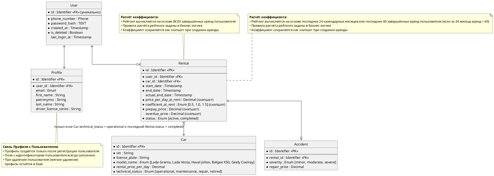

# Задание
## Проектирование БД «Сервис аренды машин посуточно»

**Бизнес-контекст:** Необходимо спроектировать реляционную базу данных для сервиса посуточной аренды автомобилей. Система управляет пользователями, их профилями, парком автомобилей, фактами аренды и случаями ДТП. Требуется построить модель данных на трёх уровнях абстракции: концептуальном, логическом и физическом.

**Цель занятия:** Пройти весь жизненный цикл проектирования базы данных (Conceptual → Logical → Physical) и оформить артефакты для каждого уровня, следуя правилам из теоретической справки.

**Модель данных (Бизнес-сущности):**

| Сущность       | Описание                                                                 |
|:---------------|:-------------------------------------------------------------------------|
| `Пользователь` | Аккаунт пользоывателя сервиса.                                            |
| `Профиль`      | Личные данные пользователя: ФИО, номер водительских прав.                |
| `Автомобиль`   | Машина, доступная для аренды. Поля: гос. номер, цена за сутки, марка.    |
| `Аренда`       | Факт сдачи автомобиля пользователю на определённые сутки.                |
| `ДТП`          | Зафиксированный случай дорожно-транспортного происшествия с автомобилем. |

**Бизнес-правила:**

1. Один пользователь может арендовать только одну машину за одни сутки.
2. Система записывает случаи ДТП для отслеживания уровня повреждения машины.
3. Случаи ДТП используются для расчёта рейтинга пользователя.

**Формат сдачи работы:**

1. Создать файл `solution.md`, который содержит три раздела, соответствующих трём уровням моделирования данных:

   - **Conceptual-level ERD** — концептуальная модель, понятная бизнесу.
   - **Logical-level ERD** — логическая модель, независимая от конкретной СУБД.
   - **Physical-level ERD** — физическая модель для выбранной реляционной СУБД PostgreSQL (Задание опционально)

2. Каждый раздел оформить в соответствии с теоретической справкой из `../lesson.md`.

**Дополнительные условия:**

- Для **концептуальной ERD**:
  - только бизнес-сущности и связи (глаголами);
  - без атрибутов, `PK`/`FK`, типов данных, индексов, привязки к СУБД;
  - связи формулируются как бизнес-отношения (например, «Пользователь арендует Автомобиль»).

- Для **логической ERD**:
  - все значимые сущности и атрибуты;
  - первичные и внешние ключи;
  - кардинальность и обязательность связей;
  - только абстрактные типы данных (`String`, `Decimal`, `Integer`, `Timestamp`, `Enum`, `Identifier` и т.п.);
  - запрещены `VARCHAR(n)`, `JSONB`, `UUID`, `BIGINT`, `TIMESTAMPTZ`, индексы, партиции, DDL;
  - модель нормализована (ориентир — 3NF); many-to-many связи разрешены через промежуточные сущности.

- Для **физической ERD**: 
  - обязательно указать целевую СУБД и конкретные типы данных;
  - реальные имена таблиц;
  - первичные/внешние ключи, ограничения (`UNIQUE`, `CHECK`, `NOT NULL`);
  - индексы, соответствующие ожидаемым запросам (поиск автомобилей по марке/цене, истории аренды пользователя, ДТП по автомобилю);
  - любой сознательный выбор (например, денормализация) должен быть обоснован.

# Решение

## **Conceptual-level ERD**

 **Ключевые бизнес сущности:** Пользователь, Профиль, Автомобиль, Аренда,ДТП.

#### **Уточнение требований**
##### Отношение Пользователь - Профиль
1. При регистрации пользователя автоматически создается профиль.
2. Пользователь может не заполнять данные профиля при этом ему доступна лента автомобилей, но без возможности аренды.
3. Одному пользователю всегда принадлежит только один профиль.
4. Профиль без пользователя создать нельзя.
5. Данные профиля хранятся при мягком удалении пользователя в течение 5 лет.

##### Отношение Пользователь - Аренда
1. Данные о всех арендах пользователя хранятся в базе данных.
2. Пользователь может храниться в системе не совершая аренд.
3. Данные об арендах удаленного пользователя сохраняются в течение 5 лет.
4. Аренда начинается с момента, когда пользователь садится в автомобиль.

##### Отношение Автомобиль - Аренда
1. Данные о всех арендах автомобиля хранятся в базе данных.
2. Автомобиль может стоять в парке день, неделю, месяц без аренды.
3. Данные об арендах удаленного автомобиля сохраняются в течение 5 лет.

##### Отношения Аренда - Пользователь, Аренда - Автомобиль
1. Аренда не может быть создана без пользователя или автомобиля.

##### Отношение Аренда - ДТП
1. Все фиксируемые ДТП совершаются во время аренды.
2. Факт ДТП является основанием для досрочного завершения аренды.
3. Данные по ДТП будут запрашиваться, в том числе, отдельно от аренды.

### Conceptual-level ERD

```plantuml
@startchen
left to right direction

entity Пользователь {
}
entity Профиль {
}
entity Автомобиль {
}
entity Аренда {
}
entity ДТП {
}

relationship Заполняет {
}

relationship Осуществляет {
}

relationship Содержит {
}

relationship Фиксирует {
}

Пользователь -1- Заполняет
Заполняет =1= Профиль

Пользователь -1- Осуществляет
Осуществляет =M= Аренда

Аренда =N= Содержит
Содержит -1- Автомобиль

Аренда -1- Фиксирует
Фиксирует =1= ДТП
@endchen
```

## **Logical-level ERD**

### **Рейтинг пользователя**
   - **Способ хранения**: Не хранится. Вычисляется динамически при каждом обращении к профилю или при аренде.


   - **Период расчёта**: Скользящее окно — последние 24 календарных месяца или последние 60 поездок, если поездок за период больше (от текущей даты по дате окончания аренды).


   - **Учитываемые аренды**: Только завершённые.


   - **Данные для расчёта**: 
     - $S_{всех\_аренд}$ - общее число аренд согласно периоду расчета
     - $S_{вес\_ДТП}$ - сумма весов степеней тяжести ДТП за период расчета
     - $\frac{S_{вес\_ДТП}}{S_{всех\_аренд}}$ - средний вес показывает, сколько баллов повреждений в среднем приходится на одну аренду пользователя


     - **Веса степеней тяжести** (фиксированы в коде):
       - Лёгкая: $minor = 1$ 
       - Средняя: $moderate = 2$ 
       - Тяжёлая: $severe = 3$
     - $K = 33.33$ - коэффициент, выбран так, чтобы при среднем весе ДТП = 3 (каждая аренда с severe) рейтинг падал до 0, а при среднем весе = 0 (без ДТП) оставался 100, обеспечивая пропорциональную шкалу от 0 до 100 для всех промежуточных значений.

   - **Итоговая формула вычисления рейтинга**:
     $$
     rating =  100 - (\frac{S_{вес\_ДТП}}{S_{всех\_аренд}} \times K)
     $$
 
### 1. Таблица граничных сценариев расчёта рейтинга

| № | Сценарий                          | Данные                                          | Расчёт                                    | Рейтинг                                      | Бизнес-решение                                                                                               | 
|:--|:----------------------------------|:------------------------------------------------|:------------------------------------------|:---------------------------------------------|:-------------------------------------------------------------------------------------------------------------|
| 1 | Новый пользователь без истории    | 0 аренд за 24 месяца                            | -                                         | 100                                          | Дает кредит доверия новым пользователям. Это стимулирует сохранять рейтинг на высоком уровне.                |
| 2 | Новичок с одной серьёзной аварией | 1 аренда, 1 severe (вес=3)                      | Сглаживание: 100 - (3/(1+2)) × 33.33 = 67 | 67                                           | Даётся шанс исправиться (не блокировка). Распространяется на всех пользователей у кого количество аренд < 3. |                                 
| 3 | Ветеран с одним тяжёлым ДТП       | 100 аренд, последние 60: 1 severe (вес=3)       | 100 - (3/60) × 33.33 = 98                 | при severe, если рейтинг выше 85, то даем 85 | Лишает коэффициента в 0.5 при расчете стоимости аренды. Это серьёзный стимул избегать аварий.                |
| 4 | Злостный нарушитель               | 100 аренд, последние 60: все с severe (вес=180) | 100 - (180/60) × 33.33 = 0                | 0                                            | Автоматическая блокировка аккаунта.                                                                          |

### 2. Параметры расчёта рейтинга

| Параметр                          | Значение                                             |
|:----------------------------------|:-----------------------------------------------------|
| Максимальный $rating$             | $100$                                                |
| Минимальный $rating$              | $0$                                                  |
| $S_{всех\_аренд}$                 | Если $< 3$, то $S_{всех\_аренд} = 3$                 |
| $rating$                          | Если есть ДТП с severe в выборке то $Rating \leq 84$ |
| $rating$ для новых пользователей  | $100$                                                |


**Где хранятся данные для рейтинга**:

  1. Статус аренды (active, completed) — в сущности `Rental`. 
  2. Дата завершения аренды — в сущности `Rental`. 
  3. Степень тяжести ДТП (minor, moderate, severe) — в сущности `Accident`. 
  4. Вся бизнес-логика расчёта рейтинга — в коде приложения.

### **Оплата аренды**
   - **Порядок оплаты**: Пользователь определяет даты начала ($start\_date$) и окончания ($end\_date$) аренды и в день начала аренды производит опату. 


   - **Предоплата**:
     - Сутки аренды исчисляются с момента фактической передачи автомобиля клиенту (час получения авто) и длятся ровно 24 часа. При аренде на несколько суток общий срок исчисляется кратно 24 часам от времени старта (например, 2 суток = 48 часов, 3 суток = 72 часа и т.д.). Окончанием срока считается тот же час последних суток, что и при старте.

     - Стоимость аренды за указанный пользователем период является предоплатой и считается по следующей формуле: 
       
       
       - $prepay\_price = rental\_price\_per\_day\_at\_rent \times rental\_days \times coefficient\_at\_rent$.
       
       
         - $rental\_price\_per\_day\_at\_rent$ - это цена автомобиля за сутки на момент аренды, фиксируется в cущности `Rental` по $rental\_price\_per\_day$ из сущности `Car`.
         
         
         - $rental\_days = end\_date - start\_date$ - это ожидаемое количество дней аренды, где $start\_date$ и $end\_date$ берутся из сущности `Rental`.
         
         
         - $coefficient\_at\_rent$ -  множитель (скидка/наценка), примененный к цене, фиксируется в cущности `Rental`, определяется в момент создания аренды в коде по рейтингу пользователя. Все варианты значений и их зависимость от рейтинга прописаны в таблице 3. 


   - **Досрочный возврат**: Деньги за неиспользованные дни не возвращаются.


   - **Просрочка возврата**:
     - Просрочка начинается по истечении последних суток аренды (в тот же час в котором был старт).


     - Стоимость аренды за период просрочки считается по следующей формуле: 
       

       - $overdue\_price = (rental\_price\_per\_day\_at\_rent \times (actual\_rental\_days - rental\_days) \times coefficient\_at\_rent) \times 2$.
       
       
         - $rental\_price\_per\_day\_at\_rent$ - это цена автомобиля за сутки на момент аренды, фиксируется в cущности `Rental` по $rental\_price\_per\_day$ из сущности `Car`.


         - $actual\_rental\_days = actual\_end\_date - start\_date$ - это фактическое количество дней аренды, где $start\_date$ и $actual\_end\_date$ берутся из сущности `Rental`.
         
         
         - $rental\_days = end\_date - start\_date$ - это ожидаемое количество дней аренды, где $start\_date$ и $end\_date$ берутся из сущности `Rental`.
         
         
         - $coefficient\_at\_rent$ -  множитель (скидка/наценка), примененный к цене, фиксируется в cущности `Rental`, определяется в момент создания аренды в коде по рейтингу пользователя. Все варианты значений и их зависимость от рейтинга прописаны в таблице 3.
        
        
         - $2$ - это множитель, коэффициент просрочки возврата автомобиля (штрафной коэффициент за несвоевременный возврат).
     
     
     - Если авто не возвращено до окончания оплаченных суток, аренда считается продлённой на **полные следующие сутки** (оплата за каждые начавшиеся сутки просрочки — в полном размере).

   - **Общая стоимость аренды с учетом просрочки**:
     - Не хранится в базе данных рассчитывается в момент возврата автомобиля.
     - $final\_price = prepay\_price + overdue\_price$
       - $prepay\_price$ - стоимость аренды на указанный пользователем период (предоплата)
       - $overdue\_price$ - стоимость дней просрочки аренды

   
   - **ДТП во время аренды**: Средства за оставшиеся дни не возвращаются. 


   - **Восстановление автомобиля при ДТП**: Оплачивает сервис.


   - **Фиксируемые атрибуты в сущности `Аренда`**:

     - `start_date`, `end_date` (вводимые пользователем)
     - `actual_return_date` (фактическая дата возврата)
     - `rental_price_per_day_at_rent` (цена за сутки на момент аренды)
     - `coefficient_at_rent` (коэффициент на момент аренды)
     - `prepay_price` (предоплата)
     - `overdue_price` (сумма переплат при просрочке, коэффициент 2)


   - **Поля** $rental\_price\_per\_day\_at\_rent$, $coefficient\_at\_rent$, $prepay\_price$, $overdue\_price$ — заполняются один раз при создании/завершении аренды и не пересчитываются (снэпшот). 


### 3. Расчёт стоимости аренды автомобиля в зависимости от рейтинга клиента и наличия просрочки
| Коэффициент                   | Рейтинг пользователя | Рассчет стоимости аренды автомобиля            | Рассчет стоимости аренды автомобиля при просрочке         |
|:------------------------------|:---------------------|:-----------------------------------------------|:----------------------------------------------------------|
| $coefficient\_at\_rent = 0.5$ | $86 < rating < 100$  | $rental\_price\_per\_day\_at\_rent \times rental\_days \times 0.5$ | $(rental\_price\_per\_day\_at\_rent \times (actual\_rental\_days - rental\_days) \times 0.5) \times 2$ |
| $coefficient\_at\_rent = 1.0$ | $30 < rating < 85$   | $rental\_price\_per\_day\_at\_rent \times rental\_days \times 1.0$ | $(rental\_price\_per\_day\_at\_rent \times (actual\_rental\_days - rental\_days) \times 1.0) \times 2$ |
| $coefficient\_at\_rent = 1.5$ | $rating < 30$        | $rental\_price\_per\_day\_at\_rent \times rental\_days \times 1.5$ | $(rental\_price\_per\_day\_at\_rent \times (actual\_rental\_days - rental\_days) \times 1.5) \times 2$ |

### **Профиль**
В рамках данной системы серия и номер водительских прав рассматриваются как **атомарный составной атрибут**, который:

не подлежит декомпозиции на независимые смысловые части;

всегда обрабатывается, валидируется и сохраняется как единое целое;

в совокупности обеспечивает уникальность записи о водительском удостоверении.


### **Автомобиль**

   - **Допустимые модели (строгое соответствие)**:
     - Lada Granta, 
     - Lada Vesta, 
     - Haval Jolion, 
     - Belgee X50, 
     - Geely Coolray.
     

   - **Добавление новых моделей** — только после согласования с руководством и изменения схемы БД. 


   - **Технические статусы** (`technical_status`):
     - `operational` (исправен)
     - `maintenance` (плановое ТО)
     - `repair` (ремонт)
     - `retired` (выведен из эксплуатации)
     

   - **Доступность для аренды**: Автомобиль доступен, если $Car.technical\_status = operational$ **И** статус последней аренды $Rental.status = completed$. 


   - **Местоположение**: Не хранится статически. Определяется в реальном времени через GPS-трекер (пользователь видит на карте).

### **ДТП**
   - **Сумма ремонта автомобиля** — фиксируется в сущности `Accident`. 
   - **Степень повреждения и сумма ремонта** оценивается независимо друг от друга, так как степень повреждения автомобиля оценивается исключительно на основании технических критериев (характер разрушений и время восстановления), указанных в таблице классификации степеней повреждения автомобиля. Сумма ремонта зависит от рыночных цен на запчасти, стоимости нормо-часа работ, категории СТО, региона и других внешних экономических факторов. Между суммой ремонта и степенью повреждения прямая корреляция отсутствует. 


   ### 4. Классификация степеней повреждения автомобиля

| Степень повреждения | Характеристика                                                                                                                                   | Время выхода из строя                                                                                                |
|:--------------------|:-------------------------------------------------------------------------------------------------------------------------------------------------|:---------------------------------------------------------------------------------------------------------------------|
| `minor`             | Геометрия кузова не нарушена. Повреждены только внешние съемные элементы.                                                                        | от 1 часа до 1 суток                                                                                                 |
| `moderate`          | Требуется замена деталей и слесарно-сварочные работы. Повреждены силовые или навесные элементы, влияющие на геометрию проемов или ходовую часть. | Выход из строя от 2 до 7 суток                                                                                       |
| `severe`            | Требуется эвакуация. Нарушена несущая способность кузова или повреждены агрегаты, обеспечивающие движение.                                       | Ремонт нецелесообразен (стоимость ремонта превышает 70-80% рыночной стоимости автомобиля) или занимает более 7 дней. |


### **Общие архитектурные решения**
  - Вся бизнес-логика расчёта (рейтинг, коэффициент, ценообразование) — в коде приложения, не в БД.


  - Некоторые поля (например, `prepay_price`) заполняются однократно и не пересчитываются. 


  - Удаление пользователя — логическое (обезличивание), данные профиля и аренд сохраняются для налоговой.


**Сущности и атрибуты:**

### **User**
| Атрибут                | Описание                               | Тип        | Обязательность | Допустимые значения                            | Для чего используется                                                           |
|:-----------------------|:---------------------------------------|:-----------|:---------------|:-----------------------------------------------|:--------------------------------------------------------------------------------|
| `user_id`              | Уникальный идентификатор пользователя. | Identifier | Да             | Генерируется автоматически (surrogate key).    | Первичный ключ. На него ссылается профиль (Profile) и аренда (Rental).          |
| `phone_number`         | Номер телефона.                        | Phone      | Да             | Только цифры, +, пробелы, дефисы, скобки.      | Используется для входа (логин) и отправки SMS.                                  |
| `password_hash`        | Хеш пароля.                            | TEXT       | Да             | Должен быть не меньше 60 символов.             | Для аутентификации.                                                             |
| `last_login_at`        | Дата последнего входа.                 | Timestamp  | Нет            | Обновляется при каждом входе на текущее время. | Для определения активности аудитории(MAU - Monthly Active Users).               |
| `is_deleted`           | Флаг мягкого удаления.                 | Boolean    | Да             | По умолчанию false.                            | Позволяет скрыть пользователя, но сохранить профиль, чтобы не потерять историю. |

### **Profile**
| Атрибут                 | Описание                          | Тип        | Обязательность | Допустимые значения                                                                                                                         | Для чего используется                           |
|:------------------------|:----------------------------------|:-----------|:---------------|:--------------------------------------------------------------------------------------------------------------------------------------------|:------------------------------------------------|
| `profile_id`            | Уникальный идентификатор профиля. | Identifier | Да             | Генерируется автоматически (surrogate key).                                                                                                 | Первичный ключ.                                 |
| `user_id`               | Ссылка на пользователя.           | Identifier | Да             | Имеет уникальное значение.                                                                                                                  | Обеспечивает связь один к одному. Внешний ключ. |
| `email`                 | Электронная почта для входа.      | Email      | Нет            | Должен быть корректный email формат.                                                                                                        | Для рассылок и восстановления пароля.           |
| `first_name`            | Имя.                              | String     | Нет            | Если указан, не может содержать пробелы.                                                                                                    | Для договора аренды.                            |
| `patronymic`            | Отчество.                         | String     | Нет            | Если указан, не может содержать пробелы.                                                                                                    | Для договора аренды.                            |
| `last_name`             | Фамилия.                          | String     | Нет            | Если указан, не может содержать пробелы.                                                                                                    | Для договора аренды.                            |
| `driver_license`        | Серия и номер водительских прав.  | String     | Нет            | Должен состоять из 10 знаков. Представляющие собой цифры или первые 4 знака представляют собой комбинации из двух цифр и двух русских букв. | Для страховки ОСАГО и проверки стажа.           |


### **Car**
| Атрибут                | Описание                             | Тип        | Обязательность | Допустимые значения                                                                                                                      | Для чего используется                                                                                                                                                             |
|:-----------------------|:-------------------------------------|:-----------|:---------------|:-----------------------------------------------------------------------------------------------------------------------------------------|:----------------------------------------------------------------------------------------------------------------------------------------------------------------------------------|
| `car_id`               | Уникальный идентификатор автомобиля. | Identifier | Да             | Генерируется автоматически (surrogate key).                                                                                              | Первичный ключ. На него ссылается аренда (Rental).                                                                                                                                |
| `vin`                  | Vin-код автомобиля.                  | String     | Да             | 17-значный код, состоящий из латинских букв и цифр (буквы I, O, Q не используются).                                                      | Для проверки истории автомобиля (пробег, ДТП, ограничения, залоги) через внешние сервисы.                                                                                         |
| `license_plate`        | Государственный номер автомобиля.    | String     | Да             | От 8 до 9 символов. Может содержать буквы: А, В, Е, К, М, Н, О, Р, С, Т, У, Х. Первой идет буква, затем 3 цифры, 2 буквы, 2 или 3 цифры. | Основной визуальный идентификатор для сотрудников и клиентов (по нему легко найти авто на парковке). Используется для взаимодействия с госорганами (штрафы, розыск, регистрация). |
| `model_name`           | Модель авто.                         | Enum       | Да             | Lada Granta, Lada Vesta, Haval Jolion, Belgee X50, Geely Coolray.                                                                        | Для привлечения клиентов. Позволяет группировать автомобили.                                                                                                                      |
| `rental_price_per_day` | Цена аренды за сутки.                | Integer    | Да             | Не может быть отрицательным. Обновляемое значение.                                                           | Является ключевым бизнес-показателем для расчета итоговой стоимости бронирования. Может динамически меняться — поэтому разрешено обновление.                                                                  |
| `technical_status`     | Технический статус автомобиля        | Enum       | Да             | operational, maintenance, repair, retired.                                                                                               | Для определения доступности автомобиля для аренды.                                                                                                                                |

### **Rental**
| Атрибут                 | Описание                                                   | Тип         | Обязательность | Допустимые значения                                                                              | Для чего используется                                                                                                                                                                                 |
|:------------------------|:-----------------------------------------------------------|:------------|:---------------|:-------------------------------------------------------------------------------------------------|:------------------------------------------------------------------------------------------------------------------------------------------------------------------------------------------------------|
| `rental_id`             | Уникальный идентификатор аренды.                           | Identifier  | Да             | Генерируется автоматически (surrogate key).                                                      | Первичный ключ. Обеспечивает уникальность записи о каждой сделке аренды. На него ссылается ДТП (Accidents). Для поддержки клиентов и внутреннего учета (позволяет быстро находить конкретную аренду). |
| `user_id`               | Ссылка на пользователя.                                    | Identifier  | Да             | Внешний ключ (FK) к таблице user.                                                                | Связывает аренду с конкретным пользователем. Используется для истории аренды и расчета рейтинга.                                                                                                      |
| `car_id`                | Ссылка на автомобиль.                                      | Identifier  | Да             | Внешний ключ (FK) к таблице car.                                                                 | Связывает аренду с конкретным автомобилем. Используется для проверки доступности и статистики по авто.                                                                                                |
| `start_date`            | Дата и время начала аренды.                                | Timestamp   | Да             | Должна совпадать с моментом создания аренды (created_at).                                        | Используется в расчете ожидаемого количества дней аренды. Является точкой отсчета.                                                                                                                    |
| `end_date`              | Дата и время планового возврата автомобиля.                | Timestamp   | Да             | Должна быть строго позже start_date.                                                             | Используется в расчете ожидаемого количества дней аренды. Участвует в расчете рейтинга пользователя.                                                                                                  |
| `actual_end_date`       | Фактическая дата и время возврата автомобиля.              | Timestamp   | Нет            | Если указан, должен быть позже или равен end_date.                                               | Триггер для расчёта просрочки (сравнение с end_date). Заполняется только при завершении аренды.                                                                                                       |
| `price_per_day_at_rent` | Цена автомобиля за сутки на момент аренды.                 | Integer     | Да             | Не может быть отрицательным.                                         | Фиксирует стоимость на момент аренды, чтобы она не менялась со временем (защита от изменения прайса).                                                                                                                             |
| `coefficient_at_rent`   | Множитель (скидка/наценка), примененный к цене.            | ENUM        | Да             | Только: 0.5, 1.0, 1.5.                                                                           | Фиксирует коэффициент на момент аренды. Влияет на prepay_price.                                                                                                                                       |
| `prepay_price`          | Стоимость аренды за плановый период с учётом коэффициента. | Integer     | Да             | Не может быть отрицательным. Должен быть &ge; price_per_day_at_rent. | Используется для предоплаты (списывается при создании аренды).                                                                                                                                                                    |
| `overdue_price`         | Стоимость доплаты за просрочку (коэффициент 2.0).          | Integer     | Нет            | Не может быть отрицательным. По умолчанию 0.                         | Рассчитывается, если actual_end_date > end_date. Используется для доплаты при возврате.                                                                                                                                           |
| `status`                | Текущий статус аренды.                                     | ENUM        | Да             | active, completed.                                                                               | Определяет сценарий возврата. Влияет на возможность новой аренды, рейтинг пользователя и доступность авто.                                                                                            |

### **Accident**
| Атрибут         | Описание                      | Тип        | Обязательность | Допустимые значения                            | Для чего используется                                                                                                                                |
|:----------------|:------------------------------|:-----------|:---------------|:-----------------------------------------------|:-----------------------------------------------------------------------------------------------------------------------------------------------------|
| `accident_id`   | Уникальный идентификатор ДТП. | Identifier | Да             | Генерируется автоматически (surrogate key).    |Первичный ключ. Обеспечивает уникальность записи о каждом ДТП. Для поддержки клиентов и внутреннего учета (позволяет быстро находить конкретное ДТП). |
| `rental_id`     | Ссылка на аренду.             | Identifier | Да             | Внешний ключ (FK) к таблице rental.            | Для привязки ДТП к конкретной аренде. Позволяет определить, какой клиент и автомобиль участвовали в инциденте.                                       |
| `severity`      | Cтепень повреждений.          | ENUM       | Да             | minor, moderate, severe.                       | Для классификации серьёзности ДТП. Влияет на рейтинг пользователя и решение о списании автомобиля.                                                   |
| `repair_price`  | Цена ремонта автомобиля       | Integer    | Нет            | Не может быть отрицательным числом.            | Для расчёта финансовых потерь компании. Используется при страховых выплатах и анализе убыточности автопарка.                                         |

### Logical-level ERD




## **Physical-level ERD**


### Целевая СУБД
PostgreSQL 18.6 on aarch64-apple-darwin24.6.0, compiled by Apple clang version 17.0.0 (clang-1700.0.13.5), 64-bit

### Денормализация
- Поля price_per_day_at_rent и coefficient_at_rent являются историческими снимками значений на момент создания аренды. Это необходимо, чтобы последующее изменение справочной цены автомобиля или коэффициентов не влияло на уже оформленные аренды и финансовые расчеты.

- Поля prepay_price и overdue_price хранят расчетные финансовые суммы, чтобы избежать повторных вычислений и обеспечить стабильность отчетов.

### Партиционирование и шардирование
- Предполагается небольшая или средняя нагрузка. Партиционирование и шардирование не требуются.

### Physical-level ERD
``` sql
create type car_model_enum as enum (
	'Lada Granta', 
    'Lada Vesta', 
    'Haval Jolion', 
    'Belgee X50', 
    'Geely Coolray'
);

create type car_technical_status_enum as enum (
    'operational', 
    'maintenance', 
    'repair', 
    'retired'
);

create type rental_status_enum as enum (
    'active', 
    'completed'
);

create type rental_coefficient_enum as enum (
    '0.5', 
    '1.0', 
    '1.5'
);

create type accident_severity_enum as enum (
    'minor', 
    'moderate', 
    'severe'
);

create table "User" (
    id UUID primary key default gen_random_uuid(),
    phone_number VARCHAR(20) unique not null check (phone_number ~ '^(\+7|8)[\- ]?\(?\d{3}\)?[\- ]?\d{3}[\- ]?\d{2}[\- ]?\d{2}$'),
    password_hash TEXT not null check (LENGTH(password_hash) >= 60),
    last_login_at TIMESTAMPTZ not null default NOW(),
    is_deleted BOOLEAN not null default false
);

create table "Profile" (
    id UUID primary key default gen_random_uuid(),
    user_id UUID unique not null,
    email VARCHAR(255) unique check (email ~* '^[A-Za-z0-9._%+-]+@[A-Za-z0-9.-]+\.[A-Za-z]{2,}$'),
    first_name VARCHAR(100) check (first_name is null or first_name not like '% %'),
    patronymic VARCHAR(100) check (patronymic is null or patronymic not like '% %'),
    last_name VARCHAR(100) check (last_name is null or last_name not like '% %'),
    driver_license VARCHAR(10) check (driver_license ~ '^[0-9А-Я]{10}$'),
    constraint fk_profile_user foreign key (user_id) references "User"(id) on delete restrict
);

create table "Car" (
    id UUID primary key default gen_random_uuid(),
    vin VARCHAR(17) unique not null check (vin ~ '^[A-HJ-NPR-Z0-9]{17}$'),
    license_plate VARCHAR(9) unique not null check (license_plate ~ '^[АВЕКМНОРСТУХ][0-9]{3}[АВЕКМНОРСТУХ]{2}[0-9]{2,3}$'),
    model_name car_model_enum not null,
    rental_price_per_day BIGINT not null check (rental_price_per_day > 0),
    technical_status car_technical_status_enum not null default 'operational'
);

create table "Rental" (
    id UUID primary key default gen_random_uuid(),
    user_id UUID not null,
    car_id UUID not null,
    start_date TIMESTAMPTZ not null,
    end_date TIMESTAMPTZ not null,
    actual_end_date TIMESTAMPTZ,
    price_per_day_at_rent BIGINT not null check (price_per_day_at_rent > 0),
    coefficient_at_rent rental_coefficient_enum not null default '1.0',
    prepay_price BIGINT not null check (prepay_price >= 0),
    overdue_price BIGINT check (overdue_price >= 0) default 0,
    status rental_status_enum not null default 'active',
    constraint chk_rental_dates check (end_date > start_date),
    constraint chk_rental_actual_end check (actual_end_date is null or actual_end_date > start_date),
    constraint fk_rental_user foreign key (user_id) references "User"(id) on delete restrict,
    constraint fk_rental_car foreign key (car_id) references "Car"(id) on delete restrict
);

create table "Accident" (
    id UUID primary key default gen_random_uuid(),
    rental_id UUID unique not null,
    severity accident_severity_enum not null,
    repair_price BIGINT check (repair_price >= 0),
    constraint fk_accident_rental foreign key (rental_id) references "Rental"(id) on delete restrict
);
```

### Скрипт сидинга базы данных аренды автомобилей
```sql
-- ================================================================
-- Генерация тестовых данных с гарантированным распределением коэффициентов
-- ================================================================

SELECT setseed(0.42);

SET work_mem = '256MB';
SET maintenance_work_mem = '512MB';

-- ================================================================
-- Параметр: целевое количество аренд
-- Меняйте это значение для генерации разного объёма данных
-- Поддерживаемые значения: 100, 500, 1000, 5000, 10000, 50000, 100000, 500000, 1000000
-- ================================================================
SELECT set_config('app.target_rentals', '100', false);

DO $$
BEGIN
    EXECUTE 'CREATE EXTENSION IF NOT EXISTS pgcrypto';
EXCEPTION WHEN OTHERS THEN
    NULL;
END;
$$;

-- Вычисление параметров на основе target_rentals
DO $$
DECLARE
    v_target bigint := current_setting('app.target_rentals')::bigint;
    v_rentals_per_user int;
    v_full_with_rentals int;
    v_user_count int;
BEGIN
    IF v_target <= 200 THEN
        v_rentals_per_user := v_target;
        v_full_with_rentals := 1;
    ELSE
        v_rentals_per_user := 200;
        v_full_with_rentals := ceil(v_target::numeric / v_rentals_per_user)::int;
    END IF;

    -- full_with_rentals ≈ full_count * 0.9 (для больших) или full_count - 100 (для малых)
    -- full_count = user_count * 0.855
    IF v_full_with_rentals >= 900 THEN
        v_user_count := ceil(v_full_with_rentals::numeric / 0.7695)::int;
    ELSE
        v_user_count := ceil((v_full_with_rentals + 100) / 0.855)::int;
    END IF;
    v_user_count := greatest(v_user_count, 10);

    PERFORM set_config('app.user_count', v_user_count::text, false);
    PERFORM set_config('app.rentals_per_user', v_rentals_per_user::text, false);

    RAISE NOTICE 'Target rentals: %, User count: %, Rentals per user: %',
        v_target, v_user_count, v_rentals_per_user;
END;
$$;

TRUNCATE TABLE "Accident", "Rental", "Car", "Profile", "User" CASCADE;

-- ================================================================
-- Вспомогательные функции
-- ================================================================

CREATE OR REPLACE FUNCTION pg_temp.gen_vin(p bigint)
RETURNS varchar(17)
LANGUAGE plpgsql
IMMUTABLE
AS $$
DECLARE
    alphabet text := 'ABCDEFGHJKLMNPRSTUVWXYZ0123456789';
    res text := '';
    x bigint := p;
BEGIN
    FOR i IN 1..17 LOOP
        res := substr(alphabet, (x % 33)::int + 1, 1) || res;
        x := x / 33;
    END LOOP;
    RETURN res;
END;
$$;

CREATE OR REPLACE FUNCTION pg_temp.gen_plate(p bigint)
RETURNS varchar(9)
LANGUAGE plpgsql
IMMUTABLE
AS $$
DECLARE
    letters text[] := ARRAY['А','В','Е','К','М','Н','О','Р','С','Т','У','Х'];
    l1 int; d1 int; l2 int; l3 int; region int;
BEGIN
    l1 := (p % 12)::int + 1;
    d1 := ((p / 12) % 1000)::int;
    l2 := ((p / 12000) % 12)::int + 1;
    l3 := ((p / 144000) % 12)::int + 1;
    region := 100 + ((p / 1728000) % 900)::int;
    RETURN letters[l1] || lpad(d1::text, 3, '0') || letters[l2] || letters[l3] || region::text;
END;
$$;

-- ================================================================
-- Пользователи и профили
-- ================================================================

DROP TABLE IF EXISTS user_map;

CREATE TEMP TABLE user_map AS
WITH base AS (
    SELECT
        gen_random_uuid() AS id,
        g,
        (g % 10 = 0) AS is_deleted,
        (g % 20 IN (1, 2, 3)) AS empty_profile
    FROM generate_series(1, current_setting('app.user_count')::int) g
),
numbered AS (
    SELECT
        b.*,
        row_number() OVER (
            PARTITION BY b.empty_profile
            ORDER BY b.g
        ) AS profile_rn
    FROM base b
),
stats AS (
    SELECT count(*) FILTER (WHERE NOT empty_profile) AS full_count
    FROM numbered
),
rules AS (
    SELECT
        n.*,
        s.full_count,
        LEAST(s.full_count - 1, 100) AS skip_count,
        CASE
            WHEN n.empty_profile THEN NULL
            WHEN n.profile_rn <= LEAST(s.full_count - 1, 100) THEN 0
            ELSE current_setting('app.rentals_per_user')::int
        END AS rental_count,
        CASE
            WHEN n.empty_profile THEN NULL
            WHEN n.profile_rn <= LEAST(s.full_count - 1, 100) THEN 0
            ELSE n.profile_rn - LEAST(s.full_count - 1, 100)
        END AS rental_rn,
        CASE
            WHEN n.empty_profile THEN NULL
            ELSE n.profile_rn
        END AS full_rn
    FROM numbered n
    CROSS JOIN stats s
)
SELECT
    r.id,
    r.g,
    r.is_deleted,
    r.empty_profile,
    r.rental_count,
    r.rental_rn,
    -- Распределение пользователей по целевым коэффициентам (относительно пользователей С АРЕНДАМИ):
    -- 30% → коэффициент 0.5 (хороший рейтинг)
    -- 50% → коэффициент 1.0 (средний рейтинг)
    -- 20% → коэффициент 1.5 (низкий рейтинг)
    CASE
        WHEN r.rental_count = 0 THEN NULL
        WHEN r.rental_rn <= ((r.full_count - r.skip_count) * 0.3)::int THEN '0.5'::rental_coefficient_enum
        WHEN r.rental_rn <= ((r.full_count - r.skip_count) * 0.8)::int THEN '1.0'::rental_coefficient_enum
        ELSE '1.5'::rental_coefficient_enum
    END AS target_coefficient,
    -- Активная аренда: у каждого 25-го + гарантированно у первого с аренда
    (
        r.rental_count > 0
        AND NOT r.is_deleted
        AND r.empty_profile = false
        AND (
            (r.profile_rn % 25 = 0)
            OR (r.profile_rn = r.skip_count + 1)
        )
    ) AS has_active
FROM rules r;

INSERT INTO "User" (id, phone_number, password_hash, last_login_at, is_deleted)
SELECT
    um.id,
    '8' || (9000000000 + um.g)::text,
    'hash$2b$12$' || md5(um.id::text) || md5(um.g::text),
    now() - (random() * interval '30 days'),
    um.is_deleted
FROM user_map um;

INSERT INTO "Profile" (id, user_id, email, first_name, patronymic, last_name, driver_license)
SELECT
    gen_random_uuid(),
    um.id,
    CASE WHEN um.empty_profile THEN NULL ELSE 'user' || um.g::text || '@example.com' END,
    CASE WHEN um.empty_profile THEN NULL ELSE 'Имя' || (um.g % 1000)::text END,
    CASE WHEN um.empty_profile THEN NULL ELSE 'Отчество' || (um.g % 900)::text END,
    CASE WHEN um.empty_profile THEN NULL ELSE 'Фамилия' || (um.g % 800)::text END,
    CASE WHEN um.empty_profile THEN NULL ELSE lpad(um.g::text, 10, '0') END
FROM user_map um;

-- ================================================================
-- Временная таблица аренд
-- ================================================================

DROP TABLE IF EXISTS rental_stage;

CREATE TEMP TABLE rental_stage (
    id uuid PRIMARY KEY DEFAULT gen_random_uuid(),
    user_id uuid NOT NULL,
    start_date timestamptz NOT NULL,
    end_date timestamptz NOT NULL,
    actual_end_date timestamptz,
    rental_days int NOT NULL,
    coefficient_at_rent rental_coefficient_enum NOT NULL,
    status rental_status_enum NOT NULL,
    has_accident boolean NOT NULL,
    severity accident_severity_enum,
    overdue_days int NOT NULL DEFAULT 0
);

-- ================================================================
-- Генерация аренд с контролем коэффициентов через ДТП
-- ================================================================

DO $$
DECLARE
    u record;
    v_now timestamptz := now();
    v_rentals_per_user int := current_setting('app.rentals_per_user')::int;
    v_horizon timestamptz := now() - (v_rentals_per_user * 4)::int * interval '1 day';
    v_current_ts timestamptz;
    v_start timestamptz;
    v_end timestamptz;
    v_actual timestamptz;
    v_duration int;
    v_days int;
    v_coeff rental_coefficient_enum;
    v_status rental_status_enum;
    v_has boolean;
    v_sev accident_severity_enum;
    v_overdue int;
    v_weight int;
    v_rating numeric;
    v_len int;
    v_denom int;
    v_r numeric;
    v_weights int[];
    v_sum int;
    v_severe_count int;
    v_start_arr timestamptz[];
    v_end_arr timestamptz[];
    v_actual_arr timestamptz[];
    v_days_arr int[];
    v_coeff_arr rental_coefficient_enum[];
    v_status_arr rental_status_enum[];
    v_has_arr boolean[];
    v_sev_arr accident_severity_enum[];
    v_overdue_arr int[];
BEGIN
    FOR u IN
        SELECT id, rental_count, target_coefficient, has_active
        FROM user_map
        WHERE rental_count > 0
        ORDER BY random()
    LOOP
        v_weights := '{}'::int[];
        v_sum := 0;
        v_severe_count := 0;
        v_current_ts := v_horizon + make_interval(days => (random() * 100)::int);
        v_start_arr := '{}'::timestamptz[];
        v_end_arr := '{}'::timestamptz[];
        v_actual_arr := '{}'::timestamptz[];
        v_days_arr := '{}'::int[];
        v_coeff_arr := '{}'::rental_coefficient_enum[];
        v_status_arr := '{}'::rental_status_enum[];
        v_has_arr := '{}'::boolean[];
        v_sev_arr := '{}'::accident_severity_enum[];
        v_overdue_arr := '{}'::int[];

        FOR i IN 1..u.rental_count LOOP
            v_len := coalesce(array_length(v_weights, 1), 0);

            IF v_len = 0 THEN
                v_rating := 100;
            ELSE
                v_denom := greatest(v_len, 3);
                v_rating := 100 - (v_sum::numeric / v_denom) * 33.33;
                IF v_severe_count > 0 AND v_rating > 84 THEN
                    v_rating := 84;
                END IF;
                IF v_rating < 0 THEN v_rating := 0;
                ELSIF v_rating > 100 THEN v_rating := 100;
                END IF;
            END IF;

            v_coeff := u.target_coefficient;

            IF u.has_active AND i = u.rental_count THEN
                v_status := 'active'::rental_status_enum;
                v_start := greatest(v_current_ts + interval '1 hour', v_now - interval '1 day');
                v_duration := 2;
                v_end := v_start + make_interval(days => v_duration);
                IF v_end <= v_now THEN v_end := v_now + interval '1 day'; END IF;
                v_days := greatest(1, (v_end::date - v_start::date));
                v_actual := NULL;
                v_overdue := 0;
                v_has := false;
                v_sev := NULL;
            ELSE
                v_status := 'completed'::rental_status_enum;
                IF v_coeff = '0.5'::rental_coefficient_enum THEN v_duration := 2;
                ELSE v_duration := 1 + (i % 2);
                END IF;

                v_start := v_current_ts;
                v_end := v_start + make_interval(days => v_duration);

                IF (i % 20) IN (1, 2, 3) THEN
                    v_overdue := 1;
                    v_actual := v_end + interval '1 day';
                ELSE
                    v_overdue := 0;
                    v_actual := NULL;
                END IF;

                -- ================================================================
                -- Контроль ДТП для достижения целевого коэффициента
                -- ================================================================
                IF u.target_coefficient = '0.5'::rental_coefficient_enum THEN
                    v_has := (i % 15 = 0);
                    IF v_has THEN
                        v_sev := 'minor'::accident_severity_enum;
                    ELSE
                        v_sev := NULL;
                    END IF;

                ELSIF u.target_coefficient = '1.0'::rental_coefficient_enum THEN
                    v_has := (i % 3 = 0);
                    IF v_has THEN
                        v_r := random();
                        IF v_r < 0.7 THEN
                            v_sev := 'minor'::accident_severity_enum;
                        ELSE
                            v_sev := 'moderate'::accident_severity_enum;
                        END IF;
                    ELSE
                        v_sev := NULL;
                    END IF;

                ELSE -- '1.5'
                    v_has := (i % 10 != 0);
                    IF v_has THEN
                        v_r := random();
                        IF v_r < 0.2 THEN
                            v_sev := 'moderate'::accident_severity_enum;
                        ELSE
                            v_sev := 'severe'::accident_severity_enum;
                        END IF;
                    ELSE
                        v_sev := NULL;
                    END IF;
                END IF;

                v_days := v_duration;
                v_current_ts := coalesce(v_actual, v_end);
                IF i % 3 = 0 THEN v_current_ts := v_current_ts + interval '1 day'; END IF;

                IF v_has THEN
                    v_weight := CASE v_sev
                        WHEN 'minor'::accident_severity_enum THEN 1
                        WHEN 'moderate'::accident_severity_enum THEN 2
                        ELSE 3
                    END;
                ELSE
                    v_weight := 0;
                END IF;

                IF v_len >= 60 THEN
                    IF v_weights[1] = 3 THEN v_severe_count := v_severe_count - 1; END IF;
                    v_sum := v_sum - v_weights[1];
                    v_weights := v_weights[2:array_length(v_weights, 1)];
                END IF;

                v_weights := array_append(v_weights, v_weight);
                v_sum := v_sum + v_weight;
                IF v_weight = 3 THEN v_severe_count := v_severe_count + 1; END IF;
            END IF;

            v_start_arr := array_append(v_start_arr, v_start);
            v_end_arr := array_append(v_end_arr, v_end);
            v_actual_arr := array_append(v_actual_arr, v_actual);
            v_days_arr := array_append(v_days_arr, v_days);
            v_coeff_arr := array_append(v_coeff_arr, v_coeff);
            v_status_arr := array_append(v_status_arr, v_status);
            v_has_arr := array_append(v_has_arr, v_has);
            v_sev_arr := array_append(v_sev_arr, v_sev);
            v_overdue_arr := array_append(v_overdue_arr, v_overdue);
        END LOOP;

        INSERT INTO rental_stage (
            user_id, start_date, end_date, actual_end_date, rental_days,
            coefficient_at_rent, status, has_accident, severity, overdue_days
        )
        SELECT
            u.id, t.start_date, t.end_date, t.actual_end_date, t.rental_days,
            t.coefficient_at_rent, t.status, t.has_accident, t.severity, t.overdue_days
        FROM unnest(
            v_start_arr, v_end_arr, v_actual_arr, v_days_arr, v_coeff_arr,
            v_status_arr, v_has_arr, v_sev_arr, v_overdue_arr
        ) AS t (
            start_date, end_date, actual_end_date, rental_days, coefficient_at_rent,
            status, has_accident, severity, overdue_days
        );
    END LOOP;
END;
$$;

-- ================================================================
-- Автомобили
-- ================================================================

DROP TABLE IF EXISTS car_plan;

CREATE TEMP TABLE car_plan (k int, total int, op int, maint int, repair int, retired int);

DO $$
DECLARE
    v_max_starts int;
    v_k int;
BEGIN
    SELECT coalesce(max(cnt), 1) INTO v_max_starts
    FROM (
        SELECT d1.day, sum(d2.cnt) AS cnt
        FROM (
            SELECT date_trunc('day', start_date)::date AS day, count(*) AS cnt
            FROM rental_stage GROUP BY 1
        ) d1
        JOIN (
            SELECT date_trunc('day', start_date)::date AS day, count(*) AS cnt
            FROM rental_stage GROUP BY 1
        ) d2 ON d2.day BETWEEN d1.day AND d1.day + 4
        GROUP BY d1.day
    ) t;

    v_k := ceil((v_max_starts + 1)::numeric / 14)::int;
    IF v_k < 1 THEN v_k := 1; END IF;

    INSERT INTO car_plan VALUES (v_k, v_k * 20, v_k * 14, v_k * 3, v_k * 2, v_k);
    RAISE NOTICE 'Max starts in 5-day window: %, total cars: %, operational cars: %',
        v_max_starts, v_k * 20, v_k * 14;
END;
$$;

INSERT INTO "Car" (id, vin, license_plate, model_name, rental_price_per_day, technical_status)
SELECT
    gen_random_uuid(),
    pg_temp.gen_vin(g),
    pg_temp.gen_plate(g),
    ((ARRAY['Lada Granta','Lada Vesta','Haval Jolion','Belgee X50','Geely Coolray'])::car_model_enum[])[1 + (g % 5)],
    1000 + ((g % 100) * 50)::bigint,
    CASE
        WHEN g <= p.op THEN 'operational'::car_technical_status_enum
        WHEN g <= p.op + p.maint THEN 'maintenance'::car_technical_status_enum
        WHEN g <= p.op + p.maint + p.repair THEN 'repair'::car_technical_status_enum
        ELSE 'retired'::car_technical_status_enum
    END
FROM car_plan p
CROSS JOIN LATERAL generate_series(1, p.total) g;

DROP TABLE IF EXISTS op_cars;

CREATE TEMP TABLE op_cars AS
SELECT id, rental_price_per_day, row_number() OVER (ORDER BY license_plate) AS rn
FROM "Car" WHERE technical_status = 'operational'::car_technical_status_enum;

CREATE INDEX ON op_cars (rn);

-- ================================================================
-- Финальная вставка аренд
-- ================================================================

INSERT INTO "Rental" (
    id, user_id, car_id, start_date, end_date, actual_end_date,
    price_per_day_at_rent, coefficient_at_rent, prepay_price, overdue_price, status
)
SELECT
    st.id, st.user_id, oc.id, st.start_date, st.end_date, st.actual_end_date,
    oc.rental_price_per_day, st.coefficient_at_rent,
    greatest(ceil(oc.rental_price_per_day * st.rental_days * st.coeff_num)::bigint, oc.rental_price_per_day),
    CASE
        WHEN st.overdue_days > 0 THEN ceil(oc.rental_price_per_day * st.overdue_days * st.coeff_num * 2)::bigint
        ELSE 0
    END,
    st.status
FROM (
    SELECT
        rs.*,
        row_number() OVER (ORDER BY rs.start_date, rs.id) AS rn,
        CASE rs.coefficient_at_rent
            WHEN '0.5'::rental_coefficient_enum THEN 0.5
            WHEN '1.0'::rental_coefficient_enum THEN 1.0
            ELSE 1.5
        END AS coeff_num
    FROM rental_stage rs
) st
CROSS JOIN (SELECT count(*) AS n FROM op_cars) c
JOIN op_cars oc ON oc.rn = 1 + ((st.rn - 1) % c.n);

-- ================================================================
-- ДТП
-- ================================================================

INSERT INTO "Accident" (id, rental_id, severity, repair_price)
SELECT
    gen_random_uuid(),
    rs.id,
    rs.severity,
    CASE rs.severity
        WHEN 'minor'::accident_severity_enum THEN (random() * 5000)::bigint
        WHEN 'moderate'::accident_severity_enum THEN 5000 + (random() * 50000)::bigint
        ELSE 50000 + (random() * 500000)::bigint
    END
FROM rental_stage rs
WHERE rs.has_accident AND rs.severity IS NOT NULL;

DROP TABLE IF EXISTS rental_stage;
DROP TABLE IF EXISTS op_cars;
DROP TABLE IF EXISTS car_plan;

-- ================================================================
-- Проверки
-- ================================================================

DO $$
DECLARE
    bad bigint;
    total_rentals bigint;
    overdue_cnt bigint;
    active_cnt bigint;
    incomplete_profile_rentals bigint;
    coef_0_5_count bigint;
    coef_1_0_count bigint;
    coef_1_5_count bigint;
BEGIN
    SELECT count(*) INTO total_rentals FROM "Rental";

    SELECT count(*) INTO bad
    FROM "Rental" r LEFT JOIN "Profile" p ON p.user_id = r.user_id
    WHERE p.user_id IS NULL;
    IF bad > 0 THEN RAISE EXCEPTION 'Rentals without profile found: %', bad; END IF;

    SELECT count(*) INTO incomplete_profile_rentals
    FROM "Rental" r
    JOIN "Profile" p ON p.user_id = r.user_id
    WHERE p.email IS NULL OR p.first_name IS NULL OR p.patronymic IS NULL
       OR p.last_name IS NULL OR p.driver_license IS NULL;
    IF incomplete_profile_rentals > 0 THEN
        RAISE EXCEPTION 'Rentals for users with incomplete profiles found: %', incomplete_profile_rentals;
    END IF;

    SELECT count(*) INTO bad
    FROM (
        SELECT user_id, start_date,
            lag(busy_until) OVER (PARTITION BY user_id ORDER BY start_date, id) AS prev_busy
        FROM (
            SELECT id, user_id, start_date, coalesce(actual_end_date, end_date) AS busy_until
            FROM "Rental"
        ) t
    ) x
    WHERE prev_busy IS NOT NULL AND prev_busy > start_date;
    IF bad > 0 THEN RAISE EXCEPTION 'User rental overlap found: %', bad; END IF;

    SELECT count(*) INTO bad
    FROM (
        SELECT car_id, start_date,
            lag(busy_until) OVER (PARTITION BY car_id ORDER BY start_date, id) AS prev_busy
        FROM (
            SELECT id, car_id, start_date, coalesce(actual_end_date, end_date) AS busy_until
            FROM "Rental"
        ) t
    ) x
    WHERE prev_busy IS NOT NULL AND prev_busy > start_date;
    IF bad > 0 THEN RAISE EXCEPTION 'Car rental overlap found: %', bad; END IF;

    SELECT count(*) INTO bad
    FROM "Rental" r JOIN "Car" c ON c.id = r.car_id
    WHERE r.status = 'active'::rental_status_enum
      AND c.technical_status <> 'operational'::car_technical_status_enum;
    IF bad > 0 THEN RAISE EXCEPTION 'Active rentals on non-operational cars found: %', bad; END IF;

    SELECT count(*) INTO bad
    FROM "Rental"
    WHERE status = 'active'::rental_status_enum AND end_date < now() - interval '5 days';
    IF bad > 0 THEN RAISE EXCEPTION 'Active rentals overdue > 5 days found: %', bad; END IF;

    SELECT count(*) INTO overdue_cnt
    FROM "Rental" WHERE actual_end_date IS NOT NULL AND overdue_price > 0;

    SELECT count(*) INTO active_cnt
    FROM "Rental" WHERE status = 'active'::rental_status_enum;

    SELECT count(*) INTO coef_0_5_count FROM "Rental" WHERE coefficient_at_rent = '0.5';
    SELECT count(*) INTO coef_1_0_count FROM "Rental" WHERE coefficient_at_rent = '1.0';
    SELECT count(*) INTO coef_1_5_count FROM "Rental" WHERE coefficient_at_rent = '1.5';

    RAISE NOTICE 'Rentals: %, overdue: % (% percent), active: %',
        total_rentals, overdue_cnt, round(overdue_cnt * 100.0 / nullif(total_rentals, 0), 2), active_cnt;
    
    RAISE NOTICE 'Coefficient distribution:';
    RAISE NOTICE '  0.5: % (% percent)', coef_0_5_count, round(coef_0_5_count * 100.0 / nullif(total_rentals, 0), 2);
    RAISE NOTICE '  1.0: % (% percent)', coef_1_0_count, round(coef_1_0_count * 100.0 / nullif(total_rentals, 0), 2);
    RAISE NOTICE '  1.5: % (% percent)', coef_1_5_count, round(coef_1_5_count * 100.0 / nullif(total_rentals, 0), 2);
END;
$$;

ANALYZE "User";
ANALYZE "Profile";
ANALYZE "Car";
ANALYZE "Rental";
ANALYZE "Accident";
```

### Операционный и финансовый мониторинг автопарка

```sql
-- ===================================================================================================================
-- Поиск активных аренд
-- ===================================================================================================================
select * from "Car" c
where c.id in (select r.car_id from "Rental" r where r.status = 'active');


-- ===================================================================================================================
-- Поиск аренд заканчиваюхихся сегодня
-- ===================================================================================================================
select
    r.id,
    r.end_date,
    c.model_name,
    c.license_plate,
    u.phone_number
from "Rental" r
join "Car" c on c.id = r.car_id
join "User" u on u.id = r.user_id
where r.status = 'active'
  and r.end_date::date = CURRENT_DATE;

-- ===================================================================================================================
-- Средняя стоимость аренды 
-- ===================================================================================================================
select avg(r.prepay_price + r.overdue_price) avg_rental_price from "Rental" r
where status = 'completed';


-- ===================================================================================================================
-- Сколько мы зарабатываем?
-- ===================================================================================================================

-- ===================================================================================================================
-- 1. Выручка за предыдущий месяц
-- ===================================================================================================================
select
    date_trunc('month', r.end_date) rental_month,
    sum(r.prepay_price + r.overdue_price) total_price
from "Rental" r
where r.status = 'completed'
  and date_trunc('month', r.end_date) = date_trunc('month', current_date) - interval '1 month'
group by date_trunc('month', r.end_date);
  
-- ===================================================================================================================
-- 2. Выручка в месяц за предыдущий год 
-- ===================================================================================================================
select
    date_trunc('month', r.start_date) rental_month,
    sum(r.prepay_price + r.overdue_price) total_price
from "Rental" r
where r.status = 'completed'
  and date_trunc('year', r.start_date) = date_trunc('year', current_date) - interval '1 year'
group by date_trunc('month', r.start_date)
order by rental_month;


-- ===================================================================================================================
-- Какие автомобили приносят доход? 
-- ===================================================================================================================

-- ===================================================================================================================
-- 1. Поиск модели автомобиля с самой высокой выручкой 
-- ===================================================================================================================
select
    c.model_name,
    sum(r.prepay_price + r.overdue_price) total_price,
    count(r.id) total_rents
from "Car" c
join "Rental" r on c.id = r.car_id
group by c.model_name


-- ===================================================================================================================
-- Какие автомобили простаивают?
-- ===================================================================================================================

-- ===================================================================================================================
-- 1. Поиск автомобилей без аренд
-- ===================================================================================================================
select * from "Car" c
where not exists (select 1 from "Rental" r where r.car_id = c.id);

-- ===================================================================================================================
-- 2. Поиск свободных машин
-- ===================================================================================================================
select c.*
from "Car" c
join (
    select distinct on (r.car_id)
        r.car_id,
        r.status
    from "Rental" r
    order by r.car_id, r.end_date desc
) last_r on last_r.car_id = c.id
where c.technical_status = 'operational'
  and last_r.status = 'completed';


-- ===================================================================================================================
-- Где мы теряем деньги?
-- ===================================================================================================================

-- ===================================================================================================================
-- 1. Какие модели чаще попадают в аварии и сколько стоит их ремонт
-- ===================================================================================================================
select 
	c.model_name, 
	sum(a.repair_price) total_repair_price, 
	count(r.id) rentals_with_accident  
from "Accident" a
join "Rental" r on r.id = a.rental_id
join "Car" c on c.id = r.car_id
group by c.model_name
order by rentals_with_accident desc

-- ===================================================================================================================
-- 2. Автомобили в ремонте или на ТО 
-- ===================================================================================================================
select c.technical_status, count(c.id)  from "Car" c
where c.technical_status = 'maintenance' or c.technical_status = 'repair'
group by c.technical_status;


-- ===================================================================================================================
-- Кто из клиентов проблемный?
-- ===================================================================================================================

-- ===================================================================================================================
-- 1. Какие клиенты имеют просроченные аренды
-- ===================================================================================================================
select
    r.id,
    r.start_date,
    r.end_date,
    c.model_name,
    c.license_plate,
    u.phone_number
from "Rental" r
join "Car" c on c.id = r.car_id
join "User" u on u.id = r.user_id
where r.status = 'active'
  and r.end_date < NOW()
order by r.end_date;

-- ===================================================================================================================
-- 2. Какие клиенты c авариями и сумма ремонта по их авариям
-- ===================================================================================================================
VACUUM (ANALYZE);

select 
	u.id, 
	p.first_name, 
	p.last_name, 
	p.patronymic, 
	u.phone_number, 
	count(a.id) accidents_count,
    count(a.id) filter (where a.severity = 'minor') minor_count,
    count(a.id) filter (where a.severity = 'moderate') moderate_count,
    count(a.id) filter (where a.severity = 'severe') severe_count,
	sum(a.repair_price) total_repair_price 
from "Accident" a
join "Rental" r on a.rental_id = r.id
join "User" u on u.id = r.user_id
join "Profile" p on p.user_id  = u.id
group by u.id, p.first_name, p.last_name, p.patronymic
order by total_repair_price desc


-- ===================================================================================================================
-- Какие машины чаще ломаются?
-- ===================================================================================================================

-- ===================================================================================================================
-- 1. Сколько аварий было по каждой машине всего и по каждой степени повреждений отдельно, а также общая сумма ремонта
-- ===================================================================================================================
select
    c.id,
    c.model_name,
    c.license_plate,
    count(a.id) accidents_count,
    count(a.id) filter (where a.severity = 'minor') minor_count,
    count(a.id) filter (where a.severity = 'moderate') moderate_count,
    count(a.id) filter (where a.severity = 'severe') severe_count,
    sum(a.repair_price) total_repair_price
from "Car" c
join "Rental" r ON r.car_id = c.id
join "Accident" a ON a.rental_id = r.id
group by
    c.id,
    c.model_name,
    c.license_plate
order by
    accidents_count desc,
    total_repair_price desc;
 


-- ===================================================================================================================
-- Какие модели пользуются спросом? 
-- ===================================================================================================================

-- ===================================================================================================================
-- 1. Сколько всего было аренд по каждой модели, cколько активных и сколько завершенных
-- ===================================================================================================================
select
    c.model_name,
    sum(r.prepay_price + r.overdue_price) total_price,
    count(r.id) total_rents,
    count(r.id) filter (where r.status = 'active') active_rentals,
    count(r.id) filter (where r.status = 'completed') completed_rentals
from "Car" c
join "Rental" r on c.id = r.car_id
group by c.model_name
```

1. VACUUM ANALYZE после сидинга.
2. Один прогревочный запуск.
3. Три измерительных запуска.
4. Записать Execution Time.
5. Посмотреть тип доступа: Seq Scan / Index Scan.
6. Посмотреть actual rows, loops, buffers, temp.
7. Сравнить объемы 10 000 и 1 000 000.
8. Сделать вывод как аналитик: риск, причина, рекомендация.

### Запрос для таблицы 5

```sql
SELECT name, setting, unit, source
FROM pg_settings
WHERE name IN (
    'shared_buffers',
    'work_mem',
    'effective_cache_size',
    'random_page_cost',
    'seq_page_cost',
    'max_parallel_workers_per_gather',
    'jit',
    'plan_cache_mode',
    'default_statistics_target',
    'search_path'
)
ORDER BY name;
```

### 5. Важные настройки из pg_settings

| name                            | setting         | unit | source             |
|:--------------------------------|:----------------|:-----|:-------------------|
| default_statistics_target	      | 100             |      | default            |
| effective_cache_size            | 524288          | 8kB  | default            |
| jit	                          | on	            |	   | default            |
| max_parallel_workers_per_gather | 2	            |      | default            |
| plan_cache_mode                 | auto            | 	   | default            |
| random_page_cost                | 4	            |	   | default            |
| search_path                     | "$user", public |      | default            |
| seq_page_cost	                  | 1               |	   | default            |
| shared_buffers	              | 16384           | 8kB  | configuration file |
| work_mem	                      | 4096	        | kB   | default            |

### Запрос для таблицы 6

```sql
SELECT
    name,
    setting,
    unit,
    source,
    reset_val,
    pending_restart
FROM pg_settings
WHERE source <> 'default'
   OR setting <> reset_val
ORDER BY name;
```

### 6. Важные нестандартные настройки из pg_settings

| name                       | setting                                           | unit | source             | reset_val                                   | pending_restart |
|:---------------------------|:--------------------------------------------------|:-----|:-------------------|:--------------------------------------------|:----------------|
| DateStyle                  | ISO, MDY                                          |      | client             | ISO, MDY                                    | false           |
| TimeZone                   | Europe/Moscow                                     |      | client             | Europe/Moscow                               | false           |
| application_name           | DBeaver 26.2.0 - SQLEditor <analytics_queries.sql>|      | session            |                                             | false           |
| archive_command            | (disabled)                                        |      | default            |                                             | false           |
| autovacuum_worker_slots    | 16                                                |      | configuration file | 16                                          | false           |
| client_encoding            | UTF8                                              |      | client             | UTF8                                        | false           |
| config_file                | /Library/PostgreSQL/18/data/postgresql.conf       |      | override           | /Library/PostgreSQL/18/data/postgresql.conf | false           |
| data_directory             | /Library/PostgreSQL/18/data                       |      | override           | /Library/PostgreSQL/18/data                 | false           |
| data_directory_mode        | 0700                                              |      | default            | 448                                         | false           |
| default_text_search_config | pg_catalog.english                                |      | configuration file | pg_catalog.english                          | false           |
| dynamic_shared_memory_type | posix                                             |      | configuration file | posix                                       | false           |
| hba_file                   | /Library/PostgreSQL/18/data/pg_hba.conf           |      | override           | /Library/PostgreSQL/18/data/pg_hba.conf     | false           |
| ident_file                 | /Library/PostgreSQL/18/data/pg_ident.conf         |      | override           | /Library/PostgreSQL/18/data/pg_ident.conf   | false           |
| lc_messages                | C                                                 |      | configuration file | C                                           | false           |
| lc_monetary                | C                                                 |      | configuration file | C                                           | false           |
| lc_numeric                 | C                                                 |      | configuration file | C                                           | false           |
| lc_time                    | C                                                 |      | configuration file | C                                           | false           |
| listen_addresses           | *                                                 |      | configuration file | *                                           | false           |
| log_destination            | stderr                                            |      | configuration file | stderr                                      | false           |
| log_file_mode              | 0600                                              |      | default            | 384                                         | false           |
| log_timezone               | Europe/Moscow                                     |      | configuration file | Europe/Moscow                               | false           |
| logging_collector          | on                                                |      | configuration file | on                                          | false           |
| max_connections            | 100                                               |      | configuration file | 100                                         | false           |
| max_wal_size               | 1024                                              | MB   | configuration file | 1024                                        | false           |
| min_wal_size               | 80                                                | MB   | configuration file | 80                                          | false           |
| port                       | 5432                                              |      | configuration file | 5432                                        | false           |
| shared_buffers             | 16384                                             | 8kB  | configuration file | 16384                                       | false           |
| tcp_keepalives_count       | 8                                                 |      | default            | 0                                           | false           |
| tcp_keepalives_idle        | 7200                                              | s    | default            | 0                                           | false           |
| tcp_keepalives_interval    | 75                                                | s    | default            | 0                                           | false           |
| transaction_deferrable     | off                                               |      | override           | off                                         | false           |
| transaction_isolation      | read committed                                    |      | override           | read committed                              | false           |
| transaction_read_only      | off                                               |      | override           | off                                         | false           |
| unix_socket_permissions    | 0777                                              |      | default            | 511                                         | false           | 


### Запрос для таблицы 7

```sql
select
    schemaname,
    tablename,
    indexname,
    indexdef
from pg_indexes
where schemaname = 'public'
order by tablename, indexname;
```

### 7. Какие индексы существуют

| schemaname | tablename | indexname              | indexdef                                                                                  |
|:-----------|:----------|:-----------------------|:------------------------------------------------------------------------------------------|
| public     | Accident  | Accident_pkey          | CREATE UNIQUE INDEX "Accident_pkey" ON public."Accident" USING btree (id)                 |
| public     | Accident  | Accident_rental_id_key | CREATE UNIQUE INDEX "Accident_rental_id_key" ON public."Accident" USING btree (rental_id) |
| public     | Car       | Car_license_plate_key  | CREATE UNIQUE INDEX "Car_license_plate_key" ON public."Car" USING btree (license_plate)   |
| public     | Car       | Car_pkey               | CREATE UNIQUE INDEX "Car_pkey" ON public."Car" USING btree (id)                           |
| public     | Car       | Car_vin_key            | CREATE UNIQUE INDEX "Car_vin_key" ON public."Car" USING btree (vin)                       |
| public     | Profile   | Profile_email_key      | CREATE UNIQUE INDEX "Profile_email_key" ON public."Profile" USING btree (email)           |
| public     | Profile   | Profile_pkey           | CREATE UNIQUE INDEX "Profile_pkey" ON public."Profile" USING btree (id)                   |
| public     | Profile   | Profile_user_id_key    | CREATE UNIQUE INDEX "Profile_user_id_key" ON public."Profile" USING btree (user_id)       |
| public     | Rental    | Rental_pkey            | CREATE UNIQUE INDEX "Rental_pkey" ON public."Rental" USING btree (id)                     |
| public     | User      | User_phone_number_key  | CREATE UNIQUE INDEX "User_phone_number_key" ON public."User" USING btree (phone_number)   |
| public     | User      | User_pkey              | CREATE UNIQUE INDEX "User_pkey" ON public."User" USING btree (id)                         | 


### Поиск активных аренд
#### 10 000

| Запрос               | Объем  | Индекс | Planning Time  | Execution Time | План     | Проблема | Вывод |
|:---------------------|:-------|:-------|:---------------|:---------------|:---------|:---------|:------|
| Поиск активных аренд | 10 000 | нет    | 0.585 ms       | 0.824 ms       |          |          |       |
| Поиск активных аренд | 10 000 | нет    |                |                |          |          |       |
| Поиск активных аренд | 10 000 | нет    |                |                |          |          |       |

Hash Right Semi Join  (cost=7.50..299.01 rows=2 width=63) (actual time=0.758..0.760 rows=2.00 loops=1)
  Hash Cond: (r.car_id = c.id)
  Buffers: shared hit=172
  ->  Seq Scan on "Rental" r  (cost=0.00..291.50 rows=2 width=16) (actual time=0.711..0.711 rows=2.00 loops=1)
        Filter: (status = 'active'::rental_status_enum)
        Rows Removed by Filter: 9798
        Buffers: shared hit=169
  ->  Hash  (cost=5.00..5.00 rows=200 width=63) (actual time=0.038..0.038 rows=200.00 loops=1)
        Buckets: 1024  Batches: 1  Memory Usage: 28kB
        Buffers: shared hit=3
        ->  Seq Scan on "Car" c  (cost=0.00..5.00 rows=200 width=63) (actual time=0.004..0.016 rows=200.00 loops=1)
              Buffers: shared hit=3
Planning:
  Buffers: shared hit=4
Planning Time: 0.280 ms
Execution Time: 0.786 ms

Hash Right Semi Join  (cost=7.50..299.01 rows=2 width=63) (actual time=0.818..0.820 rows=2.00 loops=1)
  Hash Cond: (r.car_id = c.id)
  Buffers: shared hit=172
  ->  Seq Scan on "Rental" r  (cost=0.00..291.50 rows=2 width=16) (actual time=0.768..0.769 rows=2.00 loops=1)
        Filter: (status = 'active'::rental_status_enum)
        Rows Removed by Filter: 9798
        Buffers: shared hit=169
  ->  Hash  (cost=5.00..5.00 rows=200 width=63) (actual time=0.039..0.039 rows=200.00 loops=1)
        Buckets: 1024  Batches: 1  Memory Usage: 28kB
        Buffers: shared hit=3
        ->  Seq Scan on "Car" c  (cost=0.00..5.00 rows=200 width=63) (actual time=0.004..0.016 rows=200.00 loops=1)
              Buffers: shared hit=3
Planning:
  Buffers: shared hit=4
Planning Time: 0.163 ms
Execution Time: 0.846 ms

Hash Right Semi Join  (cost=7.50..299.01 rows=2 width=63) (actual time=0.806..0.808 rows=2.00 loops=1)
  Hash Cond: (r.car_id = c.id)
  Buffers: shared hit=172
  ->  Seq Scan on "Rental" r  (cost=0.00..291.50 rows=2 width=16) (actual time=0.751..0.751 rows=2.00 loops=1)
        Filter: (status = 'active'::rental_status_enum)
        Rows Removed by Filter: 9798
        Buffers: shared hit=169
  ->  Hash  (cost=5.00..5.00 rows=200 width=63) (actual time=0.043..0.043 rows=200.00 loops=1)
        Buckets: 1024  Batches: 1  Memory Usage: 28kB
        Buffers: shared hit=3
        ->  Seq Scan on "Car" c  (cost=0.00..5.00 rows=200 width=63) (actual time=0.003..0.017 rows=200.00 loops=1)
              Buffers: shared hit=3
Planning:
  Buffers: shared hit=4
Planning Time: 0.142 ms
Execution Time: 0.840 ms

#### 1 000 000

QUERY PLAN                                                                                                                          |
------------------------------------------------------------------------------------------------------------------------------------+
Hash Right Semi Join  (cost=1653.20..26031.86 rows=289 width=63) (actual time=41.914..56.471 rows=193.00 loops=1)                   |
  Hash Cond: (r.car_id = c.id)                                                                                                      |
  Buffers: shared hit=12489 read=6443                                                                                               |
  ->  Gather  (cost=1000.00..25377.86 rows=289 width=16) (actual time=38.066..52.486 rows=193.00 loops=1)                           |
        Workers Planned: 2                                                                                                          |
        Workers Launched: 2                                                                                                         |
        Buffers: shared hit=12257 read=6443                                                                                         |
        ->  Parallel Seq Scan on "Rental" r  (cost=0.00..24348.96 rows=120 width=16) (actual time=32.223..43.354 rows=64.33 loops=3)|
              Filter: (status = 'active'::rental_status_enum)                                                                       |
              Rows Removed by Filter: 361469                                                                                        |
              Buffers: shared hit=12257 read=6443                                                                                   |
  ->  Hash  (cost=419.20..419.20 rows=18720 width=63) (actual time=3.834..3.837 rows=18720.00 loops=1)                              |
        Buckets: 32768  Batches: 1  Memory Usage: 2085kB                                                                            |
        Buffers: shared hit=232                                                                                                     |
        ->  Seq Scan on "Car" c  (cost=0.00..419.20 rows=18720 width=63) (actual time=0.007..1.184 rows=18720.00 loops=1)           |
              Buffers: shared hit=232                                                                                               |
Planning:                                                                                                                           |
  Buffers: shared hit=6                                                                                                             |
Planning Time: 0.130 ms                                                                                                             |
Execution Time: 56.928 ms                                                                                                           |

QUERY PLAN                                                                                                                          |
------------------------------------------------------------------------------------------------------------------------------------+
Hash Right Semi Join  (cost=1653.20..26031.86 rows=289 width=63) (actual time=39.260..51.544 rows=193.00 loops=1)                   |
  Hash Cond: (r.car_id = c.id)                                                                                                      |
  Buffers: shared hit=12771 read=6161                                                                                               |
  ->  Gather  (cost=1000.00..25377.86 rows=289 width=16) (actual time=35.415..47.549 rows=193.00 loops=1)                           |
        Workers Planned: 2                                                                                                          |
        Workers Launched: 2                                                                                                         |
        Buffers: shared hit=12539 read=6161                                                                                         |
        ->  Parallel Seq Scan on "Rental" r  (cost=0.00..24348.96 rows=120 width=16) (actual time=32.249..41.433 rows=64.33 loops=3)|
              Filter: (status = 'active'::rental_status_enum)                                                                       |
              Rows Removed by Filter: 361469                                                                                        |
              Buffers: shared hit=12539 read=6161                                                                                   |
  ->  Hash  (cost=419.20..419.20 rows=18720 width=63) (actual time=3.831..3.832 rows=18720.00 loops=1)                              |
        Buckets: 32768  Batches: 1  Memory Usage: 2085kB                                                                            |
        Buffers: shared hit=232                                                                                                     |
        ->  Seq Scan on "Car" c  (cost=0.00..419.20 rows=18720 width=63) (actual time=0.006..1.184 rows=18720.00 loops=1)           |
              Buffers: shared hit=232                                                                                               |
Planning:                                                                                                                           |
  Buffers: shared hit=6                                                                                                             |
Planning Time: 0.135 ms                                                                                                             |
Execution Time: 51.793 ms                                                                                                           |

QUERY PLAN                                                                                                                          |
------------------------------------------------------------------------------------------------------------------------------------+
Hash Right Semi Join  (cost=1653.20..26031.86 rows=289 width=63) (actual time=38.867..51.897 rows=193.00 loops=1)                   |
  Hash Cond: (r.car_id = c.id)                                                                                                      |
  Buffers: shared hit=13053 read=5879                                                                                               |
  ->  Gather  (cost=1000.00..25377.86 rows=289 width=16) (actual time=34.619..47.534 rows=193.00 loops=1)                           |
        Workers Planned: 2                                                                                                          |
        Workers Launched: 2                                                                                                         |
        Buffers: shared hit=12821 read=5879                                                                                         |
        ->  Parallel Seq Scan on "Rental" r  (cost=0.00..24348.96 rows=120 width=16) (actual time=31.555..41.428 rows=64.33 loops=3)|
              Filter: (status = 'active'::rental_status_enum)                                                                       |
              Rows Removed by Filter: 361469                                                                                        |
              Buffers: shared hit=12821 read=5879                                                                                   |
  ->  Hash  (cost=419.20..419.20 rows=18720 width=63) (actual time=4.210..4.212 rows=18720.00 loops=1)                              |
        Buckets: 32768  Batches: 1  Memory Usage: 2085kB                                                                            |
        Buffers: shared hit=232                                                                                                     |
        ->  Seq Scan on "Car" c  (cost=0.00..419.20 rows=18720 width=63) (actual time=0.009..1.248 rows=18720.00 loops=1)           |
              Buffers: shared hit=232                                                                                               |
Planning:                                                                                                                           |
  Buffers: shared hit=6                                                                                                             |
Planning Time: 0.157 ms                                                                                                             |
Execution Time: 52.178 ms                                                                                                           |

### Поиск модели автомобиля с самой высокой выручкой
#### 10 000

| Запрос                                           | Объем  | Индекс | Planning Time  | Execution Time | План     | Проблема | Вывод |
|:-------------------------------------------------|:-------|:-------|:---------------|:---------------|:---------|:---------|:------|
| Поиск модели автомобиля с самой высокой выручкой | 10 000 | нет    | 0.133 ms       | 4.528 ms       |          |          |       |
| Поиск модели автомобиля с самой высокой выручкой | 10 000 | нет    |                |                |          |          |       |
| Поиск модели автомобиля с самой высокой выручкой | 10 000 | нет    |                |                |          |          |       |

HashAggregate  (cost=398.77..398.83 rows=5 width=44) (actual time=4.448..4.451 rows=5.00 loops=1)
  Group Key: c.model_name
  Batches: 1  Memory Usage: 32kB
  Buffers: shared hit=172
  ->  Hash Join  (cost=7.50..300.77 rows=9800 width=36) (actual time=0.078..3.037 rows=9800.00 loops=1)
        Hash Cond: (r.car_id = c.id)
        Buffers: shared hit=172
        ->  Seq Scan on "Rental" r  (cost=0.00..267.00 rows=9800 width=48) (actual time=0.008..0.688 rows=9800.00 loops=1)
              Buffers: shared hit=169
        ->  Hash  (cost=5.00..5.00 rows=200 width=20) (actual time=0.058..0.058 rows=200.00 loops=1)
              Buckets: 1024  Batches: 1  Memory Usage: 19kB
              Buffers: shared hit=3
              ->  Seq Scan on "Car" c  (cost=0.00..5.00 rows=200 width=20) (actual time=0.007..0.029 rows=200.00 loops=1)
                    Buffers: shared hit=3
Planning:
  Buffers: shared hit=4
Planning Time: 0.142 ms
Execution Time: 4.507 ms

HashAggregate  (cost=398.77..398.83 rows=5 width=44) (actual time=4.689..4.692 rows=5.00 loops=1)
  Group Key: c.model_name
  Batches: 1  Memory Usage: 32kB
  Buffers: shared hit=172
  ->  Hash Join  (cost=7.50..300.77 rows=9800 width=36) (actual time=0.064..3.064 rows=9800.00 loops=1)
        Hash Cond: (r.car_id = c.id)
        Buffers: shared hit=172
        ->  Seq Scan on "Rental" r  (cost=0.00..267.00 rows=9800 width=48) (actual time=0.006..0.683 rows=9800.00 loops=1)
              Buffers: shared hit=169
        ->  Hash  (cost=5.00..5.00 rows=200 width=20) (actual time=0.054..0.054 rows=200.00 loops=1)
              Buckets: 1024  Batches: 1  Memory Usage: 19kB
              Buffers: shared hit=3
              ->  Seq Scan on "Car" c  (cost=0.00..5.00 rows=200 width=20) (actual time=0.004..0.025 rows=200.00 loops=1)
                    Buffers: shared hit=3
Planning:
  Buffers: shared hit=4
Planning Time: 0.127 ms
Execution Time: 4.723 ms

HashAggregate  (cost=398.77..398.83 rows=5 width=44) (actual time=4.300..4.303 rows=5.00 loops=1)
  Group Key: c.model_name
  Batches: 1  Memory Usage: 32kB
  Buffers: shared hit=172
  ->  Hash Join  (cost=7.50..300.77 rows=9800 width=36) (actual time=0.064..2.952 rows=9800.00 loops=1)
        Hash Cond: (r.car_id = c.id)
        Buffers: shared hit=172
        ->  Seq Scan on "Rental" r  (cost=0.00..267.00 rows=9800 width=48) (actual time=0.007..0.659 rows=9800.00 loops=1)
              Buffers: shared hit=169
        ->  Hash  (cost=5.00..5.00 rows=200 width=20) (actual time=0.054..0.054 rows=200.00 loops=1)
              Buckets: 1024  Batches: 1  Memory Usage: 19kB
              Buffers: shared hit=3
              ->  Seq Scan on "Car" c  (cost=0.00..5.00 rows=200 width=20) (actual time=0.004..0.026 rows=200.00 loops=1)
                    Buffers: shared hit=3
Planning:
  Buffers: shared hit=4
Planning Time: 0.131 ms
Execution Time: 4.353 ms

#### 1 000 000

QUERY PLAN                                                                                                                                                  |
------------------------------------------------------------------------------------------------------------------------------------------------------------+
Finalize GroupAggregate  (cost=30578.23..30579.81 rows=5 width=44) (actual time=200.423..200.549 rows=5.00 loops=1)                                         |
  Group Key: c.model_name                                                                                                                                   |
  Buffers: shared hit=14097 read=5315                                                                                                                       |
  ->  Gather Merge  (cost=30578.23..30579.63 rows=12 width=44) (actual time=200.410..200.533 rows=15.00 loops=1)                                            |
        Workers Planned: 2                                                                                                                                  |
        Workers Launched: 2                                                                                                                                 |
        Buffers: shared hit=14097 read=5315                                                                                                                 |
        ->  Sort  (cost=29578.21..29578.22 rows=5 width=44) (actual time=193.219..193.221 rows=5.00 loops=3)                                                |
              Sort Key: c.model_name                                                                                                                        |
              Sort Method: quicksort  Memory: 25kB                                                                                                          |
              Buffers: shared hit=14097 read=5315                                                                                                           |
              Worker 0:  Sort Method: quicksort  Memory: 25kB                                                                                               |
              Worker 1:  Sort Method: quicksort  Memory: 25kB                                                                                               |
              ->  Partial HashAggregate  (cost=29578.09..29578.15 rows=5 width=44) (actual time=193.195..193.198 rows=5.00 loops=3)                         |
                    Group Key: c.model_name                                                                                                                 |
                    Batches: 1  Memory Usage: 32kB                                                                                                          |
                    Buffers: shared hit=14081 read=5315                                                                                                     |
                    Worker 0:  Batches: 1  Memory Usage: 32kB                                                                                               |
                    Worker 1:  Batches: 1  Memory Usage: 32kB                                                                                               |
                    ->  Hash Join  (cost=653.20..25058.92 rows=451917 width=36) (actual time=5.992..139.784 rows=361533.33 loops=3)                         |
                          Hash Cond: (r.car_id = c.id)                                                                                                      |
                          Buffers: shared hit=14081 read=5315                                                                                               |
                          ->  Parallel Seq Scan on "Rental" r  (cost=0.00..23219.17 rows=451917 width=48) (actual time=0.074..40.165 rows=361533.33 loops=3)|
                                Buffers: shared hit=13385 read=5315                                                                                         |
                          ->  Hash  (cost=419.20..419.20 rows=18720 width=20) (actual time=5.810..5.810 rows=18720.00 loops=3)                              |
                                Buckets: 32768  Batches: 1  Memory Usage: 1207kB                                                                            |
                                Buffers: shared hit=696                                                                                                     |
                                ->  Seq Scan on "Car" c  (cost=0.00..419.20 rows=18720 width=20) (actual time=0.034..2.582 rows=18720.00 loops=3)           |
                                      Buffers: shared hit=696                                                                                               |
Planning:                                                                                                                                                   |
  Buffers: shared hit=6                                                                                                                                     |
Planning Time: 0.218 ms                                                                                                                                     |
Execution Time: 200.724 ms                                                                                                                                  |

QUERY PLAN                                                                                                                                                  |
------------------------------------------------------------------------------------------------------------------------------------------------------------+
Finalize GroupAggregate  (cost=30578.23..30579.81 rows=5 width=44) (actual time=195.980..199.392 rows=5.00 loops=1)                                         |
  Group Key: c.model_name                                                                                                                                   |
  Buffers: shared hit=14379 read=5033                                                                                                                       |
  ->  Gather Merge  (cost=30578.23..30579.63 rows=12 width=44) (actual time=195.971..199.379 rows=15.00 loops=1)                                            |
        Workers Planned: 2                                                                                                                                  |
        Workers Launched: 2                                                                                                                                 |
        Buffers: shared hit=14379 read=5033                                                                                                                 |
        ->  Sort  (cost=29578.21..29578.22 rows=5 width=44) (actual time=192.447..192.449 rows=5.00 loops=3)                                                |
              Sort Key: c.model_name                                                                                                                        |
              Sort Method: quicksort  Memory: 25kB                                                                                                          |
              Buffers: shared hit=14379 read=5033                                                                                                           |
              Worker 0:  Sort Method: quicksort  Memory: 25kB                                                                                               |
              Worker 1:  Sort Method: quicksort  Memory: 25kB                                                                                               |
              ->  Partial HashAggregate  (cost=29578.09..29578.15 rows=5 width=44) (actual time=192.421..192.424 rows=5.00 loops=3)                         |
                    Group Key: c.model_name                                                                                                                 |
                    Batches: 1  Memory Usage: 32kB                                                                                                          |
                    Buffers: shared hit=14363 read=5033                                                                                                     |
                    Worker 0:  Batches: 1  Memory Usage: 32kB                                                                                               |
                    Worker 1:  Batches: 1  Memory Usage: 32kB                                                                                               |
                    ->  Hash Join  (cost=653.20..25058.92 rows=451917 width=36) (actual time=5.754..139.295 rows=361533.33 loops=3)                         |
                          Hash Cond: (r.car_id = c.id)                                                                                                      |
                          Buffers: shared hit=14363 read=5033                                                                                               |
                          ->  Parallel Seq Scan on "Rental" r  (cost=0.00..23219.17 rows=451917 width=48) (actual time=0.086..39.886 rows=361533.33 loops=3)|
                                Buffers: shared hit=13667 read=5033                                                                                         |
                          ->  Hash  (cost=419.20..419.20 rows=18720 width=20) (actual time=5.562..5.562 rows=18720.00 loops=3)                              |
                                Buckets: 32768  Batches: 1  Memory Usage: 1207kB                                                                            |
                                Buffers: shared hit=696                                                                                                     |
                                ->  Seq Scan on "Car" c  (cost=0.00..419.20 rows=18720 width=20) (actual time=0.032..2.511 rows=18720.00 loops=3)           |
                                      Buffers: shared hit=696                                                                                               |
Planning:                                                                                                                                                   |
  Buffers: shared hit=6                                                                                                                                     |
Planning Time: 0.135 ms                                                                                                                                     |
Execution Time: 199.540 ms                                                                                                                                  |

QUERY PLAN                                                                                                                                                  |
------------------------------------------------------------------------------------------------------------------------------------------------------------+
Finalize GroupAggregate  (cost=30578.23..30579.81 rows=5 width=44) (actual time=197.750..201.265 rows=5.00 loops=1)                                         |
  Group Key: c.model_name                                                                                                                                   |
  Buffers: shared hit=14661 read=4751                                                                                                                       |
  ->  Gather Merge  (cost=30578.23..30579.63 rows=12 width=44) (actual time=197.741..201.252 rows=15.00 loops=1)                                            |
        Workers Planned: 2                                                                                                                                  |
        Workers Launched: 2                                                                                                                                 |
        Buffers: shared hit=14661 read=4751                                                                                                                 |
        ->  Sort  (cost=29578.21..29578.22 rows=5 width=44) (actual time=194.159..194.161 rows=5.00 loops=3)                                                |
              Sort Key: c.model_name                                                                                                                        |
              Sort Method: quicksort  Memory: 25kB                                                                                                          |
              Buffers: shared hit=14661 read=4751                                                                                                           |
              Worker 0:  Sort Method: quicksort  Memory: 25kB                                                                                               |
              Worker 1:  Sort Method: quicksort  Memory: 25kB                                                                                               |
              ->  Partial HashAggregate  (cost=29578.09..29578.15 rows=5 width=44) (actual time=194.132..194.135 rows=5.00 loops=3)                         |
                    Group Key: c.model_name                                                                                                                 |
                    Batches: 1  Memory Usage: 32kB                                                                                                          |
                    Buffers: shared hit=14645 read=4751                                                                                                     |
                    Worker 0:  Batches: 1  Memory Usage: 32kB                                                                                               |
                    Worker 1:  Batches: 1  Memory Usage: 32kB                                                                                               |
                    ->  Hash Join  (cost=653.20..25058.92 rows=451917 width=36) (actual time=5.941..140.646 rows=361533.33 loops=3)                         |
                          Hash Cond: (r.car_id = c.id)                                                                                                      |
                          Buffers: shared hit=14645 read=4751                                                                                               |
                          ->  Parallel Seq Scan on "Rental" r  (cost=0.00..23219.17 rows=451917 width=48) (actual time=0.077..39.506 rows=361533.33 loops=3)|
                                Buffers: shared hit=13949 read=4751                                                                                         |
                          ->  Hash  (cost=419.20..419.20 rows=18720 width=20) (actual time=5.741..5.741 rows=18720.00 loops=3)                              |
                                Buckets: 32768  Batches: 1  Memory Usage: 1207kB                                                                            |
                                Buffers: shared hit=696                                                                                                     |
                                ->  Seq Scan on "Car" c  (cost=0.00..419.20 rows=18720 width=20) (actual time=0.052..2.629 rows=18720.00 loops=3)           |
                                      Buffers: shared hit=696                                                                                               |
Planning:                                                                                                                                                   |
  Buffers: shared hit=6                                                                                                                                     |
Planning Time: 0.152 ms                                                                                                                                     |
Execution Time: 201.432 ms                                                                                                                                  |

### Поиск аренд заканчиваюхихся сегодня
#### 10 000

| Запрос                              | Объем  | Индекс | Planning Time  | Execution Time | План     | Проблема | Вывод |
|:------------------------------------|:-------|:-------|:---------------|:---------------|:---------|:---------|:------|
| Поиск аренд заканчиваюхихся сегодня | 10 000 | нет    | 0.197 ms       | 0.866 ms       |          |          |       |
| Поиск аренд заканчиваюхихся сегодня | 10 000 | нет    |                |                |          |          |       |
| Поиск аренд заканчиваюхихся сегодня | 10 000 | нет    |                |                |          |          |       |

Nested Loop  (cost=0.00..380.46 rows=1 width=53) (actual time=0.804..0.840 rows=2.00 loops=1)
  Join Filter: (u.id = r.user_id)
  Rows Removed by Join Filter: 224
  Buffers: shared hit=182
  ->  Nested Loop  (cost=0.00..372.50 rows=1 width=57) (actual time=0.777..0.798 rows=2.00 loops=1)
        Join Filter: (c.id = r.car_id)
        Rows Removed by Join Filter: 248
        Buffers: shared hit=175
        ->  Seq Scan on "Rental" r  (cost=0.00..365.00 rows=1 width=56) (actual time=0.753..0.754 rows=2.00 loops=1)
              Filter: ((status = 'active'::rental_status_enum) AND ((end_date)::date = CURRENT_DATE))
              Rows Removed by Filter: 9798
              Buffers: shared hit=169
        ->  Seq Scan on "Car" c  (cost=0.00..5.00 rows=200 width=33) (actual time=0.002..0.009 rows=125.00 loops=2)
              Buffers: shared hit=6
  ->  Seq Scan on "User" u  (cost=0.00..5.76 rows=176 width=28) (actual time=0.004..0.010 rows=113.00 loops=2)
        Buffers: shared hit=7
Planning:
  Buffers: shared hit=8
Planning Time: 0.195 ms
Execution Time: 0.861 ms

Nested Loop  (cost=0.00..380.46 rows=1 width=53) (actual time=0.804..0.840 rows=2.00 loops=1)
  Join Filter: (u.id = r.user_id)
  Rows Removed by Join Filter: 224
  Buffers: shared hit=182
  ->  Nested Loop  (cost=0.00..372.50 rows=1 width=57) (actual time=0.780..0.801 rows=2.00 loops=1)
        Join Filter: (c.id = r.car_id)
        Rows Removed by Join Filter: 248
        Buffers: shared hit=175
        ->  Seq Scan on "Rental" r  (cost=0.00..365.00 rows=1 width=56) (actual time=0.757..0.758 rows=2.00 loops=1)
              Filter: ((status = 'active'::rental_status_enum) AND ((end_date)::date = CURRENT_DATE))
              Rows Removed by Filter: 9798
              Buffers: shared hit=169
        ->  Seq Scan on "Car" c  (cost=0.00..5.00 rows=200 width=33) (actual time=0.002..0.009 rows=125.00 loops=2)
              Buffers: shared hit=6
  ->  Seq Scan on "User" u  (cost=0.00..5.76 rows=176 width=28) (actual time=0.002..0.009 rows=113.00 loops=2)
        Buffers: shared hit=7
Planning:
  Buffers: shared hit=8
Planning Time: 0.180 ms
Execution Time: 0.859 ms

Nested Loop  (cost=0.00..380.46 rows=1 width=53) (actual time=0.808..0.861 rows=2.00 loops=1)
  Join Filter: (u.id = r.user_id)
  Rows Removed by Join Filter: 224
  Buffers: shared hit=182
  ->  Nested Loop  (cost=0.00..372.50 rows=1 width=57) (actual time=0.781..0.804 rows=2.00 loops=1)
        Join Filter: (c.id = r.car_id)
        Rows Removed by Join Filter: 248
        Buffers: shared hit=175
        ->  Seq Scan on "Rental" r  (cost=0.00..365.00 rows=1 width=56) (actual time=0.751..0.752 rows=2.00 loops=1)
              Filter: ((status = 'active'::rental_status_enum) AND ((end_date)::date = CURRENT_DATE))
              Rows Removed by Filter: 9798
              Buffers: shared hit=169
        ->  Seq Scan on "Car" c  (cost=0.00..5.00 rows=200 width=33) (actual time=0.004..0.012 rows=125.00 loops=2)
              Buffers: shared hit=6
  ->  Seq Scan on "User" u  (cost=0.00..5.76 rows=176 width=28) (actual time=0.002..0.009 rows=113.00 loops=2)
        Buffers: shared hit=7
Planning:
  Buffers: shared hit=8
Planning Time: 0.217 ms
Execution Time: 0.879 ms

#### 1 000 000

QUERY PLAN                                                                                                                             |
---------------------------------------------------------------------------------------------------------------------------------------+
Nested Loop  (cost=1000.57..28755.04 rows=1 width=53) (actual time=43.709..46.916 rows=0.00 loops=1)                                   |
  Buffers: shared hit=14325 read=4375                                                                                                  |
  ->  Nested Loop  (cost=1000.29..28746.74 rows=1 width=57) (actual time=43.709..46.916 rows=0.00 loops=1)                             |
        Buffers: shared hit=14325 read=4375                                                                                            |
        ->  Gather  (cost=1000.00..28738.43 rows=1 width=56) (actual time=43.708..46.915 rows=0.00 loops=1)                            |
              Workers Planned: 2                                                                                                       |
              Workers Launched: 2                                                                                                      |
              Buffers: shared hit=14325 read=4375                                                                                      |
              ->  Parallel Seq Scan on "Rental" r  (cost=0.00..27738.33 rows=1 width=56) (actual time=40.499..40.499 rows=0.00 loops=3)|
                    Filter: ((status = 'active'::rental_status_enum) AND ((end_date)::date = CURRENT_DATE))                            |
                    Rows Removed by Filter: 361533                                                                                     |
                    Buffers: shared hit=14325 read=4375                                                                                |
        ->  Index Scan using "Car_pkey" on "Car" c  (cost=0.29..8.30 rows=1 width=33) (never executed)                                 |
              Index Cond: (id = r.car_id)                                                                                              |
              Index Searches: 0                                                                                                        |
  ->  Index Scan using "User_pkey" on "User" u  (cost=0.28..8.30 rows=1 width=28) (never executed)                                     |
        Index Cond: (id = r.user_id)                                                                                                   |
        Index Searches: 0                                                                                                              |
Planning:                                                                                                                              |
  Buffers: shared hit=12                                                                                                               |
Planning Time: 0.174 ms                                                                                                                |
Execution Time: 46.938 ms                                                                                                              |

QUERY PLAN                                                                                                                             |
---------------------------------------------------------------------------------------------------------------------------------------+
Nested Loop  (cost=1000.57..28755.04 rows=1 width=53) (actual time=44.574..48.090 rows=0.00 loops=1)                                   |
  Buffers: shared hit=14607 read=4093                                                                                                  |
  ->  Nested Loop  (cost=1000.29..28746.74 rows=1 width=57) (actual time=44.573..48.089 rows=0.00 loops=1)                             |
        Buffers: shared hit=14607 read=4093                                                                                            |
        ->  Gather  (cost=1000.00..28738.43 rows=1 width=56) (actual time=44.573..48.088 rows=0.00 loops=1)                            |
              Workers Planned: 2                                                                                                       |
              Workers Launched: 2                                                                                                      |
              Buffers: shared hit=14607 read=4093                                                                                      |
              ->  Parallel Seq Scan on "Rental" r  (cost=0.00..27738.33 rows=1 width=56) (actual time=40.848..40.849 rows=0.00 loops=3)|
                    Filter: ((status = 'active'::rental_status_enum) AND ((end_date)::date = CURRENT_DATE))                            |
                    Rows Removed by Filter: 361533                                                                                     |
                    Buffers: shared hit=14607 read=4093                                                                                |
        ->  Index Scan using "Car_pkey" on "Car" c  (cost=0.29..8.30 rows=1 width=33) (never executed)                                 |
              Index Cond: (id = r.car_id)                                                                                              |
              Index Searches: 0                                                                                                        |
  ->  Index Scan using "User_pkey" on "User" u  (cost=0.28..8.30 rows=1 width=28) (never executed)                                     |
        Index Cond: (id = r.user_id)                                                                                                   |
        Index Searches: 0                                                                                                              |
Planning:                                                                                                                              |
  Buffers: shared hit=12                                                                                                               |
Planning Time: 0.167 ms                                                                                                                |
Execution Time: 48.126 ms                                                                                                              |

QUERY PLAN                                                                                                                             |
---------------------------------------------------------------------------------------------------------------------------------------+
Nested Loop  (cost=1000.57..28755.04 rows=1 width=53) (actual time=43.932..47.051 rows=0.00 loops=1)                                   |
  Buffers: shared hit=14889 read=3811                                                                                                  |
  ->  Nested Loop  (cost=1000.29..28746.74 rows=1 width=57) (actual time=43.932..47.051 rows=0.00 loops=1)                             |
        Buffers: shared hit=14889 read=3811                                                                                            |
        ->  Gather  (cost=1000.00..28738.43 rows=1 width=56) (actual time=43.931..47.049 rows=0.00 loops=1)                            |
              Workers Planned: 2                                                                                                       |
              Workers Launched: 2                                                                                                      |
              Buffers: shared hit=14889 read=3811                                                                                      |
              ->  Parallel Seq Scan on "Rental" r  (cost=0.00..27738.33 rows=1 width=56) (actual time=40.654..40.654 rows=0.00 loops=3)|
                    Filter: ((status = 'active'::rental_status_enum) AND ((end_date)::date = CURRENT_DATE))                            |
                    Rows Removed by Filter: 361533                                                                                     |
                    Buffers: shared hit=14889 read=3811                                                                                |
        ->  Index Scan using "Car_pkey" on "Car" c  (cost=0.29..8.30 rows=1 width=33) (never executed)                                 |
              Index Cond: (id = r.car_id)                                                                                              |
              Index Searches: 0                                                                                                        |
  ->  Index Scan using "User_pkey" on "User" u  (cost=0.28..8.30 rows=1 width=28) (never executed)                                     |
        Index Cond: (id = r.user_id)                                                                                                   |
        Index Searches: 0                                                                                                              |
Planning:                                                                                                                              |
  Buffers: shared hit=12                                                                                                               |
Planning Time: 0.167 ms                                                                                                                |
Execution Time: 47.074 ms                                                                                                              |


### Какие клиенты c авариями и сумма ремонта по их авариям

```sql
select 
	u.id, 
	p.first_name, 
	p.last_name, 
	p.patronymic, 
	u.phone_number, 
	count(a.id) accidents_count,
    count(a.id) filter (where a.severity = 'minor') minor_count,
    count(a.id) filter (where a.severity = 'moderate') moderate_count,
    count(a.id) filter (where a.severity = 'severe') severe_count,
	sum(a.repair_price) total_repair_price 
from "Accident" a
join "Rental" r on a.rental_id = r.id
join "User" u on u.id = r.user_id
join "Profile" p on p.user_id  = u.id
group by u.id, p.first_name, p.last_name, p.patronymic
order by total_repair_price desc
```

#### 10 000

```
QUERY PLAN 1 

Sort  (cost=804.78..813.73 rows=3579 width=137) (actual time=6.477..6.483 rows=49.00 loops=1)
  Sort Key: (sum(a.repair_price)) DESC
  Sort Method: quicksort  Memory: 31kB
  Buffers: shared hit=210
  ->  HashAggregate  (cost=548.79..593.53 rows=3579 width=137) (actual time=6.428..6.450 rows=49.00 loops=1)
        Group Key: u.id, p.first_name, p.last_name, p.patronymic
        Batches: 1  Memory Usage: 105kB
        Buffers: shared hit=210
        ->  Hash Join  (cost=129.45..441.42 rows=3579 width=101) (actual time=1.028..5.033 rows=3579.00 loops=1)
              Hash Cond: (u.id = p.user_id)
              Buffers: shared hit=210
              ->  Hash Join  (cost=122.49..424.84 rows=3579 width=72) (actual time=0.967..4.234 rows=3579.00 loops=1)
                    Hash Cond: (r.user_id = u.id)
                    Buffers: shared hit=207
                    ->  Hash Join  (cost=114.53..407.26 rows=3579 width=44) (actual time=0.917..3.399 rows=3579.00 loops=1)
                          Hash Cond: (r.id = a.rental_id)
                          Buffers: shared hit=203
                          ->  Seq Scan on "Rental" r  (cost=0.00..267.00 rows=9800 width=32) (actual time=0.003..0.696 rows=9800.00 loops=1)
                                Buffers: shared hit=169
                          ->  Hash  (cost=69.79..69.79 rows=3579 width=44) (actual time=0.909..0.910 rows=3579.00 loops=1)
                                Buckets: 4096  Batches: 1  Memory Usage: 312kB
                                Buffers: shared hit=34
                                ->  Seq Scan on "Accident" a  (cost=0.00..69.79 rows=3579 width=44) (actual time=0.003..0.339 rows=3579.00 loops=1)
                                      Buffers: shared hit=34
                    ->  Hash  (cost=5.76..5.76 rows=176 width=28) (actual time=0.043..0.044 rows=176.00 loops=1)
                          Buckets: 1024  Batches: 1  Memory Usage: 19kB
                          Buffers: shared hit=4
                          ->  Seq Scan on "User" u  (cost=0.00..5.76 rows=176 width=28) (actual time=0.003..0.021 rows=176.00 loops=1)
                                Buffers: shared hit=4
              ->  Hash  (cost=4.76..4.76 rows=176 width=61) (actual time=0.053..0.054 rows=176.00 loops=1)
                    Buckets: 1024  Batches: 1  Memory Usage: 23kB
                    Buffers: shared hit=3
                    ->  Seq Scan on "Profile" p  (cost=0.00..4.76 rows=176 width=61) (actual time=0.008..0.027 rows=176.00 loops=1)
                          Buffers: shared hit=3
Planning:
  Buffers: shared hit=28
Planning Time: 0.407 ms
Execution Time: 6.600 ms
```

```
QUERY PLAN 2

Sort  (cost=804.78..813.73 rows=3579 width=137) (actual time=6.042..6.048 rows=49.00 loops=1)
  Sort Key: (sum(a.repair_price)) DESC
  Sort Method: quicksort  Memory: 31kB
  Buffers: shared hit=210
  ->  HashAggregate  (cost=548.79..593.53 rows=3579 width=137) (actual time=6.004..6.026 rows=49.00 loops=1)
        Group Key: u.id, p.first_name, p.last_name, p.patronymic
        Batches: 1  Memory Usage: 105kB
        Buffers: shared hit=210
        ->  Hash Join  (cost=129.45..441.42 rows=3579 width=101) (actual time=0.949..4.734 rows=3579.00 loops=1)
              Hash Cond: (u.id = p.user_id)
              Buffers: shared hit=210
              ->  Hash Join  (cost=122.49..424.84 rows=3579 width=72) (actual time=0.886..3.905 rows=3579.00 loops=1)
                    Hash Cond: (r.user_id = u.id)
                    Buffers: shared hit=207
                    ->  Hash Join  (cost=114.53..407.26 rows=3579 width=44) (actual time=0.834..3.150 rows=3579.00 loops=1)
                          Hash Cond: (r.id = a.rental_id)
                          Buffers: shared hit=203
                          ->  Seq Scan on "Rental" r  (cost=0.00..267.00 rows=9800 width=32) (actual time=0.002..0.668 rows=9800.00 loops=1)
                                Buffers: shared hit=169
                          ->  Hash  (cost=69.79..69.79 rows=3579 width=44) (actual time=0.827..0.827 rows=3579.00 loops=1)
                                Buckets: 4096  Batches: 1  Memory Usage: 312kB
                                Buffers: shared hit=34
                                ->  Seq Scan on "Accident" a  (cost=0.00..69.79 rows=3579 width=44) (actual time=0.003..0.350 rows=3579.00 loops=1)
                                      Buffers: shared hit=34
                    ->  Hash  (cost=5.76..5.76 rows=176 width=28) (actual time=0.042..0.043 rows=176.00 loops=1)
                          Buckets: 1024  Batches: 1  Memory Usage: 19kB
                          Buffers: shared hit=4
                          ->  Seq Scan on "User" u  (cost=0.00..5.76 rows=176 width=28) (actual time=0.003..0.020 rows=176.00 loops=1)
                                Buffers: shared hit=4
              ->  Hash  (cost=4.76..4.76 rows=176 width=61) (actual time=0.052..0.052 rows=176.00 loops=1)
                    Buckets: 1024  Batches: 1  Memory Usage: 23kB
                    Buffers: shared hit=3
                    ->  Seq Scan on "Profile" p  (cost=0.00..4.76 rows=176 width=61) (actual time=0.007..0.026 rows=176.00 loops=1)
                          Buffers: shared hit=3
Planning:
  Buffers: shared hit=28
Planning Time: 0.338 ms
Execution Time: 6.110 ms
```

```
QUERY PLAN 3

Sort  (cost=804.78..813.73 rows=3579 width=137) (actual time=6.284..6.290 rows=49.00 loops=1)
  Sort Key: (sum(a.repair_price)) DESC
  Sort Method: quicksort  Memory: 31kB
  Buffers: shared hit=210
  ->  HashAggregate  (cost=548.79..593.53 rows=3579 width=137) (actual time=6.244..6.267 rows=49.00 loops=1)
        Group Key: u.id, p.first_name, p.last_name, p.patronymic
        Batches: 1  Memory Usage: 105kB
        Buffers: shared hit=210
        ->  Hash Join  (cost=129.45..441.42 rows=3579 width=101) (actual time=1.018..4.947 rows=3579.00 loops=1)
              Hash Cond: (u.id = p.user_id)
              Buffers: shared hit=210
              ->  Hash Join  (cost=122.49..424.84 rows=3579 width=72) (actual time=0.925..4.121 rows=3579.00 loops=1)
                    Hash Cond: (r.user_id = u.id)
                    Buffers: shared hit=207
                    ->  Hash Join  (cost=114.53..407.26 rows=3579 width=44) (actual time=0.880..3.341 rows=3579.00 loops=1)
                          Hash Cond: (r.id = a.rental_id)
                          Buffers: shared hit=203
                          ->  Seq Scan on "Rental" r  (cost=0.00..267.00 rows=9800 width=32) (actual time=0.003..0.680 rows=9800.00 loops=1)
                                Buffers: shared hit=169
                          ->  Hash  (cost=69.79..69.79 rows=3579 width=44) (actual time=0.871..0.872 rows=3579.00 loops=1)
                                Buckets: 4096  Batches: 1  Memory Usage: 312kB
                                Buffers: shared hit=34
                                ->  Seq Scan on "Accident" a  (cost=0.00..69.79 rows=3579 width=44) (actual time=0.003..0.373 rows=3579.00 loops=1)
                                      Buffers: shared hit=34
                    ->  Hash  (cost=5.76..5.76 rows=176 width=28) (actual time=0.042..0.043 rows=176.00 loops=1)
                          Buckets: 1024  Batches: 1  Memory Usage: 19kB
                          Buffers: shared hit=4
                          ->  Seq Scan on "User" u  (cost=0.00..5.76 rows=176 width=28) (actual time=0.003..0.020 rows=176.00 loops=1)
                                Buffers: shared hit=4
              ->  Hash  (cost=4.76..4.76 rows=176 width=61) (actual time=0.090..0.091 rows=176.00 loops=1)
                    Buckets: 1024  Batches: 1  Memory Usage: 23kB
                    Buffers: shared hit=3
                    ->  Seq Scan on "Profile" p  (cost=0.00..4.76 rows=176 width=61) (actual time=0.008..0.044 rows=176.00 loops=1)
                          Buffers: shared hit=3
Planning:
  Buffers: shared hit=28
Planning Time: 0.317 ms
Execution Time: 6.361 ms
```

#### 1 000 000

```
QUERY PLAN 1                                                                                                                                                                   

Sort  (cost=222921.71..223910.16 rows=395377 width=137) (actual time=744.707..757.628 rows=5423.00 loops=1)                                                                    
  Sort Key: (sum(a.repair_price)) DESC                                                                                                                                         
  Sort Method: quicksort  Memory: 913kB                                                                                                                                        
  Buffers: shared hit=15933 read=7159, temp read=15307 written=15390                                                                                                           
  ->  GroupAggregate  (cost=66551.06..129402.75 rows=395377 width=137) (actual time=495.909..754.567 rows=5423.00 loops=1)                                                     
        Group Key: u.id, p.first_name, p.last_name, p.patronymic                                                                                                               
        Buffers: shared hit=15933 read=7159, temp read=15307 written=15390                                                                                                    
        ->  Gather Merge  (cost=66551.06..112599.23 rows=395377 width=101) (actual time=495.782..655.733 rows=395377.00 loops=1)                                               
              Workers Planned: 2                                                                                                                                               
              Workers Launched: 2                                                                                                                                              
              Buffers: shared hit=15933 read=7159, temp read=15307 written=15390                                                                                               
              ->  Sort  (cost=65551.04..65962.89 rows=164740 width=101) (actual time=490.587..538.343 rows=131792.33 loops=3)                                                  
                    Sort Key: u.id, p.first_name, p.last_name, p.patronymic                                                                                                    
                    Sort Method: external merge  Disk: 14496kB                                                                                                                 
                    Buffers: shared hit=15933 read=7159, temp read=15307 written=15390                                                                                         
                    Worker 0:  Sort Method: external merge  Disk: 15064kB                                                                                                      
                    Worker 1:  Sort Method: external merge  Disk: 14584kB                                                                                                      
                    ->  Hash Join  (cost=9365.06..42263.95 rows=164740 width=101) (actual time=227.561..392.726 rows=131792.33 loops=3)                                        
                          Hash Cond: (u.id = p.user_id)                                                                                                                        
                          Buffers: shared hit=15903 read=7159, temp read=9789 written=9860                                                                                     
                          ->  Hash Join  (cost=9115.86..41582.03 rows=164740 width=72) (actual time=225.185..353.903 rows=131792.33 loops=3)                                   
                                Hash Cond: (r.user_id = u.id)                                                                                                                  
                                Buffers: shared hit=15594 read=7159, temp read=9789 written=9860                                                                               
                                ->  Parallel Hash Join  (cost=8850.65..40884.10 rows=164740 width=44) (actual time=223.115..316.040 rows=131792.33 loops=3)                    
                                      Hash Cond: (r.id = a.rental_id)                                                                                                          
                                      Buffers: shared hit=15237 read=7159, temp read=9789 written=9860                                                                         
                                      ->  Parallel Seq Scan on "Rental" r  (cost=0.00..23219.17 rows=451917 width=32) (actual time=0.138..62.071 rows=361533.33 loops=3)       
                                            Buffers: shared hit=11541 read=7159                                                                                                
                                      ->  Parallel Hash  (cost=5343.40..5343.40 rows=164740 width=44) (actual time=59.858..59.858 rows=131792.33 loops=3)                      
                                            Buckets: 131072  Batches: 8  Memory Usage: 4928kB                                                                                  
                                            Buffers: shared hit=3696, temp written=2920                                                                                        
                                            ->  Parallel Seq Scan on "Accident" a  (cost=0.00..5343.40 rows=164740 width=44) (actual time=0.007..17.390 rows=131792.33 loops=3)
                                                  Buffers: shared hit=3696                                                                                                     
                                ->  Hash  (cost=183.98..183.98 rows=6498 width=28) (actual time=2.024..2.024 rows=6498.00 loops=3)                                             
                                      Buckets: 8192  Batches: 1  Memory Usage: 445kB                                                                                           
                                      Buffers: shared hit=357                                                                                                                  
                                      ->  Seq Scan on "User" u  (cost=0.00..183.98 rows=6498 width=28) (actual time=0.050..0.969 rows=6498.00 loops=3)                         
                                            Buffers: shared hit=357                                                                                                            
                          ->  Hash  (cost=167.98..167.98 rows=6498 width=61) (actual time=2.330..2.331 rows=6498.00 loops=3)                                                   
                                Buckets: 8192  Batches: 1  Memory Usage: 626kB                                                                                                 
                                Buffers: shared hit=309                                                                                                                        
                                ->  Seq Scan on "Profile" p  (cost=0.00..167.98 rows=6498 width=61) (actual time=0.034..1.037 rows=6498.00 loops=3)                            
                                      Buffers: shared hit=309                                                                                                                  
Planning:                                                                                                                                                                      
  Buffers: shared hit=40                                                                                                                                                       
Planning Time: 0.398 ms                                                                                                                                                        
Execution Time: 761.304 ms                                                                                                                                                     
```

```
QUERY PLAN 2                                                                                                                                                                    

Sort  (cost=222921.71..223910.16 rows=395377 width=137) (actual time=739.511..748.600 rows=5423.00 loops=1)                                                                    
  Sort Key: (sum(a.repair_price)) DESC                                                                                                                                         
  Sort Method: quicksort  Memory: 913kB                                                                                                                                        
  Buffers: shared hit=16076 read=7016, temp read=15305 written=15370                                                                                                           
  ->  GroupAggregate  (cost=66551.06..129402.75 rows=395377 width=137) (actual time=488.417..745.545 rows=5423.00 loops=1)                                                     
        Group Key: u.id, p.first_name, p.last_name, p.patronymic                                                                                                               
        Buffers: shared hit=16076 read=7016, temp read=15305 written=15370                                                                                                     
        ->  Gather Merge  (cost=66551.06..112599.23 rows=395377 width=101) (actual time=488.293..646.991 rows=395377.00 loops=1)                                               
              Workers Planned: 2                                                                                                                                               
              Workers Launched: 2                                                                                                                                              
              Buffers: shared hit=16076 read=7016, temp read=15305 written=15370                                                                                               
              ->  Sort  (cost=65551.04..65962.89 rows=164740 width=101) (actual time=482.773..530.570 rows=131792.33 loops=3)                                                  
                    Sort Key: u.id, p.first_name, p.last_name, p.patronymic                                                                                                    
                    Sort Method: external merge  Disk: 15168kB                                                                                                                 
                    Buffers: shared hit=16076 read=7016, temp read=15305 written=15370                                                                                         
                    Worker 0:  Sort Method: external merge  Disk: 14344kB                                                                                                      
                    Worker 1:  Sort Method: external merge  Disk: 14632kB                                                                                                      
                    ->  Hash Join  (cost=9365.06..42263.95 rows=164740 width=101) (actual time=219.273..382.916 rows=131792.33 loops=3)                                        
                          Hash Cond: (u.id = p.user_id)                                                                                                                        
                          Buffers: shared hit=16046 read=7016, temp read=9787 written=9840                                                                                     
                          ->  Hash Join  (cost=9115.86..41582.03 rows=164740 width=72) (actual time=217.036..344.784 rows=131792.33 loops=3)                                   
                                Hash Cond: (r.user_id = u.id)                                                                                                                  
                                Buffers: shared hit=15737 read=7016, temp read=9787 written=9840                                                                               
                                ->  Parallel Hash Join  (cost=8850.65..40884.10 rows=164740 width=44) (actual time=214.887..307.524 rows=131792.33 loops=3)                    
                                      Hash Cond: (r.id = a.rental_id)                                                                                                          
                                      Buffers: shared hit=15380 read=7016, temp read=9787 written=9840                                                                         
                                      ->  Parallel Seq Scan on "Rental" r  (cost=0.00..23219.17 rows=451917 width=32) (actual time=0.243..61.331 rows=361533.33 loops=3)       
                                            Buffers: shared hit=11684 read=7016                                                                                                
                                      ->  Parallel Hash  (cost=5343.40..5343.40 rows=164740 width=44) (actual time=58.950..58.951 rows=131792.33 loops=3)                      
                                            Buckets: 131072  Batches: 8  Memory Usage: 4928kB                                                                                  
                                            Buffers: shared hit=3696, temp written=2908                                                                                        
                                            ->  Parallel Seq Scan on "Accident" a  (cost=0.00..5343.40 rows=164740 width=44) (actual time=0.007..17.621 rows=131792.33 loops=3)
                                                  Buffers: shared hit=3696                                                                                                     
                                ->  Hash  (cost=183.98..183.98 rows=6498 width=28) (actual time=2.112..2.112 rows=6498.00 loops=3)                                             
                                      Buckets: 8192  Batches: 1  Memory Usage: 445kB                                                                                           
                                      Buffers: shared hit=357                                                                                                                  
                                      ->  Seq Scan on "User" u  (cost=0.00..183.98 rows=6498 width=28) (actual time=0.044..0.994 rows=6498.00 loops=3)                         
                                            Buffers: shared hit=357                                                                                                            
                          ->  Hash  (cost=167.98..167.98 rows=6498 width=61) (actual time=2.191..2.191 rows=6498.00 loops=3)                                                   
                                Buckets: 8192  Batches: 1  Memory Usage: 626kB                                                                                                 
                                Buffers: shared hit=309                                                                                                                        
                                ->  Seq Scan on "Profile" p  (cost=0.00..167.98 rows=6498 width=61) (actual time=0.042..1.002 rows=6498.00 loops=3)                            
                                      Buffers: shared hit=309                                                                                                                  
Planning:                                                                                                                                                                      
  Buffers: shared hit=40                                                                                                                                                       
Planning Time: 0.461 ms                                                                                                                                                        
Execution Time: 750.388 ms
```                                                                                                                                                     

```
QUERY PLAN 3                                                                                                                                                                    

Sort  (cost=222921.71..223910.16 rows=395377 width=137) (actual time=738.985..751.748 rows=5423.00 loops=1)                                                                    
  Sort Key: (sum(a.repair_price)) DESC                                                                                                                                         
  Sort Method: quicksort  Memory: 913kB                                                                                                                                        
  Buffers: shared hit=16345 read=6747, temp read=15306 written=15382                                                                                                           
  ->  GroupAggregate  (cost=66551.06..129402.75 rows=395377 width=137) (actual time=485.539..748.728 rows=5423.00 loops=1)                                                     
        Group Key: u.id, p.first_name, p.last_name, p.patronymic                                                                                                               
        Buffers: shared hit=16345 read=6747, temp read=15306 written=15382                                                                                                     
        ->  Gather Merge  (cost=66551.06..112599.23 rows=395377 width=101) (actual time=485.415..648.741 rows=395377.00 loops=1)                                               
              Workers Planned: 2                                                                                                                                               
              Workers Launched: 2                                                                                                                                              
              Buffers: shared hit=16345 read=6747, temp read=15306 written=15382                                                                                               
              ->  Sort  (cost=65551.04..65962.89 rows=164740 width=101) (actual time=479.842..527.892 rows=131792.33 loops=3)                                                  
                    Sort Key: u.id, p.first_name, p.last_name, p.patronymic                                                                                                    
                    Sort Method: external merge  Disk: 15192kB                                                                                                                 
                    Buffers: shared hit=16345 read=6747, temp read=15306 written=15382                                                                                         
                    Worker 0:  Sort Method: external merge  Disk: 14600kB                                                                                                      
                    Worker 1:  Sort Method: external merge  Disk: 14352kB                                                                                                      
                    ->  Hash Join  (cost=9365.06..42263.95 rows=164740 width=101) (actual time=216.138..382.639 rows=131792.33 loops=3)                                        
                          Hash Cond: (u.id = p.user_id)                                                                                                                        
                          Buffers: shared hit=16315 read=6747, temp read=9788 written=9852                                                                                     
                          ->  Hash Join  (cost=9115.86..41582.03 rows=164740 width=72) (actual time=213.786..344.665 rows=131792.33 loops=3)                                   
                                Hash Cond: (r.user_id = u.id)                                                                                                                  
                                Buffers: shared hit=16006 read=6747, temp read=9788 written=9852                                                                               
                                ->  Parallel Hash Join  (cost=8850.65..40884.10 rows=164740 width=44) (actual time=211.720..307.425 rows=131792.33 loops=3)                    
                                      Hash Cond: (r.id = a.rental_id)                                                                                                          
                                      Buffers: shared hit=15649 read=6747, temp read=9788 written=9852                                                                         
                                      ->  Parallel Seq Scan on "Rental" r  (cost=0.00..23219.17 rows=451917 width=32) (actual time=0.094..60.994 rows=361533.33 loops=3)       
                                            Buffers: shared hit=11953 read=6747                                                                                                
                                      ->  Parallel Hash  (cost=5343.40..5343.40 rows=164740 width=44) (actual time=55.115..55.116 rows=131792.33 loops=3)                      
                                            Buckets: 131072  Batches: 8  Memory Usage: 4928kB                                                                                  
                                            Buffers: shared hit=3696, temp written=2916                                                                                        
                                            ->  Parallel Seq Scan on "Accident" a  (cost=0.00..5343.40 rows=164740 width=44) (actual time=0.007..16.501 rows=131792.33 loops=3)
                                                  Buffers: shared hit=3696                                                                                                     
                                ->  Hash  (cost=183.98..183.98 rows=6498 width=28) (actual time=2.030..2.030 rows=6498.00 loops=3)                                             
                                      Buckets: 8192  Batches: 1  Memory Usage: 445kB                                                                                           
                                      Buffers: shared hit=357                                                                                                                  
                                      ->  Seq Scan on "User" u  (cost=0.00..183.98 rows=6498 width=28) (actual time=0.053..0.966 rows=6498.00 loops=3)                         
                                            Buffers: shared hit=357                                                                                                            
                          ->  Hash  (cost=167.98..167.98 rows=6498 width=61) (actual time=2.312..2.313 rows=6498.00 loops=3)                                                   
                                Buckets: 8192  Batches: 1  Memory Usage: 626kB                                                                                                 
                                Buffers: shared hit=309                                                                                                                        
                                ->  Seq Scan on "Profile" p  (cost=0.00..167.98 rows=6498 width=61) (actual time=0.038..1.041 rows=6498.00 loops=3)                            
                                      Buffers: shared hit=309                                                                                                                  
Planning:                                                                                                                                                                      
  Buffers: shared hit=40                                                                                                                                                       
Planning Time: 0.457 ms                                                                                                                                                        
Execution Time: 755.134 ms                                                                                                                                                     
```

На объеме около 1 000 000 аренд запрос выполняется примерно 755 мс.

План показывает, что основная стоимость находится в обработке почти всего объема данных:
полное сканирование Rental и Accident, соединения через Hash Join,
затем сортировка по ключу группировки и агрегация.

Главная проблема — промежуточная сортировка перед GroupAggregate выполняется
с использованием временных файлов:
```                                                                                         
  Sort Method: external merge
  Disk: ~15 MB на процесс
  temp read/written: ~120 MB
```

Также планировщик переоценивает количество групп:
  ожидается 395 377 групп,
  фактически получается 5 423 группы.

Индексы в этом запросе не используются, но для полного агрегирующего отчета
это ожидаемо, так как фильтрация по конкретным пользователям, датам или статусам отсутствует.

Рекомендуется проверить запрос при увеличенном work_mem
и рассмотреть вариант предварительной агрегации по user_id.

Для увелечения work_mem на момент запроса пишем SET work_mem = '64MB'; и RESET work_mem; в начале и в конце запроса соответственно.


QUERY PLAN                                                                                                                                                |
----------------------------------------------------------------------------------------------------------------------------------------------------------+
Sort  (cost=101136.05..102124.49 rows=395377 width=137) (actual time=1015.315..1015.706 rows=5423.00 loops=1)                                             |
  Sort Key: (sum(a.repair_price)) DESC                                                                                                                    |
  Sort Method: quicksort  Memory: 913kB                                                                                                                   |
  Buffers: shared hit=15889 read=6729                                                                                                                     |
  ->  HashAggregate  (cost=59437.88..64380.09 rows=395377 width=137) (actual time=1010.454..1012.557 rows=5423.00 loops=1)                                |
        Group Key: u.id, p.first_name, p.last_name, p.patronymic                                                                                          |
        Batches: 1  Memory Usage: 5649kB                                                                                                                  |
        Buffers: shared hit=15889 read=6729                                                                                                               |
        ->  Hash Join  (cost=13106.39..47576.57 rows=395377 width=101) (actual time=152.364..814.770 rows=395377.00 loops=1)                              |
              Hash Cond: (u.id = p.user_id)                                                                                                               |
              Buffers: shared hit=15889 read=6729                                                                                                         |
              ->  Hash Join  (cost=12857.19..46288.82 rows=395377 width=72) (actual time=150.553..708.220 rows=395377.00 loops=1)                         |
                    Hash Cond: (r.user_id = u.id)                                                                                                         |
                    Buffers: shared hit=15786 read=6729                                                                                                   |
                    ->  Hash Join  (cost=12591.98..44985.07 rows=395377 width=44) (actual time=148.866..602.561 rows=395377.00 loops=1)                   |
                          Hash Cond: (r.id = a.rental_id)                                                                                                 |
                          Buffers: shared hit=15667 read=6729                                                                                             |
                          ->  Seq Scan on "Rental" r  (cost=0.00..29546.00 rows=1084600 width=32) (actual time=0.119..103.339 rows=1084600.00 loops=1)    |
                                Buffers: shared hit=12098 read=6602                                                                                       |
                          ->  Hash  (cost=7649.77..7649.77 rows=395377 width=44) (actual time=146.724..146.725 rows=395377.00 loops=1)                    |
                                Buckets: 524288  Batches: 1  Memory Usage: 34985kB                                                                        |
                                Buffers: shared hit=3569 read=127                                                                                         |
                                ->  Seq Scan on "Accident" a  (cost=0.00..7649.77 rows=395377 width=44) (actual time=0.125..43.148 rows=395377.00 loops=1)|
                                      Buffers: shared hit=3569 read=127                                                                                   |
                    ->  Hash  (cost=183.98..183.98 rows=6498 width=28) (actual time=1.677..1.677 rows=6498.00 loops=1)                                    |
                          Buckets: 8192  Batches: 1  Memory Usage: 445kB                                                                                  |
                          Buffers: shared hit=119                                                                                                         |
                          ->  Seq Scan on "User" u  (cost=0.00..183.98 rows=6498 width=28) (actual time=0.006..0.700 rows=6498.00 loops=1)                |
                                Buffers: shared hit=119                                                                                                   |
              ->  Hash  (cost=167.98..167.98 rows=6498 width=61) (actual time=1.803..1.803 rows=6498.00 loops=1)                                          |
                    Buckets: 8192  Batches: 1  Memory Usage: 626kB                                                                                        |
                    Buffers: shared hit=103                                                                                                               |
                    ->  Seq Scan on "Profile" p  (cost=0.00..167.98 rows=6498 width=61) (actual time=0.016..0.729 rows=6498.00 loops=1)                   |
                          Buffers: shared hit=103                                                                                                         |
Settings: work_mem = '64MB'  
Planning:                                                                                                                                                 |
  Buffers: shared hit=32 read=8                                                                                                                           |
Planning Time: 0.561 ms                                                                                                                                   |
Execution Time: 1023.131 ms                                                                                                                               |

QUERY PLAN                                                                                                                                                |
----------------------------------------------------------------------------------------------------------------------------------------------------------+
Sort  (cost=101136.05..102124.49 rows=395377 width=137) (actual time=1012.211..1012.611 rows=5423.00 loops=1)                                             |
  Sort Key: (sum(a.repair_price)) DESC                                                                                                                    |
  Sort Method: quicksort  Memory: 913kB                                                                                                                   |
  Buffers: shared hit=16025 read=6593                                                                                                                     |
  ->  HashAggregate  (cost=59437.88..64380.09 rows=395377 width=137) (actual time=1007.662..1009.696 rows=5423.00 loops=1)                                |
        Group Key: u.id, p.first_name, p.last_name, p.patronymic                                                                                          |
        Batches: 1  Memory Usage: 5649kB                                                                                                                  |
        Buffers: shared hit=16025 read=6593                                                                                                               |
        ->  Hash Join  (cost=13106.39..47576.57 rows=395377 width=101) (actual time=150.895..812.730 rows=395377.00 loops=1)                              |
              Hash Cond: (u.id = p.user_id)                                                                                                               |
              Buffers: shared hit=16025 read=6593                                                                                                         |
              ->  Hash Join  (cost=12857.19..46288.82 rows=395377 width=72) (actual time=149.042..708.058 rows=395377.00 loops=1)                         |
                    Hash Cond: (r.user_id = u.id)                                                                                                         |
                    Buffers: shared hit=15922 read=6593                                                                                                   |
                    ->  Hash Join  (cost=12591.98..44985.07 rows=395377 width=44) (actual time=147.346..600.148 rows=395377.00 loops=1)                   |
                          Hash Cond: (r.id = a.rental_id)                                                                                                 |
                          Buffers: shared hit=15803 read=6593                                                                                             |
                          ->  Seq Scan on "Rental" r  (cost=0.00..29546.00 rows=1084600 width=32) (actual time=0.200..103.151 rows=1084600.00 loops=1)    |
                                Buffers: shared hit=12107 read=6593                                                                                       |
                          ->  Hash  (cost=7649.77..7649.77 rows=395377 width=44) (actual time=145.419..145.420 rows=395377.00 loops=1)                    |
                                Buckets: 524288  Batches: 1  Memory Usage: 34985kB                                                                        |
                                Buffers: shared hit=3696                                                                                                  |
                                ->  Seq Scan on "Accident" a  (cost=0.00..7649.77 rows=395377 width=44) (actual time=0.013..42.023 rows=395377.00 loops=1)|
                                      Buffers: shared hit=3696                                                                                            |
                    ->  Hash  (cost=183.98..183.98 rows=6498 width=28) (actual time=1.664..1.665 rows=6498.00 loops=1)                                    |
                          Buckets: 8192  Batches: 1  Memory Usage: 445kB                                                                                  |
                          Buffers: shared hit=119                                                                                                         |
                          ->  Seq Scan on "User" u  (cost=0.00..183.98 rows=6498 width=28) (actual time=0.006..0.659 rows=6498.00 loops=1)                |
                                Buffers: shared hit=119                                                                                                   |
              ->  Hash  (cost=167.98..167.98 rows=6498 width=61) (actual time=1.791..1.791 rows=6498.00 loops=1)                                          |
                    Buckets: 8192  Batches: 1  Memory Usage: 626kB                                                                                        |
                    Buffers: shared hit=103                                                                                                               |
                    ->  Seq Scan on "Profile" p  (cost=0.00..167.98 rows=6498 width=61) (actual time=0.010..0.746 rows=6498.00 loops=1)                   |
                          Buffers: shared hit=103                                                                                                         |
Settings: work_mem = '64MB'                                                                                                                               |
Planning:                                                                                                                                                 |
  Buffers: shared hit=40                                                                                                                                  |
Planning Time: 0.396 ms                                                                                                                                   |
Execution Time: 1018.301 ms                                                                                                                               |

QUERY PLAN                                                                                                                                                |
----------------------------------------------------------------------------------------------------------------------------------------------------------+
Sort  (cost=101136.05..102124.49 rows=395377 width=137) (actual time=1017.067..1017.502 rows=5423.00 loops=1)                                             |
  Sort Key: (sum(a.repair_price)) DESC                                                                                                                    |
  Sort Method: quicksort  Memory: 913kB                                                                                                                   |
  Buffers: shared hit=16079 read=6539                                                                                                                     |
  ->  HashAggregate  (cost=59437.88..64380.09 rows=395377 width=137) (actual time=1012.384..1014.588 rows=5423.00 loops=1)                                |
        Group Key: u.id, p.first_name, p.last_name, p.patronymic                                                                                          |
        Batches: 1  Memory Usage: 5649kB                                                                                                                  |
        Buffers: shared hit=16079 read=6539                                                                                                               |
        ->  Hash Join  (cost=13106.39..47576.57 rows=395377 width=101) (actual time=152.688..815.010 rows=395377.00 loops=1)                              |
              Hash Cond: (u.id = p.user_id)                                                                                                               |
              Buffers: shared hit=16079 read=6539                                                                                                         |
              ->  Hash Join  (cost=12857.19..46288.82 rows=395377 width=72) (actual time=150.961..709.297 rows=395377.00 loops=1)                         |
                    Hash Cond: (r.user_id = u.id)                                                                                                         |
                    Buffers: shared hit=15976 read=6539                                                                                                   |
                    ->  Hash Join  (cost=12591.98..44985.07 rows=395377 width=44) (actual time=149.289..602.973 rows=395377.00 loops=1)                   |
                          Hash Cond: (r.id = a.rental_id)                                                                                                 |
                          Buffers: shared hit=15857 read=6539                                                                                             |
                          ->  Seq Scan on "Rental" r  (cost=0.00..29546.00 rows=1084600 width=32) (actual time=0.218..102.244 rows=1084600.00 loops=1)    |
                                Buffers: shared hit=12161 read=6539                                                                                       |
                          ->  Hash  (cost=7649.77..7649.77 rows=395377 width=44) (actual time=147.368..147.369 rows=395377.00 loops=1)                    |
                                Buckets: 524288  Batches: 1  Memory Usage: 34985kB                                                                        |
                                Buffers: shared hit=3696                                                                                                  |
                                ->  Seq Scan on "Accident" a  (cost=0.00..7649.77 rows=395377 width=44) (actual time=0.013..42.785 rows=395377.00 loops=1)|
                                      Buffers: shared hit=3696                                                                                            |
                    ->  Hash  (cost=183.98..183.98 rows=6498 width=28) (actual time=1.642..1.643 rows=6498.00 loops=1)                                    |
                          Buckets: 8192  Batches: 1  Memory Usage: 445kB                                                                                  |
                          Buffers: shared hit=119                                                                                                         |
                          ->  Seq Scan on "User" u  (cost=0.00..183.98 rows=6498 width=28) (actual time=0.006..0.639 rows=6498.00 loops=1)                |
                                Buffers: shared hit=119                                                                                                   |
              ->  Hash  (cost=167.98..167.98 rows=6498 width=61) (actual time=1.720..1.720 rows=6498.00 loops=1)                                          |
                    Buckets: 8192  Batches: 1  Memory Usage: 626kB                                                                                        |
                    Buffers: shared hit=103                                                                                                               |
                    ->  Seq Scan on "Profile" p  (cost=0.00..167.98 rows=6498 width=61) (actual time=0.018..0.710 rows=6498.00 loops=1)                   |
                          Buffers: shared hit=103                                                                                                         |
Settings: work_mem = '64MB'                                                                                                                               |
Planning:                                                                                                                                                 |
  Buffers: shared hit=40                                                                                                                                  |
  Planning Time: 0.395 ms                                                                                                                                 |
Execution Time: 1024.896 ms                                                                                                                               |

Проверка показала, что увеличение work_mem до 64MB устраняет использование временных файлов,
но не приводит к ускорению запроса.

При стандартном значении work_mem запрос выполняется примерно за 755 мс
с использованием параллельного плана и временных файлов.

При work_mem = 64MB запрос перестает использовать временные файлы,
переходит на HashAggregate в памяти,
но теряет параллельность и выполняется примерно за 1023 мс.

Таким образом, простая рекомендация "увеличить work_mem" не подтверждается.
Необходимо дополнительно проверить вариант запроса с предварительной агрегацией по user_id:

```sql
select
    u.id,
    p.first_name,
    p.last_name,
    p.patronymic,
    u.phone_number,
    agg.accidents_count,
    agg.minor_count,
    agg.moderate_count,
    agg.severe_count,
    agg.total_repair_price
from (
    select
        r.user_id,
        count(a.id) as accidents_count,
        count(a.id) filter (where a.severity = 'minor') as minor_count,
        count(a.id) filter (where a.severity = 'moderate') as moderate_count,
        count(a.id) filter (where a.severity = 'severe') as severe_count,
        sum(a.repair_price) as total_repair_price
    from "Accident" a
    join "Rental" r on a.rental_id = r.id
    where r.user_id is not null
    group by r.user_id
) agg
join "User" u on u.id = agg.user_id
join "Profile" p on p.user_id = u.id
order by agg.total_repair_price desc;
```
С применением стандартного work_mem и с work_mem = 64MB.

#### Предварительная агрегация

QUERY PLAN                                                                                                                                                                                 |
-------------------------------------------------------------------------------------------------------------------------------------------------------------------------------------------+
Sort  (cost=48178.47..48192.02 rows=5423 width=137) (actual time=383.299..391.971 rows=5423.00 loops=1)                                                                                    |
  Sort Key: agg.total_repair_price DESC                                                                                                                                                    |
  Sort Method: quicksort  Memory: 913kB                                                                                                                                                    |
  Buffers: shared hit=15902 read=6716, temp read=9790 written=9860                                                                                                                         |
  ->  Hash Join  (cost=47626.81..47842.11 rows=5423 width=137) (actual time=376.896..389.069 rows=5423.00 loops=1)                                                                         |
        Hash Cond: (u.id = p.user_id)                                                                                                                                                      |
        Buffers: shared hit=15902 read=6716, temp read=9790 written=9860                                                                                                                   |
        ->  Hash Join  (cost=47377.61..47578.66 rows=5423 width=108) (actual time=374.948..385.646 rows=5423.00 loops=1)                                                                   |
              Hash Cond: (u.id = agg.user_id)                                                                                                                                              |
              Buffers: shared hit=15799 read=6716, temp read=9790 written=9860                                                                                                             |
              ->  Seq Scan on "User" u  (cost=0.00..183.98 rows=6498 width=28) (actual time=0.006..0.609 rows=6498.00 loops=1)                                                             |
                    Buffers: shared hit=119                                                                                                                                                |
              ->  Hash  (cost=47309.82..47309.82 rows=5423 width=80) (actual time=374.876..383.159 rows=5423.00 loops=1)                                                                   |
                    Buckets: 8192  Batches: 1  Memory Usage: 525kB                                                                                                                         |
                    Buffers: shared hit=15680 read=6716, temp read=9790 written=9860                                                                                                       |
                    ->  Subquery Scan on agg  (cost=47187.80..47309.82 rows=5423 width=80) (actual time=370.412..381.693 rows=5423.00 loops=1)                                             |
                          Buffers: shared hit=15680 read=6716, temp read=9790 written=9860                                                                                                 |
                          ->  Finalize HashAggregate  (cost=47187.80..47255.59 rows=5423 width=80) (actual time=370.410..380.990 rows=5423.00 loops=1)                                     |
                                Group Key: r.user_id                                                                                                                                       |
                                Batches: 1  Memory Usage: 1425kB                                                                                                                           |
                                Buffers: shared hit=15680 read=6716, temp read=9790 written=9860                                                                                           |
                                ->  Gather  (cost=45590.75..46960.04 rows=13015 width=80) (actual time=359.685..371.488 rows=16232.00 loops=1)                                             |
                                      Workers Planned: 2                                                                                                                                   |
                                      Workers Launched: 2                                                                                                                                  |
                                      Buffers: shared hit=15680 read=6716, temp read=9790 written=9860                                                                                     |
                                      ->  Partial HashAggregate  (cost=44590.75..44658.54 rows=5423 width=80) (actual time=356.200..357.972 rows=5410.67 loops=3)                          |
                                            Group Key: r.user_id                                                                                                                           |
                                            Batches: 1  Memory Usage: 1425kB                                                                                                               |
                                            Buffers: shared hit=15680 read=6716, temp read=9790 written=9860                                                                               |
                                            Worker 0:  Batches: 1  Memory Usage: 1425kB                                                                                                    |
                                            Worker 1:  Batches: 1  Memory Usage: 1425kB                                                                                                    |
                                            ->  Parallel Hash Join  (cost=8850.65..40884.10 rows=164740 width=44) (actual time=214.351..312.385 rows=131792.33 loops=3)                    |
                                                  Hash Cond: (r.id = a.rental_id)                                                                                                          |
                                                  Buffers: shared hit=15680 read=6716, temp read=9790 written=9860                                                                         |
                                                  ->  Parallel Seq Scan on "Rental" r  (cost=0.00..23219.17 rows=451917 width=32) (actual time=0.550..57.581 rows=361533.33 loops=3)       |
                                                        Buffers: shared hit=11984 read=6716                                                                                                |
                                                  ->  Parallel Hash  (cost=5343.40..5343.40 rows=164740 width=44) (actual time=61.145..61.146 rows=131792.33 loops=3)                      |
                                                        Buckets: 131072  Batches: 8  Memory Usage: 4928kB                                                                                  |
                                                        Buffers: shared hit=3696, temp written=2924                                                                                        |
                                                        ->  Parallel Seq Scan on "Accident" a  (cost=0.00..5343.40 rows=164740 width=44) (actual time=0.012..18.016 rows=131792.33 loops=3)|
                                                              Buffers: shared hit=3696                                                                                                     |
        ->  Hash  (cost=167.98..167.98 rows=6498 width=61) (actual time=1.912..1.913 rows=6498.00 loops=1)                                                                                 |
              Buckets: 8192  Batches: 1  Memory Usage: 626kB                                                                                                                               |
              Buffers: shared hit=103                                                                                                                                                      |
              ->  Seq Scan on "Profile" p  (cost=0.00..167.98 rows=6498 width=61) (actual time=0.008..0.734 rows=6498.00 loops=1)                                                          |
                    Buffers: shared hit=103                                                                                                                                                |
Planning:                                                                                                                                                                                  |
  Buffers: shared hit=28                                                                                                                                                                   |
Planning Time: 0.326 ms                                                                                                                                                                    |
Execution Time: 392.657 ms                                                                                                                                                                 |

QUERY PLAN                                                                                                                                                                                 |
-------------------------------------------------------------------------------------------------------------------------------------------------------------------------------------------+
Sort  (cost=48178.47..48192.02 rows=5423 width=137) (actual time=373.516..381.528 rows=5423.00 loops=1)                                                                                    |
  Sort Key: agg.total_repair_price DESC                                                                                                                                                    |
  Sort Method: quicksort  Memory: 913kB                                                                                                                                                    |
  Buffers: shared hit=15902 read=6716, temp read=9789 written=9852                                                                                                                         |
  ->  Hash Join  (cost=47626.81..47842.11 rows=5423 width=137) (actual time=367.400..378.688 rows=5423.00 loops=1)                                                                         |
        Hash Cond: (u.id = p.user_id)                                                                                                                                                      |
        Buffers: shared hit=15902 read=6716, temp read=9789 written=9852                                                                                                                   |
        ->  Hash Join  (cost=47377.61..47578.66 rows=5423 width=108) (actual time=365.529..375.379 rows=5423.00 loops=1)                                                                   |
              Hash Cond: (u.id = agg.user_id)                                                                                                                                              |
              Buffers: shared hit=15799 read=6716, temp read=9789 written=9852                                                                                                             |
              ->  Seq Scan on "User" u  (cost=0.00..183.98 rows=6498 width=28) (actual time=0.004..0.595 rows=6498.00 loops=1)                                                             |
                    Buffers: shared hit=119                                                                                                                                                |
              ->  Hash  (cost=47309.82..47309.82 rows=5423 width=80) (actual time=365.494..373.144 rows=5423.00 loops=1)                                                                   |
                    Buckets: 8192  Batches: 1  Memory Usage: 525kB                                                                                                                         |
                    Buffers: shared hit=15680 read=6716, temp read=9789 written=9852                                                                                                       |
                    ->  Subquery Scan on agg  (cost=47187.80..47309.82 rows=5423 width=80) (actual time=362.530..372.062 rows=5423.00 loops=1)                                             |
                          Buffers: shared hit=15680 read=6716, temp read=9789 written=9852                                                                                                 |
                          ->  Finalize HashAggregate  (cost=47187.80..47255.59 rows=5423 width=80) (actual time=362.528..371.405 rows=5423.00 loops=1)                                     |
                                Group Key: r.user_id                                                                                                                                       |
                                Batches: 1  Memory Usage: 1425kB                                                                                                                           |
                                Buffers: shared hit=15680 read=6716, temp read=9789 written=9852                                                                                           |
                                ->  Gather  (cost=45590.75..46960.04 rows=13015 width=80) (actual time=352.532..363.445 rows=16244.00 loops=1)                                             |
                                      Workers Planned: 2                                                                                                                                   |
                                      Workers Launched: 2                                                                                                                                  |
                                      Buffers: shared hit=15680 read=6716, temp read=9789 written=9852                                                                                     |
                                      ->  Partial HashAggregate  (cost=44590.75..44658.54 rows=5423 width=80) (actual time=349.056..350.672 rows=5414.67 loops=3)                          |
                                            Group Key: r.user_id                                                                                                                           |
                                            Batches: 1  Memory Usage: 1425kB                                                                                                               |
                                            Buffers: shared hit=15680 read=6716, temp read=9789 written=9852                                                                               |
                                            Worker 0:  Batches: 1  Memory Usage: 1425kB                                                                                                    |
                                            Worker 1:  Batches: 1  Memory Usage: 1425kB                                                                                                    |
                                            ->  Parallel Hash Join  (cost=8850.65..40884.10 rows=164740 width=44) (actual time=213.422..306.939 rows=131792.33 loops=3)                    |
                                                  Hash Cond: (r.id = a.rental_id)                                                                                                          |
                                                  Buffers: shared hit=15680 read=6716, temp read=9789 written=9852                                                                         |
                                                  ->  Parallel Seq Scan on "Rental" r  (cost=0.00..23219.17 rows=451917 width=32) (actual time=0.617..59.821 rows=361533.33 loops=3)       |
                                                        Buffers: shared hit=11984 read=6716                                                                                                |
                                                  ->  Parallel Hash  (cost=5343.40..5343.40 rows=164740 width=44) (actual time=56.345..56.346 rows=131792.33 loops=3)                      |
                                                        Buckets: 131072  Batches: 8  Memory Usage: 4928kB                                                                                  |
                                                        Buffers: shared hit=3696, temp written=2916                                                                                        |
                                                        ->  Parallel Seq Scan on "Accident" a  (cost=0.00..5343.40 rows=164740 width=44) (actual time=0.009..16.944 rows=131792.33 loops=3)|
                                                              Buffers: shared hit=3696                                                                                                     |
        ->  Hash  (cost=167.98..167.98 rows=6498 width=61) (actual time=1.838..1.839 rows=6498.00 loops=1)                                                                                 |
              Buckets: 8192  Batches: 1  Memory Usage: 626kB                                                                                                                               |
              Buffers: shared hit=103                                                                                                                                                      |
              ->  Seq Scan on "Profile" p  (cost=0.00..167.98 rows=6498 width=61) (actual time=0.007..0.697 rows=6498.00 loops=1)                                                          |
                    Buffers: shared hit=103                                                                                                                                                |
Planning:                                                                                                                                                                                  |
  Buffers: shared hit=28                                                                                                                                                                   |
Planning Time: 0.302 ms                                                                                                                                                                    |
Execution Time: 382.189 ms                                                                                                                                                                 |

QUERY PLAN                                                                                                                                                                                 |
-------------------------------------------------------------------------------------------------------------------------------------------------------------------------------------------+
Sort  (cost=48178.47..48192.02 rows=5423 width=137) (actual time=366.258..374.413 rows=5423.00 loops=1)                                                                                    |
  Sort Key: agg.total_repair_price DESC                                                                                                                                                    |
  Sort Method: quicksort  Memory: 913kB                                                                                                                                                    |
  Buffers: shared hit=15902 read=6716, temp read=9787 written=9856                                                                                                                         |
  ->  Hash Join  (cost=47626.81..47842.11 rows=5423 width=137) (actual time=360.269..371.575 rows=5423.00 loops=1)                                                                         |
        Hash Cond: (u.id = p.user_id)                                                                                                                                                      |
        Buffers: shared hit=15902 read=6716, temp read=9787 written=9856                                                                                                                   |
        ->  Hash Join  (cost=47377.61..47578.66 rows=5423 width=108) (actual time=358.381..368.285 rows=5423.00 loops=1)                                                                   |
              Hash Cond: (u.id = agg.user_id)                                                                                                                                              |
              Buffers: shared hit=15799 read=6716, temp read=9787 written=9856                                                                                                             |
              ->  Seq Scan on "User" u  (cost=0.00..183.98 rows=6498 width=28) (actual time=0.005..0.561 rows=6498.00 loops=1)                                                             |
                    Buffers: shared hit=119                                                                                                                                                |
              ->  Hash  (cost=47309.82..47309.82 rows=5423 width=80) (actual time=358.346..366.083 rows=5423.00 loops=1)                                                                   |
                    Buckets: 8192  Batches: 1  Memory Usage: 525kB                                                                                                                         |
                    Buffers: shared hit=15680 read=6716, temp read=9787 written=9856                                                                                                       |
                    ->  Subquery Scan on agg  (cost=47187.80..47309.82 rows=5423 width=80) (actual time=355.560..365.049 rows=5423.00 loops=1)                                             |
                          Buffers: shared hit=15680 read=6716, temp read=9787 written=9856                                                                                                 |
                          ->  Finalize HashAggregate  (cost=47187.80..47255.59 rows=5423 width=80) (actual time=355.559..364.434 rows=5423.00 loops=1)                                     |
                                Group Key: r.user_id                                                                                                                                       |
                                Batches: 1  Memory Usage: 1425kB                                                                                                                           |
                                Buffers: shared hit=15680 read=6716, temp read=9787 written=9856                                                                                           |
                                ->  Gather  (cost=45590.75..46960.04 rows=13015 width=80) (actual time=344.970..356.379 rows=16240.00 loops=1)                                             |
                                      Workers Planned: 2                                                                                                                                   |
                                      Workers Launched: 2                                                                                                                                  |
                                      Buffers: shared hit=15680 read=6716, temp read=9787 written=9856                                                                                     |
                                      ->  Partial HashAggregate  (cost=44590.75..44658.54 rows=5423 width=80) (actual time=341.211..342.777 rows=5413.33 loops=3)                          |
                                            Group Key: r.user_id                                                                                                                           |
                                            Batches: 1  Memory Usage: 1425kB                                                                                                               |
                                            Buffers: shared hit=15680 read=6716, temp read=9787 written=9856                                                                               |
                                            Worker 0:  Batches: 1  Memory Usage: 1425kB                                                                                                    |
                                            Worker 1:  Batches: 1  Memory Usage: 1425kB                                                                                                    |
                                            ->  Parallel Hash Join  (cost=8850.65..40884.10 rows=164740 width=44) (actual time=207.804..300.567 rows=131792.33 loops=3)                    |
                                                  Hash Cond: (r.id = a.rental_id)                                                                                                          |
                                                  Buffers: shared hit=15680 read=6716, temp read=9787 written=9856                                                                         |
                                                  ->  Parallel Seq Scan on "Rental" r  (cost=0.00..23219.17 rows=451917 width=32) (actual time=0.533..57.718 rows=361533.33 loops=3)       |
                                                        Buffers: shared hit=11984 read=6716                                                                                                |
                                                  ->  Parallel Hash  (cost=5343.40..5343.40 rows=164740 width=44) (actual time=55.064..55.065 rows=131792.33 loops=3)                      |
                                                        Buckets: 131072  Batches: 8  Memory Usage: 4928kB                                                                                  |
                                                        Buffers: shared hit=3696, temp written=2920                                                                                        |
                                                        ->  Parallel Seq Scan on "Accident" a  (cost=0.00..5343.40 rows=164740 width=44) (actual time=0.010..16.699 rows=131792.33 loops=3)|
                                                              Buffers: shared hit=3696                                                                                                     |
        ->  Hash  (cost=167.98..167.98 rows=6498 width=61) (actual time=1.848..1.849 rows=6498.00 loops=1)                                                                                 |
              Buckets: 8192  Batches: 1  Memory Usage: 626kB                                                                                                                               |
              Buffers: shared hit=103                                                                                                                                                      |
              ->  Seq Scan on "Profile" p  (cost=0.00..167.98 rows=6498 width=61) (actual time=0.008..0.701 rows=6498.00 loops=1)                                                          |
                    Buffers: shared hit=103                                                                                                                                                |
Planning:                                                                                                                                                                                  |
  Buffers: shared hit=28                                                                                                                                                                   |
Planning Time: 0.303 ms                                                                                                                                                                    |
Execution Time: 375.187 ms                                                                                                                                                                 |

#### Предварительная агрегация и work_mem = 64MB

QUERY PLAN                                                                                                                                                                                 |
-------------------------------------------------------------------------------------------------------------------------------------------------------------------------------------------+
Sort  (cost=39102.47..39116.02 rows=5423 width=137) (actual time=319.485..321.779 rows=5423.00 loops=1)                                                                                    |
  Sort Key: agg.total_repair_price DESC                                                                                                                                                    |
  Sort Method: quicksort  Memory: 913kB                                                                                                                                                    |
  Buffers: shared hit=15902 read=6716                                                                                                                                                      |
  ->  Hash Join  (cost=38550.81..38766.11 rows=5423 width=137) (actual time=313.273..318.888 rows=5423.00 loops=1)                                                                         |
        Hash Cond: (u.id = p.user_id)                                                                                                                                                      |
        Buffers: shared hit=15902 read=6716                                                                                                                                                |
        ->  Hash Join  (cost=38301.61..38502.66 rows=5423 width=108) (actual time=311.397..315.547 rows=5423.00 loops=1)                                                                   |
              Hash Cond: (u.id = agg.user_id)                                                                                                                                              |
              Buffers: shared hit=15799 read=6716                                                                                                                                          |
              ->  Seq Scan on "User" u  (cost=0.00..183.98 rows=6498 width=28) (actual time=0.006..0.601 rows=6498.00 loops=1)                                                             |
                    Buffers: shared hit=119                                                                                                                                                |
              ->  Hash  (cost=38233.82..38233.82 rows=5423 width=80) (actual time=311.359..313.264 rows=5423.00 loops=1)                                                                   |
                    Buckets: 8192  Batches: 1  Memory Usage: 525kB                                                                                                                         |
                    Buffers: shared hit=15680 read=6716                                                                                                                                    |
                    ->  Subquery Scan on agg  (cost=38111.80..38233.82 rows=5423 width=80) (actual time=308.217..312.022 rows=5423.00 loops=1)                                             |
                          Buffers: shared hit=15680 read=6716                                                                                                                              |
                          ->  Finalize HashAggregate  (cost=38111.80..38179.59 rows=5423 width=80) (actual time=308.216..311.363 rows=5423.00 loops=1)                                     |
                                Group Key: r.user_id                                                                                                                                       |
                                Batches: 1  Memory Usage: 1681kB                                                                                                                           |
                                Buffers: shared hit=15680 read=6716                                                                                                                        |
                                ->  Gather  (cost=36514.75..37884.04 rows=13015 width=80) (actual time=296.557..303.018 rows=16242.00 loops=1)                                             |
                                      Workers Planned: 2                                                                                                                                   |
                                      Workers Launched: 2                                                                                                                                  |
                                      Buffers: shared hit=15680 read=6716                                                                                                                  |
                                      ->  Partial HashAggregate  (cost=35514.75..35582.54 rows=5423 width=80) (actual time=292.997..294.618 rows=5414.00 loops=3)                          |
                                            Group Key: r.user_id                                                                                                                           |
                                            Batches: 1  Memory Usage: 1681kB                                                                                                               |
                                            Buffers: shared hit=15680 read=6716                                                                                                            |
                                            Worker 0:  Batches: 1  Memory Usage: 1681kB                                                                                                    |
                                            Worker 1:  Batches: 1  Memory Usage: 1681kB                                                                                                    |
                                            ->  Parallel Hash Join  (cost=7402.65..31808.10 rows=164740 width=44) (actual time=59.507..241.156 rows=131792.33 loops=3)                     |
                                                  Hash Cond: (r.id = a.rental_id)                                                                                                          |
                                                  Buffers: shared hit=15680 read=6716                                                                                                      |
                                                  ->  Parallel Seq Scan on "Rental" r  (cost=0.00..23219.17 rows=451917 width=32) (actual time=0.571..39.413 rows=361533.33 loops=3)       |
                                                        Buffers: shared hit=11984 read=6716                                                                                                |
                                                  ->  Parallel Hash  (cost=5343.40..5343.40 rows=164740 width=44) (actual time=58.246..58.247 rows=131792.33 loops=3)                      |
                                                        Buckets: 524288  Batches: 1  Memory Usage: 35072kB                                                                                 |
                                                        Buffers: shared hit=3696                                                                                                           |
                                                        ->  Parallel Seq Scan on "Accident" a  (cost=0.00..5343.40 rows=164740 width=44) (actual time=0.010..17.632 rows=131792.33 loops=3)|
                                                              Buffers: shared hit=3696                                                                                                     |
        ->  Hash  (cost=167.98..167.98 rows=6498 width=61) (actual time=1.845..1.846 rows=6498.00 loops=1)                                                                                 |
              Buckets: 8192  Batches: 1  Memory Usage: 626kB                                                                                                                               |
              Buffers: shared hit=103                                                                                                                                                      |
              ->  Seq Scan on "Profile" p  (cost=0.00..167.98 rows=6498 width=61) (actual time=0.008..0.705 rows=6498.00 loops=1)                                                          |
                    Buffers: shared hit=103                                                                                                                                                |
Settings: work_mem = '64MB'                                                                                                                                                                |
Planning:                                                                                                                                                                                  |
  Buffers: shared hit=28                                                                                                                                                                   |
Planning Time: 0.305 ms                                                                                                                                                                    |
Execution Time: 322.442 ms                                                                                                                                                                 |

QUERY PLAN                                                                                                                                                                                 |
-------------------------------------------------------------------------------------------------------------------------------------------------------------------------------------------+
Sort  (cost=39102.47..39116.02 rows=5423 width=137) (actual time=321.588..324.305 rows=5423.00 loops=1)                                                                                    |
  Sort Key: agg.total_repair_price DESC                                                                                                                                                    |
  Sort Method: quicksort  Memory: 913kB                                                                                                                                                    |
  Buffers: shared hit=15902 read=6716                                                                                                                                                      |
  ->  Hash Join  (cost=38550.81..38766.11 rows=5423 width=137) (actual time=315.449..321.213 rows=5423.00 loops=1)                                                                         |
        Hash Cond: (u.id = p.user_id)                                                                                                                                                      |
        Buffers: shared hit=15902 read=6716                                                                                                                                                |
        ->  Hash Join  (cost=38301.61..38502.66 rows=5423 width=108) (actual time=313.578..317.867 rows=5423.00 loops=1)                                                                   |
              Hash Cond: (u.id = agg.user_id)                                                                                                                                              |
              Buffers: shared hit=15799 read=6716                                                                                                                                          |
              ->  Seq Scan on "User" u  (cost=0.00..183.98 rows=6498 width=28) (actual time=0.005..0.563 rows=6498.00 loops=1)                                                             |
                    Buffers: shared hit=119                                                                                                                                                |
              ->  Hash  (cost=38233.82..38233.82 rows=5423 width=80) (actual time=313.542..315.641 rows=5423.00 loops=1)                                                                   |
                    Buckets: 8192  Batches: 1  Memory Usage: 525kB                                                                                                                         |
                    Buffers: shared hit=15680 read=6716                                                                                                                                    |
                    ->  Subquery Scan on agg  (cost=38111.80..38233.82 rows=5423 width=80) (actual time=310.423..314.426 rows=5423.00 loops=1)                                             |
                          Buffers: shared hit=15680 read=6716                                                                                                                              |
                          ->  Finalize HashAggregate  (cost=38111.80..38179.59 rows=5423 width=80) (actual time=310.422..313.769 rows=5423.00 loops=1)                                     |
                                Group Key: r.user_id                                                                                                                                       |
                                Batches: 1  Memory Usage: 1681kB                                                                                                                           |
                                Buffers: shared hit=15680 read=6716                                                                                                                        |
                                ->  Gather  (cost=36514.75..37884.04 rows=13015 width=80) (actual time=297.460..304.076 rows=16237.00 loops=1)                                             |
                                      Workers Planned: 2                                                                                                                                   |
                                      Workers Launched: 2                                                                                                                                  |
                                      Buffers: shared hit=15680 read=6716                                                                                                                  |
                                      ->  Partial HashAggregate  (cost=35514.75..35582.54 rows=5423 width=80) (actual time=293.913..296.379 rows=5412.33 loops=3)                          |
                                            Group Key: r.user_id                                                                                                                           |
                                            Batches: 1  Memory Usage: 1681kB                                                                                                               |
                                            Buffers: shared hit=15680 read=6716                                                                                                            |
                                            Worker 0:  Batches: 1  Memory Usage: 1681kB                                                                                                    |
                                            Worker 1:  Batches: 1  Memory Usage: 1681kB                                                                                                    |
                                            ->  Parallel Hash Join  (cost=7402.65..31808.10 rows=164740 width=44) (actual time=59.902..241.689 rows=131792.33 loops=3)                     |
                                                  Hash Cond: (r.id = a.rental_id)                                                                                                          |
                                                  Buffers: shared hit=15680 read=6716                                                                                                      |
                                                  ->  Parallel Seq Scan on "Rental" r  (cost=0.00..23219.17 rows=451917 width=32) (actual time=0.574..39.464 rows=361533.33 loops=3)       |
                                                        Buffers: shared hit=11984 read=6716                                                                                                |
                                                  ->  Parallel Hash  (cost=5343.40..5343.40 rows=164740 width=44) (actual time=58.620..58.621 rows=131792.33 loops=3)                      |
                                                        Buckets: 524288  Batches: 1  Memory Usage: 35072kB                                                                                 |
                                                        Buffers: shared hit=3696                                                                                                           |
                                                        ->  Parallel Seq Scan on "Accident" a  (cost=0.00..5343.40 rows=164740 width=44) (actual time=0.009..17.945 rows=131792.33 loops=3)|
                                                              Buffers: shared hit=3696                                                                                                     |
        ->  Hash  (cost=167.98..167.98 rows=6498 width=61) (actual time=1.837..1.837 rows=6498.00 loops=1)                                                                                 |
              Buckets: 8192  Batches: 1  Memory Usage: 626kB                                                                                                                               |
              Buffers: shared hit=103                                                                                                                                                      |
              ->  Seq Scan on "Profile" p  (cost=0.00..167.98 rows=6498 width=61) (actual time=0.007..0.699 rows=6498.00 loops=1)                                                          |
                    Buffers: shared hit=103                                                                                                                                                |
Settings: work_mem = '64MB'                                                                                                                                                                |
Planning:                                                                                                                                                                                  |
  Buffers: shared hit=28                                                                                                                                                                   |
Planning Time: 0.306 ms                                                                                                                                                                    |
Execution Time: 325.035 ms                                                                                                                                                                 |

QUERY PLAN                                                                                                                                                                                 |
-------------------------------------------------------------------------------------------------------------------------------------------------------------------------------------------+
Sort  (cost=39102.47..39116.02 rows=5423 width=137) (actual time=311.063..313.368 rows=5423.00 loops=1)                                                                                    |
  Sort Key: agg.total_repair_price DESC                                                                                                                                                    |
  Sort Method: quicksort  Memory: 913kB                                                                                                                                                    |
  Buffers: shared hit=15902 read=6716                                                                                                                                                      |
  ->  Hash Join  (cost=38550.81..38766.11 rows=5423 width=137) (actual time=304.953..310.524 rows=5423.00 loops=1)                                                                         |
        Hash Cond: (u.id = p.user_id)                                                                                                                                                      |
        Buffers: shared hit=15902 read=6716                                                                                                                                                |
        ->  Hash Join  (cost=38301.61..38502.66 rows=5423 width=108) (actual time=302.960..307.075 rows=5423.00 loops=1)                                                                   |
              Hash Cond: (u.id = agg.user_id)                                                                                                                                              |
              Buffers: shared hit=15799 read=6716                                                                                                                                          |
              ->  Seq Scan on "User" u  (cost=0.00..183.98 rows=6498 width=28) (actual time=0.007..0.586 rows=6498.00 loops=1)                                                             |
                    Buffers: shared hit=119                                                                                                                                                |
              ->  Hash  (cost=38233.82..38233.82 rows=5423 width=80) (actual time=302.921..304.851 rows=5423.00 loops=1)                                                                   |
                    Buckets: 8192  Batches: 1  Memory Usage: 525kB                                                                                                                         |
                    Buffers: shared hit=15680 read=6716                                                                                                                                    |
                    ->  Subquery Scan on agg  (cost=38111.80..38233.82 rows=5423 width=80) (actual time=299.742..303.611 rows=5423.00 loops=1)                                             |
                          Buffers: shared hit=15680 read=6716                                                                                                                              |
                          ->  Finalize HashAggregate  (cost=38111.80..38179.59 rows=5423 width=80) (actual time=299.741..302.938 rows=5423.00 loops=1)                                     |
                                Group Key: r.user_id                                                                                                                                       |
                                Batches: 1  Memory Usage: 1681kB                                                                                                                           |
                                Buffers: shared hit=15680 read=6716                                                                                                                        |
                                ->  Gather  (cost=36514.75..37884.04 rows=13015 width=80) (actual time=288.429..294.751 rows=16245.00 loops=1)                                             |
                                      Workers Planned: 2                                                                                                                                   |
                                      Workers Launched: 2                                                                                                                                  |
                                      Buffers: shared hit=15680 read=6716                                                                                                                  |
                                      ->  Partial HashAggregate  (cost=35514.75..35582.54 rows=5423 width=80) (actual time=284.235..285.781 rows=5415.00 loops=3)                          |
                                            Group Key: r.user_id                                                                                                                           |
                                            Batches: 1  Memory Usage: 1681kB                                                                                                               |
                                            Buffers: shared hit=15680 read=6716                                                                                                            |
                                            Worker 0:  Batches: 1  Memory Usage: 1681kB                                                                                                    |
                                            Worker 1:  Batches: 1  Memory Usage: 1681kB                                                                                                    |
                                            ->  Parallel Hash Join  (cost=7402.65..31808.10 rows=164740 width=44) (actual time=62.754..236.473 rows=131792.33 loops=3)                     |
                                                  Hash Cond: (r.id = a.rental_id)                                                                                                          |
                                                  Buffers: shared hit=15680 read=6716                                                                                                      |
                                                  ->  Parallel Seq Scan on "Rental" r  (cost=0.00..23219.17 rows=451917 width=32) (actual time=0.543..37.539 rows=361533.33 loops=3)       |
                                                        Buffers: shared hit=11984 read=6716                                                                                                |
                                                  ->  Parallel Hash  (cost=5343.40..5343.40 rows=164740 width=44) (actual time=61.508..61.508 rows=131792.33 loops=3)                      |
                                                        Buckets: 524288  Batches: 1  Memory Usage: 35104kB                                                                                 |
                                                        Buffers: shared hit=3696                                                                                                           |
                                                        ->  Parallel Seq Scan on "Accident" a  (cost=0.00..5343.40 rows=164740 width=44) (actual time=0.012..18.690 rows=131792.33 loops=3)|
                                                              Buffers: shared hit=3696                                                                                                     |
        ->  Hash  (cost=167.98..167.98 rows=6498 width=61) (actual time=1.954..1.955 rows=6498.00 loops=1)                                                                                 |
              Buckets: 8192  Batches: 1  Memory Usage: 626kB                                                                                                                               |
              Buffers: shared hit=103                                                                                                                                                      |
              ->  Seq Scan on "Profile" p  (cost=0.00..167.98 rows=6498 width=61) (actual time=0.008..0.730 rows=6498.00 loops=1)                                                          |
                    Buffers: shared hit=103                                                                                                                                                |
Settings: work_mem = '64MB'                                                                                                                                                                |
Planning:                                                                                                                                                                                  |
  Buffers: shared hit=28                                                                                                                                                                   |
Planning Time: 0.329 ms                                                                                                                                                                    |
Execution Time: 314.052 ms                                                                                                                                                                 |

| Объем аренд                                                | Использование индексов | Среднее время планирования  | Среднее время выполнения | Тип агрегации  | Метод сортировки | Память сортировки | Временные файлы (temp) | Чтение с диска    | Проблема                                                                                        | Вывод                                                                                                              |
|:-----------------------------------------------------------|:-----------------------|:----------------------------|:-------------------------|:---------------|:-----------------|:------------------|:-----------------------|:------------------|:------------------------------------------------------------------------------------------------|:-------------------------------------------------------------------------------------------------------------------|
| 10 000                                                     | нет                    | 0.354 ms                    | 6.357 ms                 | HashAggregate  | quicksort        | Memory: 31kB      | Нет                    | HashAggregate     | нет                                                                                             |                                                                                                                    |
| 1 000 000                                                  | нет                    | 0.439 ms                    | 755.609 ms               | GroupAggregate | external merge   | Disk: ~15MB       | ~120 MB                | shared read ~7000 | промежуточная сортировка уходит во временные файлы и планировщик переоценивает количество групп | Рекомендуется проверить запрос при увеличенном work_mem и рассмотреть вариант предварительной агрегации по user_id |
| 1 000 000(увеличение work_mem)                             | нет                    | 0.451 ms                    | 1022.109 ms              | HashAggregate  | quicksort        | Memory: 913kB     | Нет                    | shared read ~7000 | увеличилось среднее время выполнения и планировщик переоценивает количество групп               | увеличение work_mem до 64MB устраняет использование временных файлов,но не приводит к ускорению запроса            |
| 1 000 000(предварительная агрегация)                       | нет                    | 0.310 ms                    | 383.344 ms               | HashAggregate  | quicksort        | Memory: 913kB     | ~78 MB                 | shared read ~7000 | все еще используются временные файлы                                                            | предварительная агрегация по user_id приводит к ускорению запроса, но не устраняет использование временных файлов  |
| 1 000 000(увеличение work_mem и предварительная агрегация) | нет                    | 0.313 ms                    | 320.509 ms               | HashAggregate  | quicksort        | Memory: 913kB     | Нет                    | shared read ~7000 |                                                                                                 |                                                                                                                    |