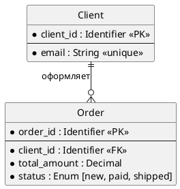

# Задание
## Проектирование БД «Сервис аренды машин посуточно»

**Бизнес-контекст:** Необходимо спроектировать реляционную базу данных для сервиса посуточной аренды автомобилей. Система управляет пользователями, их профилями, парком автомобилей, фактами аренды и случаями ДТП. Требуется построить модель данных на трёх уровнях абстракции: концептуальном, логическом и физическом.

**Цель занятия:** Пройти весь жизненный цикл проектирования базы данных (Conceptual → Logical → Physical) и оформить артефакты для каждого уровня, следуя правилам из теоретической справки.

**Модель данных (Бизнес-сущности):**

| Сущность | Описание |
| :--- | :--- |
| `Пользователь` | Аккаунт пользователя сервиса. |
| `Профиль` | Личные данные пользователя: ФИО, номер водительских прав. |
| `Автомобиль` | Машина, доступная для аренды. Поля: гос. номер, цена за сутки, марка. |
| `Аренда` | Факт сдачи автомобиля пользователю на определённые сутки. |
| `ДТП` | Зафиксированный случай дорожно-транспортного происшествия с автомобилем. |

**Бизнес-правила:**

1. Один пользователь может арендовать только одну машину за одни сутки.
2. Система записывает случаи ДТП для отслеживания уровня повреждения машины.
3. Случаи ДТП используются для расчёта рейтинга пользователя.

**Формат сдачи работы:**

1. Создать файл `solution.md`, который содержит три раздела, соответствующих трём уровням моделирования данных:

   - **Conceptual-level ERD** — концептуальная модель, понятная бизнесу.
   - **Logical-level ERD** — логическая модель, независимая от конкретной СУБД.
   - **Physical-level ERD** — физическая модель для выбранной реляционной СУБД PostgreSQL (Задание опционально)

2. Каждый раздел оформить в соответствии с теоретической справкой из `../lesson.md`.

**Дополнительные условия:**

- Для **концептуальной ERD**:
  - только бизнес-сущности и связи (глаголами);
  - без атрибутов, `PK`/`FK`, типов данных, индексов, привязки к СУБД;
  - связи формулируются как бизнес-отношения (например, «Пользователь арендует Автомобиль»).

- Для **логической ERD**:
  - все значимые сущности и атрибуты;
  - первичные и внешние ключи;
  - кардинальность и обязательность связей;
  - только абстрактные типы данных (`String`, `Decimal`, `Integer`, `Timestamp`, `Enum`, `Identifier` и т.п.);
  - запрещены `VARCHAR(n)`, `JSONB`, `UUID`, `BIGINT`, `TIMESTAMPTZ`, индексы, партиции, DDL;
  - модель нормализована (ориентир — 3NF); many-to-many связи разрешены через промежуточные сущности.

- Для **физической ERD**: 
  - обязательно указать целевую СУБД и конкретные типы данных;
  - реальные имена таблиц;
  - первичные/внешние ключи, ограничения (`UNIQUE`, `CHECK`, `NOT NULL`);
  - индексы, соответствующие ожидаемым запросам (поиск автомобилей по марке/цене, истории аренды пользователя, ДТП по автомобилю);
  - любой сознательный выбор (например, денормализация) должен быть обоснован.

# Решение

## **Conceptual-level ERD**

 **ключевые бизнес сущности:** Пользователь, Профиль, Автомобиль, Аренда, ДТП.

Пользователь после регистрации заполняет свой профиль.
При аренде автомобиля пользователем, создается записть об аренде в которой содержатся данные по автомобилю и пользователю.
Если автомобиль попадает в ДТП, в данных по ДТП фиксируется инфомация об аренде автомобиля.

 **Связи между сущностями:**
 1. Пользователь заполняет Профиль
 2. Пользователь осуществляет Аренду
 3. Аренда содержит Автомобиль
 4. Автомобиль попадает в ДТП
 6. ДТП фиксирует данные по Аренде

**Отношения между сущностями:**
1. Одному Пользователю пренадлежит один Профиль (1:1)
2. Пользователь может иметь много Аренд (1:N)
3. Много Аренд может содержать один Автомобиль (N:1)
3. Одно ДТП может иметь одну Аренду (1:1).


```plantuml
@startchen
left to right direction

entity Пользователь {
}
entity Профиль {
}
entity Автомобиль {
}
entity Аренда {
}
entity ДТП {
}

relationship Заполняет <<identifying>> {
}

relationship Осуществляет {
}

relationship Содержит <<identifying>> {
}

relationship Фиксирует <<identifying>> {
}

relationship Попадает {
}

Пользователь -1- Заполняет
Заполняет =1= Профиль

Пользователь -1- Осуществляет
Осуществляет =N= Аренда

Аренда =N= Содержит
Содержит -1- Автомобиль

Автомобиль -1- Попадает
Попадает =N= ДТП

ДТП =1= Фиксирует
Фиксирует -1- Аренда

@endchen
```
## **Logical-level ERD**

**сущности и атрибуты:**

### **User**
| Атрибут | Описание | Тип | Обязательность | Допустимые значения |
| :--- | :--- | :--- | :--- | :--- |
| `user_id` | Уникальный идентификатор пользователя  | Identifier | Да | Генерируется автоматически (surrogate key), PK |
| `email` | Электронная почта для входа | Email | Да | Должен быть корректный email формат |
| `password_hash` | Хеш пароля | TEXT | Да | Должен быть не меньше 60 символов |
| `phone_number` | Номер телефона | Phone | Нет | Только цифры, +, пробелы, дефисы, скобки |
| `created_at` | Дата создания записи | Timestamp | Да | По умолчанию текущее время |

### **Profile**
| Атрибут | Описание | Тип | Обязательность | Допустимые значения |
| :--- | :--- | :--- | :--- | :--- |
| `profile_id` | Уникальный идентификатор профиля | Identifier | Да | Генерируется автоматически (surrogate key), PK |
| `user_id` | Ссылка на пользователя | Identifier | Да | one-to-one, FK |
| `first_name` | Имя | String | Да | Не может быть пустым или содержать пробелы |
| `patronymic` | Отчество | String | Нет | Если указан, не может быть пустым или содержать пробелы |
| `last_name` | Фамилия | String | Да | Не может быть пустым или содержать пробелы |
| `driver_license_number` | Номер водительских прав | Integer | Да | Минимум 10 символов |
| `rating`??? | Рейтинг профиля | Integer | Да | Число от 0 до 100, при создании 100 |

### **Car**
| Атрибут | Описание | Тип | Обязательность | Допустимые значения |
| :--- | :--- | :--- | :--- | :--- |
| `car_id` | Уникальный идентификатор автомобиля | Identifier | Да | Генерируется автоматически (surrogate key), PK |
| `vin` | Vin-код автомобиля | String | Да | 17-значный код, состоящий из латинских букв и цифр (буквы I, O, Q не используются) |
| `license_plate` | Государственный номер автомобиля | String | Да | От 8 до 9 символов. Может содержать буквы: А, В, Е, К, М, Н, О, Р, С, Т, У, Х. Первой идет буква, затем 3 цифры, 2 буквы, 2 или 3 цифры.|
| `model` | Модель авто | String | Да | не может быть пустым. Максимум 100 символов. |
| `rental_price_per_day` | Цена аренды за сутки | Decimal | Да | До двух знаков после точки. Не может быть отрицательным. |

### **Rental**
| Атрибут | Описание | Тип | Обязательность | Допустимые значения |
| :--- | :--- | :--- | :--- | :--- |
| `rental_id` | Уникальный идентификатор аренды | Identifier | Да | Генерируется автоматически (surrogate key), PK |
| `user_id` | Ссылка на пользователя | Identifier | Да | FK |
| `car_id` | Ссылка на автомобиль | Identifier | Да | FK |
| `start_date` | Дата и время начала аренды | Timestamp | Да | Должен совпадать с датой создания аренды |
| `end_date` | Дата и время ожидаемого возврата автомобиля | Timestamp | Да | Не должен совпадать и быть раньше даты начала аренды |
| `actual_end_date` | Фактическая дата и время возвращения автомобиля | Timestamp | Нет | Если указан, не должен совпадать и быть раньше даты начала аренды |
| `total_price` | Итоговая сумма на выбранное количество дней |  Decimal | Да | До двух знаков после точки. Не может быть отрицательным и меньше цены аренды автомобиля за сутки |
| `status` | Статус аренды | ENUM | Да | Только: pending, active, completed |
| `created_at` | Дата создания аренды | Timestamp | Да | Дата создания записи |

### **Accidents**
| Атрибут | Описание | Тип | Обязательность | Допустимые значения |
| :--- | :--- | :--- | :--- | :--- |
| `accidents_id` | Уникальный идентификатор ДТП | Identifier | Да | Генерируется автоматически (surrogate key), PK |
| `car_id` | Ссылка на автомобиль | Identifier | Да | FK |
| `rental_id` | Ссылка на аренду | Identifier | Да | FK |
| `accident_date` | Дата и время ДТП | Timestamp | Да | Соответствует сегоднешне |
| `severity` | Уровень повреждений | ENUM | Да | Только minor, moderate, major |


