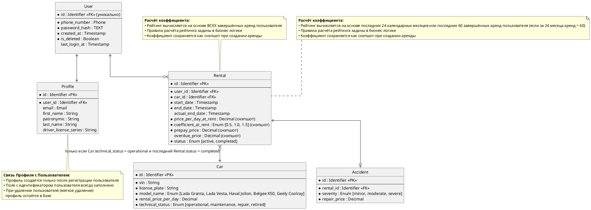

# Задание
## Проектирование БД «Сервис аренды машин посуточно»

**Бизнес-контекст:** Необходимо спроектировать реляционную базу данных для сервиса посуточной аренды автомобилей. Система управляет пользователями, их профилями, парком автомобилей, фактами аренды и случаями ДТП. Требуется построить модель данных на трёх уровнях абстракции: концептуальном, логическом и физическом.

**Цель занятия:** Пройти весь жизненный цикл проектирования базы данных (Conceptual → Logical → Physical) и оформить артефакты для каждого уровня, следуя правилам из теоретической справки.

**Модель данных (Бизнес-сущности):**

| Сущность       | Описание                                                                 |
|:---------------|:-------------------------------------------------------------------------|
| `Пользователь` | Аккаунт пользователя сервиса.                                            |
| `Профиль`      | Личные данные пользователя: ФИО, номер водительских прав.                |
| `Автомобиль`   | Машина, доступная для аренды. Поля: гос. номер, цена за сутки, марка.    |
| `Аренда`       | Факт сдачи автомобиля пользователю на определённые сутки.                |
| `ДТП`          | Зафиксированный случай дорожно-транспортного происшествия с автомобилем. |

**Бизнес-правила:**

1. Один пользователь может арендовать только одну машину за одни сутки.
2. Система записывает случаи ДТП для отслеживания уровня повреждения машины.
3. Случаи ДТП используются для расчёта рейтинга пользователя.

**Формат сдачи работы:**

1. Создать файл `solution.md`, который содержит три раздела, соответствующих трём уровням моделирования данных:

   - **Conceptual-level ERD** — концептуальная модель, понятная бизнесу.
   - **Logical-level ERD** — логическая модель, независимая от конкретной СУБД.
   - **Physical-level ERD** — физическая модель для выбранной реляционной СУБД PostgreSQL (Задание опционально)

2. Каждый раздел оформить в соответствии с теоретической справкой из `../lesson.md`.

**Дополнительные условия:**

- Для **концептуальной ERD**:
  - только бизнес-сущности и связи (глаголами);
  - без атрибутов, `PK`/`FK`, типов данных, индексов, привязки к СУБД;
  - связи формулируются как бизнес-отношения (например, «Пользователь арендует Автомобиль»).

- Для **логической ERD**:
  - все значимые сущности и атрибуты;
  - первичные и внешние ключи;
  - кардинальность и обязательность связей;
  - только абстрактные типы данных (`String`, `Decimal`, `Integer`, `Timestamp`, `Enum`, `Identifier` и т.п.);
  - запрещены `VARCHAR(n)`, `JSONB`, `UUID`, `BIGINT`, `TIMESTAMPTZ`, индексы, партиции, DDL;
  - модель нормализована (ориентир — 3NF); many-to-many связи разрешены через промежуточные сущности.

- Для **физической ERD**: 
  - обязательно указать целевую СУБД и конкретные типы данных;
  - реальные имена таблиц;
  - первичные/внешние ключи, ограничения (`UNIQUE`, `CHECK`, `NOT NULL`);
  - индексы, соответствующие ожидаемым запросам (поиск автомобилей по марке/цене, истории аренды пользователя, ДТП по автомобилю);
  - любой сознательный выбор (например, денормализация) должен быть обоснован.

# Решение

## **Conceptual-level ERD**

 **Ключевые бизнес сущности:** Пользователь, Профиль, Автомобиль, Аренда,ДТП.

#### **Уточнение требований**
##### Отношение Пользователь - Профиль
1. При регистрации пользователя автоматически создается профиль.
2. Пользователь может не заполнять данные профиля при этом ему доступна лента автомобилей, но без возможности аренды.
3. Одному пользователю всегда принадлежит только один профиль.
4. Профиль без пользователя создать нельзя.
5. Данные профиля хранятся при мягком удалении пользователя в течение 5 лет.

##### Отношение Пользователь - Аренда
1. Данные о всех арендах пользователя хранятся в базе данных.
2. Пользователь может храниться в системе не совершая аренд.
3. Данные об арендах удаленного пользователя сохраняются в течение 5 лет.
4. Аренда начинается с момента, когда пользователь садится в автомобиль.

##### Отношение Автомобиль - Аренда
1. Данные о всех арендах автомобиля хранятся в базе данных.
2. Автомобиль может стоять в парке день, неделю, месяц без аренды.
3. Данные об арендах удаленного автомобиля сохраняются в течение 5 лет.

##### Отношения Аренда - Пользователь, Аренда - Автомобиль
1. Аренда не может быть создана без пользователя или автомобиля.

##### Отношение Аренда - ДТП
1. Все фиксируемые ДТП совершаются во время аренды.
2. Факт ДТП является основанием для досрочного завершения аренды.
3. Данные по ДТП будут запрашиваться, в том числе, отдельно от аренды.

### Conceptual-level ERD

```plantuml
@startchen
left to right direction

entity Пользователь {
}
entity Профиль {
}
entity Автомобиль {
}
entity Аренда {
}
entity ДТП {
}

relationship Заполняет {
}

relationship Осуществляет {
}

relationship Содержит {
}

relationship Фиксирует {
}

Пользователь -1- Заполняет
Заполняет =1= Профиль

Пользователь -1- Осуществляет
Осуществляет =M= Аренда

Аренда =N= Содержит
Содержит -1- Автомобиль

Аренда -1- Фиксирует
Фиксирует =1= ДТП
@endchen
```

## **Logical-level ERD**

### **Рейтинг пользователя**
   - **Способ хранения**: Не хранится. Вычисляется динамически при каждом обращении к профилю или при аренде.


   - **Период расчёта**: Скользящее окно — последние 24 календарных месяца или последние 60 поездок, если поездок за период больше (от текущей даты по дате окончания аренды).


   - **Учитываемые аренды**: Только завершённые.


   - **Данные для расчёта**: 
     - $S_{всех\_аренд}$ - общее число аренд согласно периоду расчета
     - $S_{вес\_ДТП}$ - сумма весов степеней тяжести ДТП за период расчета
     - $\frac{S_{вес\_ДТП}}{S_{всех\_аренд}}$ - средний вес показывает, сколько баллов повреждений в среднем приходится на одну аренду пользователя


     - **Веса степеней тяжести** (фиксированы в коде):
       - Лёгкая: $minor = 1$ 
       - Средняя: $moderate = 2$ 
       - Тяжёлая: $severe = 3$
     - $K = 33.33$ - коэффициент, выбран так, чтобы при среднем весе ДТП = 3 (каждая аренда с severe) рейтинг падал до 0, а при среднем весе = 0 (без ДТП) оставался 100, обеспечивая пропорциональную шкалу от 0 до 100 для всех промежуточных значений.

   - **Итоговая формула вычисления рейтинга**:
     $$
     rating =  100 - (\frac{S_{вес\_ДТП}}{S_{всех\_аренд}} \times K)
     $$
 
### 1. Таблица граничных сценариев расчёта рейтинга

| № | Сценарий                          | Данные                                          | Расчёт                                    | Рейтинг                                      | Бизнес-решение                                                                                               | 
|:--|:----------------------------------|:------------------------------------------------|:------------------------------------------|:---------------------------------------------|:-------------------------------------------------------------------------------------------------------------|
| 1 | Новый пользователь без истории    | 0 аренд за 24 месяца                            | -                                         | 100                                          | Дает кредит доверия новым пользователям. Это стимулирует сохранять рейтинг на высоком уровне.                |
| 2 | Новичок с одной серьёзной аварией | 1 аренда, 1 severe (вес=3)                      | Сглаживание: 100 - (3/(1+2)) × 33.33 = 67 | 67                                           | Даётся шанс исправиться (не блокировка). Распространяется на всех пользователей у кого количество аренд < 3. |                                 
| 3 | Ветеран с одним тяжёлым ДТП       | 100 аренд, последние 60: 1 severe (вес=3)       | 100 - (3/60) × 33.33 = 98                 | при severe, если рейтинг выше 85, то даем 85 | Лишает коэффициента в 0.5 при расчете стоимости аренды. Это серьёзный стимул избегать аварий.                |
| 4 | Злостный нарушитель               | 100 аренд, последние 60: все с severe (вес=180) | 100 - (180/60) × 33.33 = 0                | 0                                            | Автоматическая блокировка аккаунта.                                                                          |

### 2. Параметры расчёта рейтинга

| Параметр                          | Значение                                             |
|:----------------------------------|:-----------------------------------------------------|
| Максимальный $rating$             | $100$                                                |
| Минимальный $rating$              | $0$                                                  |
| $S_{всех\_аренд}$                 | Если $< 3$, то $S_{всех\_аренд} = 3$                 |
| $rating$                          | Если есть ДТП с severe в выборке то $Rating \leq 84$ |
| $rating$ для новых пользователей  | $100$                                                |


**Где хранятся данные для рейтинга**:

  1. Статус аренды (active, completed) — в сущности `Rental`. 
  2. Дата завершения аренды — в сущности `Rental`. 
  3. Степень тяжести ДТП (minor, moderate, severe) — в сущности `Accident`. 
  4. Вся бизнес-логика расчёта рейтинга — в коде приложения.

### **Оплата аренды**
   - **Порядок оплаты**: Пользователь определяет даты начала ($start\_date$) и окончания ($end\_date$) аренды и в день начала аренды производит опату. 


   - **Предоплата**:
     - Сутки аренды исчисляются с момента фактической передачи автомобиля клиенту (час получения авто) и длятся ровно 24 часа. При аренде на несколько суток общий срок исчисляется кратно 24 часам от времени старта (например, 2 суток = 48 часов, 3 суток = 72 часа и т.д.). Окончанием срока считается тот же час последних суток, что и при старте.

     - Стоимость аренды за указанный пользователем период является предоплатой и считается по следующей формуле: 
       
       
       - $prepay\_price = rental\_price\_per\_day\_at\_rent \times rental\_days \times coefficient\_at\_rent$.
       
       
         - $rental\_price\_per\_day\_at\_rent$ - это цена автомобиля за сутки на момент аренды, фиксируется в cущности `Rental` по $rental\_price\_per\_day$ из сущности `Car`.
         
         
         - $rental\_days = end\_date - start\_date$ - это ожидаемое количество дней аренды, где $start\_date$ и $end\_date$ берутся из сущности `Rental`.
         
         
         - $coefficient\_at\_rent$ -  множитель (скидка/наценка), примененный к цене, фиксируется в cущности `Rental`, определяется в момент создания аренды в коде по рейтингу пользователя. Все варианты значений и их зависимость от рейтинга прописаны в таблице 3. 


   - **Досрочный возврат**: Деньги за неиспользованные дни не возвращаются.


   - **Просрочка возврата**:
     - Просрочка начинается по истечении последних суток аренды (в тот же час в котором был старт).


     - Стоимость аренды за период просрочки считается по следующей формуле: 
       

       - $overdue\_price = (rental\_price\_per\_day\_at\_rent \times (actual\_rental\_days - rental\_days) \times coefficient\_at\_rent) \times 2$.
       
       
         - $rental\_price\_per\_day\_at\_rent$ - это цена автомобиля за сутки на момент аренды, фиксируется в cущности `Rental` по $rental\_price\_per\_day$ из сущности `Car`.


         - $actual\_rental\_days = actual\_end\_date - start\_date$ - это фактическое количество дней аренды, где $start\_date$ и $actual\_end\_date$ берутся из сущности `Rental`.
         
         
         - $rental\_days = end\_date - start\_date$ - это ожидаемое количество дней аренды, где $start\_date$ и $end\_date$ берутся из сущности `Rental`.
         
         
         - $coefficient\_at\_rent$ -  множитель (скидка/наценка), примененный к цене, фиксируется в cущности `Rental`, определяется в момент создания аренды в коде по рейтингу пользователя. Все варианты значений и их зависимость от рейтинга прописаны в таблице 3.
        
        
         - $2$ - это множитель, коэффициент просрочки возврата автомобиля (штрафной коэффициент за несвоевременный возврат).
     
     
     - Если авто не возвращено до окончания оплаченных суток, аренда считается продлённой на **полные следующие сутки** (оплата за каждые начавшиеся сутки просрочки — в полном размере).

   - **Общая стоимость аренды с учетом просрочки**:
     - Не хранится в базе данных рассчитывается в момент возврата автомобиля.
     - $final\_price = prepay\_price + overdue\_price$
       - $prepay\_price$ - стоимость аренды на указанный пользователем период (предоплата)
       - $overdue\_price$ - стоимость дней просрочки аренды

   
   - **ДТП во время аренды**: Средства за оставшиеся дни не возвращаются. 


   - **Восстановление автомобиля при ДТП**: Оплачивает сервис.


   - **Фиксируемые атрибуты в сущности `Аренда`**:

     - `start_date`, `end_date` (вводимые пользователем)
     - `actual_return_date` (фактическая дата возврата)
     - `rental_price_per_day_at_rent` (цена за сутки на момент аренды)
     - `coefficient_at_rent` (коэффициент на момент аренды)
     - `prepay_price` (предоплата)
     - `overdue_price` (сумма переплат при просрочке, коэффициент 2)


   - **Поля** $rental\_price\_per\_day\_at\_rent$, $coefficient\_at\_rent$, $prepay\_price$, $overdue\_price$ — заполняются один раз при создании/завершении аренды и не пересчитываются (снэпшот). 


### 3. Расчёт стоимости аренды автомобиля в зависимости от рейтинга клиента и наличия просрочки
| Коэффициент                   | Рейтинг пользователя | Рассчет стоимости аренды автомобиля            | Рассчет стоимости аренды автомобиля при просрочке         |
|:------------------------------|:---------------------|:-----------------------------------------------|:----------------------------------------------------------|
| $coefficient\_at\_rent = 0.5$ | $86 < rating < 100$  | $rental\_price\_per\_day\_at\_rent \times rental\_days \times 0.5$ | $(rental\_price\_per\_day\_at\_rent \times (actual\_rental\_days - rental\_days) \times 0.5) \times 2$ |
| $coefficient\_at\_rent = 1.0$ | $30 < rating < 85$   | $rental\_price\_per\_day\_at\_rent \times rental\_days \times 1.0$ | $(rental\_price\_per\_day\_at\_rent \times (actual\_rental\_days - rental\_days) \times 1.0) \times 2$ |
| $coefficient\_at\_rent = 1.5$ | $rating < 30$        | $rental\_price\_per\_day\_at\_rent \times rental\_days \times 1.5$ | $(rental\_price\_per\_day\_at\_rent \times (actual\_rental\_days - rental\_days) \times 1.5) \times 2$ |

### **Профиль**
В рамках данной системы серия и номер водительских прав рассматриваются как **атомарный составной атрибут**, который:

не подлежит декомпозиции на независимые смысловые части;

всегда обрабатывается, валидируется и сохраняется как единое целое;

в совокупности обеспечивает уникальность записи о водительском удостоверении.


### **Автомобиль**

   - **Допустимые модели (строгое соответствие)**:
     - Lada Granta, 
     - Lada Vesta, 
     - Haval Jolion, 
     - Belgee X50, 
     - Geely Coolray.
     

   - **Добавление новых моделей** — только после согласования с руководством и изменения схемы БД. 


   - **Технические статусы** (`technical_status`):
     - `operational` (исправен)
     - `maintenance` (плановое ТО)
     - `repair` (ремонт)
     - `retired` (выведен из эксплуатации)
     

   - **Доступность для аренды**: Автомобиль доступен, если $Car.technical\_status = operational$ **И** статус последней аренды $Rental.status = completed$. 


   - **Местоположение**: Не хранится статически. Определяется в реальном времени через GPS-трекер (пользователь видит на карте).

### **ДТП**
   - **Сумма ремонта автомобиля** — фиксируется в сущности `Accident`. 
   - **Степень повреждения и сумма ремонта** оценивается независимо друг от друга, так как степень повреждения автомобиля оценивается исключительно на основании технических критериев (характер разрушений и время восстановления), указанных в таблице классификации степеней повреждения автомобиля. Сумма ремонта зависит от рыночных цен на запчасти, стоимости нормо-часа работ, категории СТО, региона и других внешних экономических факторов. Между суммой ремонта и степенью повреждения прямая корреляция отсутствует. 


   ### 4. Классификация степеней повреждения автомобиля

| Степень повреждения | Характеристика                                                                                                                                   | Время выхода из строя                                                                                                |
|:--------------------|:-------------------------------------------------------------------------------------------------------------------------------------------------|:---------------------------------------------------------------------------------------------------------------------|
| `minor`             | Геометрия кузова не нарушена. Повреждены только внешние съемные элементы.                                                                        | от 1 часа до 1 суток                                                                                                 |
| `moderate`          | Требуется замена деталей и слесарно-сварочные работы. Повреждены силовые или навесные элементы, влияющие на геометрию проемов или ходовую часть. | Выход из строя от 2 до 7 суток                                                                                       |
| `severe`            | Требуется эвакуация. Нарушена несущая способность кузова или повреждены агрегаты, обеспечивающие движение.                                       | Ремонт нецелесообразен (стоимость ремонта превышает 70-80% рыночной стоимости автомобиля) или занимает более 7 дней. |


### **Общие архитектурные решения**
  - Вся бизнес-логика расчёта (рейтинг, коэффициент, ценообразование) — в коде приложения, не в БД.


  - Некоторые поля (например, `prepay_price`) заполняются однократно и не пересчитываются. 


  - Удаление пользователя — логическое (обезличивание), данные профиля и аренд сохраняются для налоговой.


**Сущности и атрибуты:**

### **User**
| Атрибут                | Описание                               | Тип        | Обязательность | Допустимые значения                            | Для чего используется                                                           |
|:-----------------------|:---------------------------------------|:-----------|:---------------|:-----------------------------------------------|:--------------------------------------------------------------------------------|
| `user_id`              | Уникальный идентификатор пользователя. | Identifier | Да             | Генерируется автоматически (surrogate key).    | Первичный ключ. На него ссылается профиль (Profile) и аренда (Rental).          |
| `phone_number`         | Номер телефона.                        | Phone      | Да             | Только цифры, +, пробелы, дефисы, скобки.      | Используется для входа (логин) и отправки SMS.                                  |
| `password_hash`        | Хеш пароля.                            | TEXT       | Да             | Должен быть не меньше 60 символов.             | Для аутентификации.                                                             |
| `last_login_at`        | Дата последнего входа.                 | Timestamp  | Нет            | Обновляется при каждом входе на текущее время. | Для определения активности аудитории(MAU - Monthly Active Users).               |
| `is_deleted`           | Флаг мягкого удаления.                 | Boolean    | Да             | По умолчанию false.                            | Позволяет скрыть пользователя, но сохранить профиль, чтобы не потерять историю. |

### **Profile**
| Атрибут                 | Описание                          | Тип        | Обязательность | Допустимые значения                                                                                                                         | Для чего используется                           |
|:------------------------|:----------------------------------|:-----------|:---------------|:--------------------------------------------------------------------------------------------------------------------------------------------|:------------------------------------------------|
| `profile_id`            | Уникальный идентификатор профиля. | Identifier | Да             | Генерируется автоматически (surrogate key).                                                                                                 | Первичный ключ.                                 |
| `user_id`               | Ссылка на пользователя.           | Identifier | Да             | Имеет уникальное значение.                                                                                                                  | Обеспечивает связь один к одному. Внешний ключ. |
| `email`                 | Электронная почта для входа.      | Email      | Нет            | Должен быть корректный email формат.                                                                                                        | Для рассылок и восстановления пароля.           |
| `first_name`            | Имя.                              | String     | Нет            | Если указан, не может содержать пробелы.                                                                                                    | Для договора аренды.                            |
| `patronymic`            | Отчество.                         | String     | Нет            | Если указан, не может содержать пробелы.                                                                                                    | Для договора аренды.                            |
| `last_name`             | Фамилия.                          | String     | Нет            | Если указан, не может содержать пробелы.                                                                                                    | Для договора аренды.                            |
| `driver_license`        | Серия и номер водительских прав.  | String     | Нет            | Должен состоять из 10 знаков. Представляющие собой цифры или первые 4 знака представляют собой комбинации из двух цифр и двух русских букв. | Для страховки ОСАГО и проверки стажа.           |


### **Car**
| Атрибут                | Описание                             | Тип        | Обязательность | Допустимые значения                                                                                                                      | Для чего используется                                                                                                                                                             |
|:-----------------------|:-------------------------------------|:-----------|:---------------|:-----------------------------------------------------------------------------------------------------------------------------------------|:----------------------------------------------------------------------------------------------------------------------------------------------------------------------------------|
| `car_id`               | Уникальный идентификатор автомобиля. | Identifier | Да             | Генерируется автоматически (surrogate key).                                                                                              | Первичный ключ. На него ссылается аренда (Rental).                                                                                                                                |
| `vin`                  | Vin-код автомобиля.                  | String     | Да             | 17-значный код, состоящий из латинских букв и цифр (буквы I, O, Q не используются).                                                      | Для проверки истории автомобиля (пробег, ДТП, ограничения, залоги) через внешние сервисы.                                                                                         |
| `license_plate`        | Государственный номер автомобиля.    | String     | Да             | От 8 до 9 символов. Может содержать буквы: А, В, Е, К, М, Н, О, Р, С, Т, У, Х. Первой идет буква, затем 3 цифры, 2 буквы, 2 или 3 цифры. | Основной визуальный идентификатор для сотрудников и клиентов (по нему легко найти авто на парковке). Используется для взаимодействия с госорганами (штрафы, розыск, регистрация). |
| `model_name`           | Модель авто.                         | Enum       | Да             | Lada Granta, Lada Vesta, Haval Jolion, Belgee X50, Geely Coolray.                                                                        | Для привлечения клиентов. Позволяет группировать автомобили.                                                                                                                      |
| `rental_price_per_day` | Цена аренды за сутки.                | Integer    | Да             | Не может быть отрицательным. Обновляемое значение.                                                           | Является ключевым бизнес-показателем для расчета итоговой стоимости бронирования. Может динамически меняться — поэтому разрешено обновление.                                                                  |
| `technical_status`     | Технический статус автомобиля        | Enum       | Да             | operational, maintenance, repair, retired.                                                                                               | Для определения доступности автомобиля для аренды.                                                                                                                                |

### **Rental**
| Атрибут                 | Описание                                                   | Тип         | Обязательность | Допустимые значения                                                                              | Для чего используется                                                                                                                                                                                 |
|:------------------------|:-----------------------------------------------------------|:------------|:---------------|:-------------------------------------------------------------------------------------------------|:------------------------------------------------------------------------------------------------------------------------------------------------------------------------------------------------------|
| `rental_id`             | Уникальный идентификатор аренды.                           | Identifier  | Да             | Генерируется автоматически (surrogate key).                                                      | Первичный ключ. Обеспечивает уникальность записи о каждой сделке аренды. На него ссылается ДТП (Accidents). Для поддержки клиентов и внутреннего учета (позволяет быстро находить конкретную аренду). |
| `user_id`               | Ссылка на пользователя.                                    | Identifier  | Да             | Внешний ключ (FK) к таблице user.                                                                | Связывает аренду с конкретным пользователем. Используется для истории аренды и расчета рейтинга.                                                                                                      |
| `car_id`                | Ссылка на автомобиль.                                      | Identifier  | Да             | Внешний ключ (FK) к таблице car.                                                                 | Связывает аренду с конкретным автомобилем. Используется для проверки доступности и статистики по авто.                                                                                                |
| `start_date`            | Дата и время начала аренды.                                | Timestamp   | Да             | Должна совпадать с моментом создания аренды (created_at).                                        | Используется в расчете ожидаемого количества дней аренды. Является точкой отсчета.                                                                                                                    |
| `end_date`              | Дата и время планового возврата автомобиля.                | Timestamp   | Да             | Должна быть строго позже start_date.                                                             | Используется в расчете ожидаемого количества дней аренды. Участвует в расчете рейтинга пользователя.                                                                                                  |
| `actual_end_date`       | Фактическая дата и время возврата автомобиля.              | Timestamp   | Нет            | Если указан, должен быть позже или равен end_date.                                               | Триггер для расчёта просрочки (сравнение с end_date). Заполняется только при завершении аренды.                                                                                                       |
| `price_per_day_at_rent` | Цена автомобиля за сутки на момент аренды.                 | Integer     | Да             | Не может быть отрицательным.                                         | Фиксирует стоимость на момент аренды, чтобы она не менялась со временем (защита от изменения прайса).                                                                                                                             |
| `coefficient_at_rent`   | Множитель (скидка/наценка), примененный к цене.            | ENUM        | Да             | Только: 0.5, 1.0, 1.5.                                                                           | Фиксирует коэффициент на момент аренды. Влияет на prepay_price.                                                                                                                                       |
| `prepay_price`          | Стоимость аренды за плановый период с учётом коэффициента. | Integer     | Да             | Не может быть отрицательным. Должен быть &ge; price_per_day_at_rent. | Используется для предоплаты (списывается при создании аренды).                                                                                                                                                                    |
| `overdue_price`         | Стоимость доплаты за просрочку (коэффициент 2.0).          | Integer     | Нет            | Не может быть отрицательным. По умолчанию 0.                         | Рассчитывается, если actual_end_date > end_date. Используется для доплаты при возврате.                                                                                                                                           |
| `status`                | Текущий статус аренды.                                     | ENUM        | Да             | active, completed.                                                                               | Определяет сценарий возврата. Влияет на возможность новой аренды, рейтинг пользователя и доступность авто.                                                                                            |

### **Accident**
| Атрибут         | Описание                      | Тип        | Обязательность | Допустимые значения                            | Для чего используется                                                                                                                                |
|:----------------|:------------------------------|:-----------|:---------------|:-----------------------------------------------|:-----------------------------------------------------------------------------------------------------------------------------------------------------|
| `accident_id`   | Уникальный идентификатор ДТП. | Identifier | Да             | Генерируется автоматически (surrogate key).    |Первичный ключ. Обеспечивает уникальность записи о каждом ДТП. Для поддержки клиентов и внутреннего учета (позволяет быстро находить конкретное ДТП). |
| `rental_id`     | Ссылка на аренду.             | Identifier | Да             | Внешний ключ (FK) к таблице rental.            | Для привязки ДТП к конкретной аренде. Позволяет определить, какой клиент и автомобиль участвовали в инциденте.                                       |
| `severity`      | Cтепень повреждений.          | ENUM       | Да             | minor, moderate, severe.                       | Для классификации серьёзности ДТП. Влияет на рейтинг пользователя и решение о списании автомобиля.                                                   |
| `repair_price`  | Цена ремонта автомобиля       | Integer    | Нет            | Не может быть отрицательным числом.            | Для расчёта финансовых потерь компании. Используется при страховых выплатах и анализе убыточности автопарка.                                         |

### Logical-level ERD



create type car_model_enum as enum (
	'Lada Granta', 
    'Lada Vesta', 
    'Haval Jolion', 
    'Belgee X50', 
    'Geely Coolray'
);

create type car_technical_status_enum as enum (
    'operational', 
    'maintenance', 
    'repair', 
    'retired'
);

create type rental_status_enum as enum (
    'active', 
    'completed'
);

create type rental_coefficient_enum as enum (
    '0.5', 
    '1.0', 
    '1.5'
);

create type accident_severity_enum as enum (
    'minor', 
    'moderate', 
    'severe'
);

create table "User" (
    id UUID primary key default gen_random_uuid(),
    phone_number VARCHAR(20) unique not null check (phone_number ~ '^(\+7|8)[\- ]?\(?\d{3}\)?[\- ]?\d{3}[\- ]?\d{2}[\- ]?\d{2}$'),
    password_hash TEXT not null check (LENGTH(password_hash) >= 60),
    last_login_at TIMESTAMPTZ not null default NOW(),
    is_deleted BOOLEAN not null default false
);

create table "Profile" (
    id UUID primary key default gen_random_uuid(),
    user_id UUID unique not null,
    email VARCHAR(255) unique check (email ~* '^[A-Za-z0-9._%+-]+@[A-Za-z0-9.-]+\.[A-Za-z]{2,}$'),
    first_name VARCHAR(100) check (first_name is null or first_name not like '% %'),
    patronymic VARCHAR(100) check (patronymic is null or patronymic not like '% %'),
    last_name VARCHAR(100) check (last_name is null or last_name not like '% %'),
    driver_license VARCHAR(10) check (driver_license ~ '^[0-9А-Я]{10}$'),
    constraint fk_profile_user foreign key (user_id) references "User"(id) on delete restrict
);

create table "Car" (
    id UUID primary key default gen_random_uuid(),
    vin VARCHAR(17) unique not null check (vin ~ '^[A-HJ-NPR-Z0-9]{17}$'),
    license_plate VARCHAR(9) unique not null check (license_plate ~ '^[АВЕКМНОРСТУХ][0-9]{3}[АВЕКМНОРСТУХ]{2}[0-9]{2,3}$'),
    model_name car_model_enum not null,
    rental_price_per_day BIGINT not null check (rental_price_per_day > 0),
    technical_status car_technical_status_enum not null default 'operational'
);

create table "Rental" (
    id UUID primary key default gen_random_uuid(),
    user_id UUID not null,
    car_id UUID not null,
    start_date TIMESTAMPTZ not null,
    end_date TIMESTAMPTZ not null,
    actual_end_date TIMESTAMPTZ,
    price_per_day_at_rent BIGINT not null check (price_per_day_at_rent > 0),
    coefficient_at_rent rental_coefficient_enum not null default '1.0',
    prepay_price BIGINT not null check (prepay_price >= 0),
    overdue_price BIGINT check (overdue_price >= 0) default 0,
    status rental_status_enum not null default 'active',
    constraint prepay_vs_price_per_day check (prepay_price >= price_per_day_at_rent),
    constraint chk_rental_dates check (end_date > start_date),
    constraint chk_rental_actual_end check (actual_end_date is null or actual_end_date > start_date),
    constraint fk_rental_user foreign key (user_id) references "User"(id) on delete restrict,
    constraint fk_rental_car foreign key (car_id) references "Car"(id) on delete restrict
);

create table "Accident" (
    id UUID primary key default gen_random_uuid(),
    rental_id UUID unique not null,
    severity accident_severity_enum not null,
    repair_price BIGINT check (repair_price >= 0),
    constraint fk_accident_rental foreign key (rental_id) references "Rental"(id) on delete restrict
);


