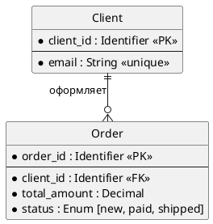

# Задание
## Проектирование БД «Сервис аренды машин посуточно»

**Бизнес-контекст:** Необходимо спроектировать реляционную базу данных для сервиса посуточной аренды автомобилей. Система управляет пользователями, их профилями, парком автомобилей, фактами аренды и случаями ДТП. Требуется построить модель данных на трёх уровнях абстракции: концептуальном, логическом и физическом.

**Цель занятия:** Пройти весь жизненный цикл проектирования базы данных (Conceptual → Logical → Physical) и оформить артефакты для каждого уровня, следуя правилам из теоретической справки.

**Модель данных (Бизнес-сущности):**

| Сущность | Описание |
| :--- | :--- |
| `Пользователь` | Аккаунт пользователя сервиса. |
| `Профиль` | Личные данные пользователя: ФИО, номер водительских прав. |
| `Автомобиль` | Машина, доступная для аренды. Поля: гос. номер, цена за сутки, марка. |
| `Аренда` | Факт сдачи автомобиля пользователю на определённые сутки. |
| `ДТП` | Зафиксированный случай дорожно-транспортного происшествия с автомобилем. |

**Бизнес-правила:**

1. Один пользователь может арендовать только одну машину за одни сутки.
2. Система записывает случаи ДТП для отслеживания уровня повреждения машины.
3. Случаи ДТП используются для расчёта рейтинга пользователя.

**Формат сдачи работы:**

1. Создать файл `solution.md`, который содержит три раздела, соответствующих трём уровням моделирования данных:

   - **Conceptual-level ERD** — концептуальная модель, понятная бизнесу.
   - **Logical-level ERD** — логическая модель, независимая от конкретной СУБД.
   - **Physical-level ERD** — физическая модель для выбранной реляционной СУБД PostgreSQL (Задание опционально)

2. Каждый раздел оформить в соответствии с теоретической справкой из `../lesson.md`.

**Дополнительные условия:**

- Для **концептуальной ERD**:
  - только бизнес-сущности и связи (глаголами);
  - без атрибутов, `PK`/`FK`, типов данных, индексов, привязки к СУБД;
  - связи формулируются как бизнес-отношения (например, «Пользователь арендует Автомобиль»).

- Для **логической ERD**:
  - все значимые сущности и атрибуты;
  - первичные и внешние ключи;
  - кардинальность и обязательность связей;
  - только абстрактные типы данных (`String`, `Decimal`, `Integer`, `Timestamp`, `Enum`, `Identifier` и т.п.);
  - запрещены `VARCHAR(n)`, `JSONB`, `UUID`, `BIGINT`, `TIMESTAMPTZ`, индексы, партиции, DDL;
  - модель нормализована (ориентир — 3NF); many-to-many связи разрешены через промежуточные сущности.

- Для **физической ERD**: 
  - обязательно указать целевую СУБД и конкретные типы данных;
  - реальные имена таблиц;
  - первичные/внешние ключи, ограничения (`UNIQUE`, `CHECK`, `NOT NULL`);
  - индексы, соответствующие ожидаемым запросам (поиск автомобилей по марке/цене, истории аренды пользователя, ДТП по автомобилю);
  - любой сознательный выбор (например, денормализация) должен быть обоснован.

# Решение

## **Conceptual-level ERD**

 **ключевые бизнес сущности:** Пользователь, Профиль, Автомобиль, ДТП.

#### **Уточнение требований**
##### Отношение Пользователь - Профиль
1. Пользователь при регистрации заполняет свой профиль.
2. Данные профиля привязаны к пользователю и не должны сохраняться при удалении пользователя.
3. Одному пользователю всегда пренадлежит только один профиль.

##### Отношение Пользователь - Автомобиль
1. Пользователь после регистрации может арендовать автомобиль.
2. Каждая аренда автомобиля пользователем фиксируется.
3. Пользователь имеет активную аренду, она всегда только одна.
4. У пользователя также есть завершенные аренды их может быть множество.
5. В каждой аренде участвует только один пользователь и только один автомобиль.
6. Автомобиль имеет активную аренду, она всегда только одна.
7. У автомобиля также есть завершенные аренды их может быть множество.

##### Отношение Автомобиль - ДТП
8. Автомобиль может попасть в ДТП.
9. Информация об участии автомобиля в ДТП фиксируется.
10. Один автомобиль может , быть участником большого количества ДТП.
11. За период аренды допускается только одно ДТП.
12. Факт ДТП является основанием для досрочного завершения аренды.
14. ДТП делится по степени повреждения автомобиля на легкую, среднюю и тяжелую (см. таблицу 1).

##### Пользователь
17. Пользователь имеет рейтинг.
18. Рейтинг имеет диапазон от 0 до 100 единиц.
19. Пользователь при регистрации имеет максимальный рейтинг(80 единиц).
20. Рейтинг пользователя может уменьшиться, в соответствии со степенью повреждения автомобиля в ДТП, на
- 10 единиц при легкой степени
- 50 единиц при средней степени
- 100 единиц при тяжелой степени.
21. Рейтинг повышается на 1 каждый раз когда аренда завершается без ДТП, при этом не может вырасти больше максимального значения (100).
22. Пользователь с максимальным рейтингом получает скидку на аренду в 5%.
23. Пользователь с нулевым рейтингом теряет возможность арендовать автомобиль.


```plantuml
@startchen
left to right direction

entity Пользователь {
}
entity Профиль <<weak>> {
}
entity Автомобиль {
}
entity ДТП {
}

relationship Заполняет <<identifying>> {
}

relationship Арендует {
}

relationship Попадает {
}

Пользователь -1- Заполняет
Заполняет =1= Профиль

Пользователь -M- Арендует
Арендует -N- Автомобиль

Автомобиль -1- Попадает
Попадает =N= ДТП


@endchen
```
## **Logical-level ERD**

**сущности и атрибуты:**

### **User**
| Атрибут | Описание | Тип | Обязательность | Допустимые значения |
| :--- | :--- | :--- | :--- | :--- |
| `user_id` | Уникальный идентификатор пользователя  | Identifier | Да | Генерируется автоматически (surrogate key), PK |
| `email` | Электронная почта для входа | Email | Да | Должен быть корректный email формат |
| `password_hash` | Хеш пароля | TEXT | Да | Должен быть не меньше 60 символов |
| `phone_number` | Номер телефона | Phone | Нет | Только цифры, +, пробелы, дефисы, скобки |
| `created_at` | Дата создания записи | Timestamp | Да | По умолчанию текущее время |

### **Profile**
| Атрибут | Описание | Тип | Обязательность | Допустимые значения |
| :--- | :--- | :--- | :--- | :--- |
| `profile_id` | Уникальный идентификатор профиля | Identifier | Да | Генерируется автоматически (surrogate key), PK |
| `user_id` | Ссылка на пользователя | Identifier | Да | one-to-one, FK |
| `first_name` | Имя | String | Да | Не может быть пустым или содержать пробелы |
| `patronymic` | Отчество | String | Нет | Если указан, не может быть пустым или содержать пробелы |
| `last_name` | Фамилия | String | Да | Не может быть пустым или содержать пробелы |
| `driver_license_number` | Номер водительских прав | Integer | Да | Минимум 10 символов |
| `rating`??? | Рейтинг профиля | Integer | Да | Число от 0 до 100, при создании 100 |

### **Car**
| Атрибут | Описание | Тип | Обязательность | Допустимые значения |
| :--- | :--- | :--- | :--- | :--- |
| `car_id` | Уникальный идентификатор автомобиля | Identifier | Да | Генерируется автоматически (surrogate key), PK |
| `vin` | Vin-код автомобиля | String | Да | 17-значный код, состоящий из латинских букв и цифр (буквы I, O, Q не используются) |
| `license_plate` | Государственный номер автомобиля | String | Да | От 8 до 9 символов. Может содержать буквы: А, В, Е, К, М, Н, О, Р, С, Т, У, Х. Первой идет буква, затем 3 цифры, 2 буквы, 2 или 3 цифры.|
| `model` | Модель авто | String | Да | не может быть пустым. Максимум 100 символов. |
| `rental_price_per_day` | Цена аренды за сутки | Decimal | Да | До двух знаков после точки. Не может быть отрицательным. |

### **Rental**
| Атрибут | Описание | Тип | Обязательность | Допустимые значения |
| :--- | :--- | :--- | :--- | :--- |
| `rental_id` | Уникальный идентификатор аренды | Identifier | Да | Генерируется автоматически (surrogate key), PK |
| `user_id` | Ссылка на пользователя | Identifier | Да | FK |
| `car_id` | Ссылка на автомобиль | Identifier | Да | FK |
| `start_date` | Дата и время начала аренды | Timestamp | Да | Должен совпадать с датой создания аренды |
| `end_date` | Дата и время ожидаемого возврата автомобиля | Timestamp | Да | Не должен совпадать и быть раньше даты начала аренды |
| `actual_end_date` | Фактическая дата и время возвращения автомобиля | Timestamp | Нет | Если указан, не должен совпадать и быть раньше даты начала аренды |
| `total_price` | Итоговая сумма на выбранное количество дней |  Decimal | Да | До двух знаков после точки. Не может быть отрицательным и меньше цены аренды автомобиля за сутки |
| `status` | Статус аренды | ENUM | Да | Только: активна, завершена, ДТП |
| `created_at` | Дата создания аренды | Timestamp | Да | Дата создания записи |

### **Accidents**
| Атрибут | Описание | Тип | Обязательность | Допустимые значения |
| :--- | :--- | :--- | :--- | :--- |
| `accidents_id` | Уникальный идентификатор ДТП | Identifier | Да | Генерируется автоматически (surrogate key), PK |
| `car_id` | Ссылка на автомобиль | Identifier | Да | FK |
| `rental_id` | Ссылка на аренду | Identifier | Да | FK |
| `accident_date` | Дата и время ДТП | Timestamp | Да | Соответствует сегоднешне |
| `severity` | Уровень повреждений | ENUM | Да | Только minor, moderate, major |



### **1. Описание степени повреждения автомобиля**
| Степень повреждения | Характеристика | Время выхода из строя |
| :--- | :--- | :--- |
| `легкая` |Геометрия кузова не нарушена. Повреждены только внешние съемные элементы. | от 1 часа до 1 суток |
| `средняя` | Требуется замена деталей и слесарно-сварочные работы. Повреждены силовые или навесные элементы, влияющие на геометрию проемов или ходовую часть. | Выход из строя от 2 до 7 суток |
| `тяжелая` | Требуется эвакуация. Нарушена несущая способность кузова или повреждены агрегаты, обеспечивающие движение. | Ремонт нецелесообразен (стоимость ремонта привышает 70-80% рыночной стоимости автомобиля) или занимает более 7 дней. |
